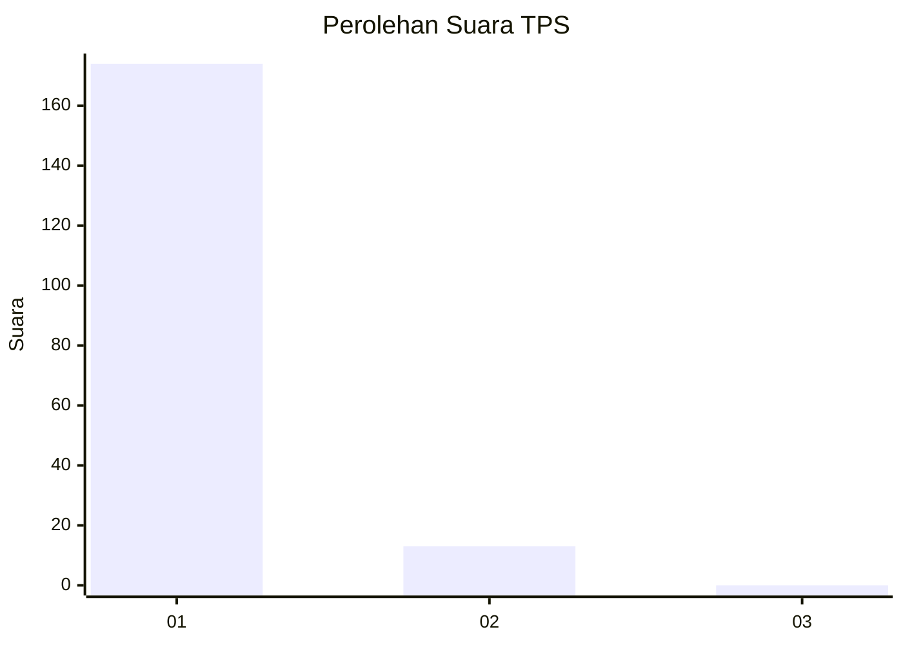
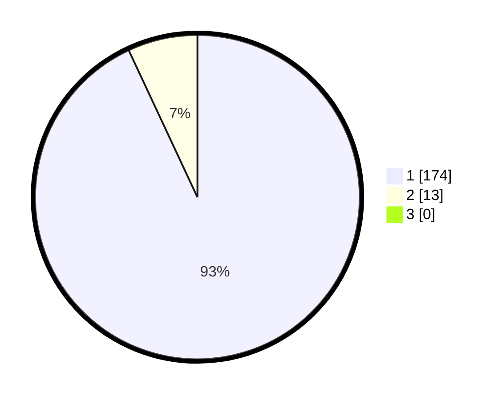

# Hasil

## Grafik

## Tabel

| No. | Nama Paslon    | Suara | Suara (raw) | Persentase |
|:--- |:-------------- | -----:| -----------:| ----------:|
| 1   | ANIES MUHAIMIN | 174   | [174][p-1]  | 93,05      |
| 2   | PRABOWO GIBRAN | 13    | [13][p-2]   | 6,95       |
| 3   | GANJAR MAHFUD  | 0     | [0][p-3]    | 0,00       |

[p-1]: https://github.com/gigit-pemilu/pemilu-2024-11-aceh/blob/main/pilpres/hitung-suara/sub/11-aceh/sub/08-aceh-utara/sub/01-baktiya/sub/2023-alue-dama/sub/001-tps/sub/paslon-1.txt
[p-2]: https://github.com/gigit-pemilu/pemilu-2024-11-aceh/blob/main/pilpres/hitung-suara/sub/11-aceh/sub/08-aceh-utara/sub/01-baktiya/sub/2023-alue-dama/sub/001-tps/sub/paslon-2.txt
[p-3]: https://github.com/gigit-pemilu/pemilu-2024-11-aceh/blob/main/pilpres/hitung-suara/sub/11-aceh/sub/08-aceh-utara/sub/01-baktiya/sub/2023-alue-dama/sub/001-tps/sub/paslon-3.txt

## Foto C Plano

https://sirekap-obj-formc.kpu.go.id/eef4/pemilu/ppwp/11/08/01/20/23/1108012023001-20240215-144701--198fca0d-cedf-4a1b-bd56-6c1f4765f050.jpg

https://sirekap-obj-formc.kpu.go.id/eef4/pemilu/ppwp/11/08/01/20/23/1108012023001-20240215-114253--05cfbabd-4936-4026-8f5f-88d6e3a86f38.jpg

https://sirekap-obj-formc.kpu.go.id/eef4/pemilu/ppwp/11/08/01/20/23/1108012023001-20240215-114343--345e4485-fdf8-4657-b536-d836f6bff0b1.jpg

## Metadata

| Key        | Value               |
| ---------- | ------------------- |
| Time Stamp | 2024-02-15 19:00:26 |

