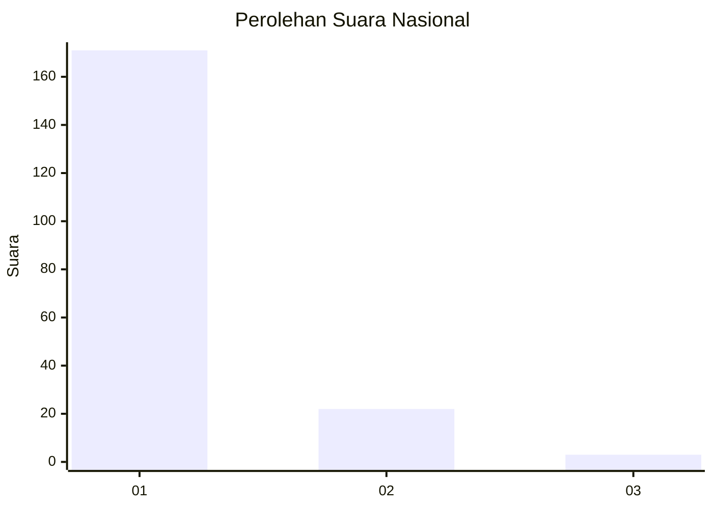
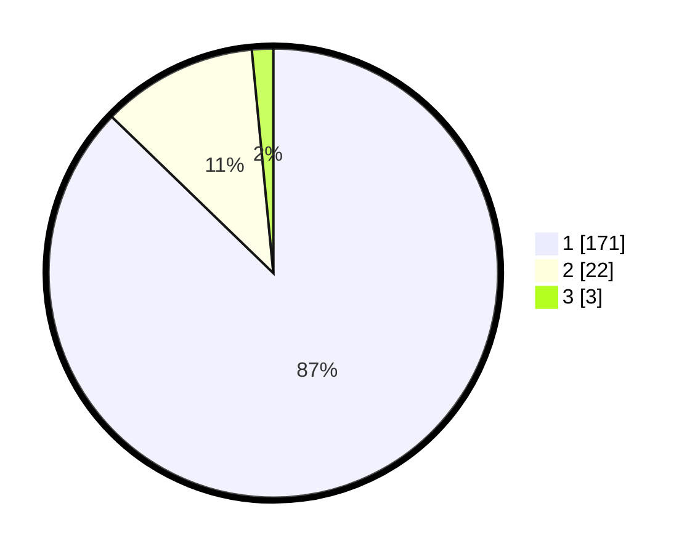

# Hasil

## Grafik

## Tabel

| No. | Nama Paslon    | Suara | Suara (raw) | Persentase |
|:--- |:-------------- | -----:| -----------:| ----------:|
| 1   | ANIES MUHAIMIN | 171   | [171][p-1]  | 87,24      |
| 2   | PRABOWO GIBRAN | 22    | [22][p-2]   | 11,22      |
| 3   | GANJAR MAHFUD  | 3     | [3][p-3]    | 1,53       |

[p-1]: https://github.com/gigit-pemilu/pemilu-2024/blob/main/pilpres/hitung-suara/sub/11-aceh/sub/08-aceh-utara/sub/01-baktiya/sub/2025-rambong-dalam/sub/001-tps/sub/paslon-1.txt
[p-2]: https://github.com/gigit-pemilu/pemilu-2024/blob/main/pilpres/hitung-suara/sub/11-aceh/sub/08-aceh-utara/sub/01-baktiya/sub/2025-rambong-dalam/sub/001-tps/sub/paslon-2.txt
[p-3]: https://github.com/gigit-pemilu/pemilu-2024/blob/main/pilpres/hitung-suara/sub/11-aceh/sub/08-aceh-utara/sub/01-baktiya/sub/2025-rambong-dalam/sub/001-tps/sub/paslon-3.txt

## Foto C Plano

https://sirekap-obj-formc.kpu.go.id/9f97/pemilu/ppwp/11/08/01/20/25/1108012025001-20240219-163916--5c604100-bb5a-4c5f-8421-5b3b99de02d8.jpg

https://sirekap-obj-formc.kpu.go.id/9f97/pemilu/ppwp/11/08/01/20/25/1108012025001-20240219-163035--d3e9e8a4-d1c2-4209-bd75-75633d59bf14.jpg

https://sirekap-obj-formc.kpu.go.id/9f97/pemilu/ppwp/11/08/01/20/25/1108012025001-20240219-164037--3f01faa0-f66d-496a-ae49-e8cd39c7afb4.jpg

## Metadata

| Key        | Value               |
| ---------- | ------------------- |
| Time Stamp | 2024-02-24 22:31:28 |

