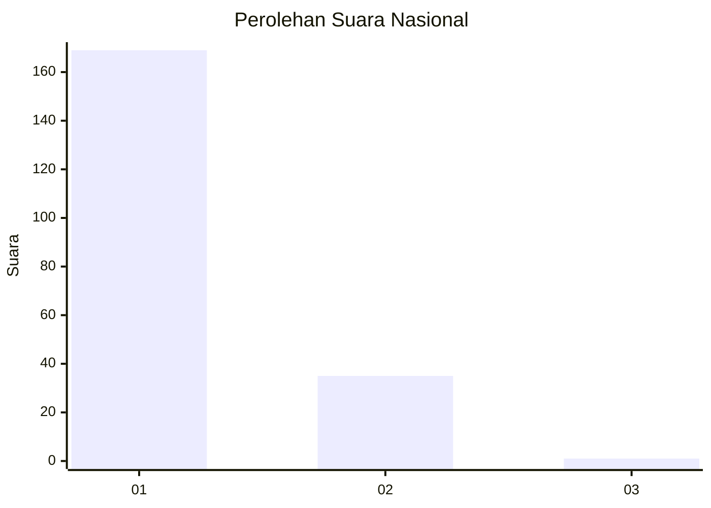
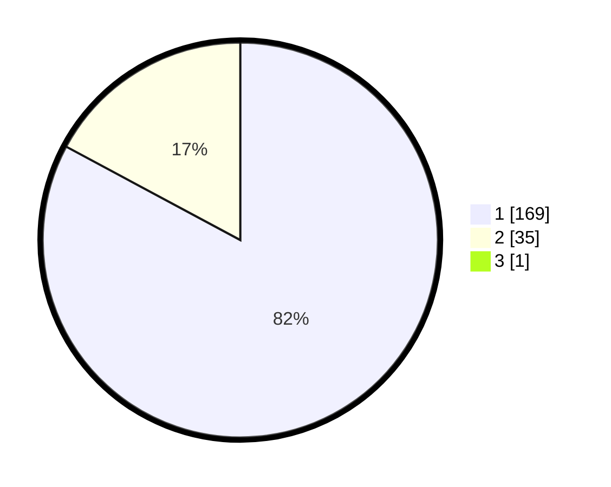

# Hasil

## Grafik

## Tabel

| No. | Nama Paslon    | Suara | Suara (raw) | Persentase |
|:--- |:-------------- | -----:| -----------:| ----------:|
| 1   | ANIES MUHAIMIN | 169   | [169][p-1]  | 82,44      |
| 2   | PRABOWO GIBRAN | 35    | [35][p-2]   | 17,07      |
| 3   | GANJAR MAHFUD  | 1     | [1][p-3]    | 0,49       |

[p-1]: https://github.com/gigit-pemilu/pemilu-2024/blob/main/pilpres/hitung-suara/sub/11-aceh/sub/08-aceh-utara/sub/01-baktiya/sub/2025-rambong-dalam/sub/002-tps/sub/paslon-1.txt
[p-2]: https://github.com/gigit-pemilu/pemilu-2024/blob/main/pilpres/hitung-suara/sub/11-aceh/sub/08-aceh-utara/sub/01-baktiya/sub/2025-rambong-dalam/sub/002-tps/sub/paslon-2.txt
[p-3]: https://github.com/gigit-pemilu/pemilu-2024/blob/main/pilpres/hitung-suara/sub/11-aceh/sub/08-aceh-utara/sub/01-baktiya/sub/2025-rambong-dalam/sub/002-tps/sub/paslon-3.txt

## Foto C Plano

https://sirekap-obj-formc.kpu.go.id/60a4/pemilu/ppwp/11/08/01/20/25/1108012025002-20240219-164026--fe1eb564-71d4-4a30-9785-60ba2ca82d39.jpg

https://sirekap-obj-formc.kpu.go.id/60a4/pemilu/ppwp/11/08/01/20/25/1108012025002-20240219-164146--7e3ad2ee-21e1-40d0-988e-bb8e00ebd94a.jpg

https://sirekap-obj-formc.kpu.go.id/60a4/pemilu/ppwp/11/08/01/20/25/1108012025002-20240219-164258--ad6e4ef4-9dcb-45bd-80df-aa7465fc3f27.jpg

## Metadata

| Key        | Value               |
| ---------- | ------------------- |
| Time Stamp | 2024-02-24 22:31:28 |

