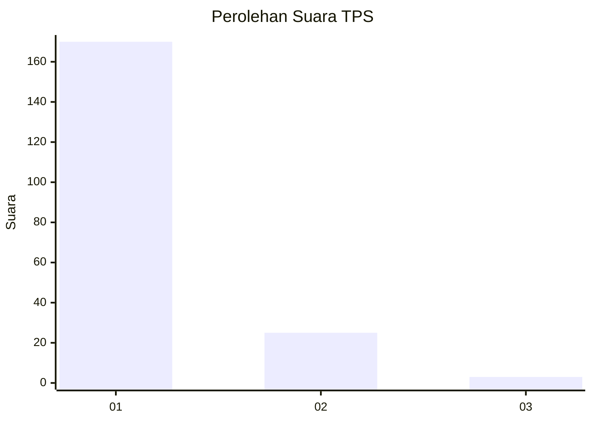
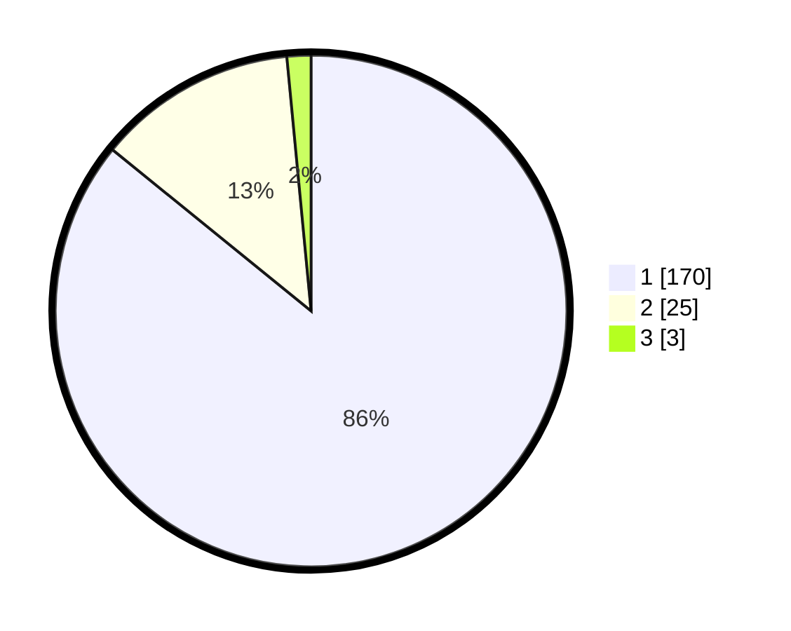

# Hasil

## Grafik

## Tabel

| No. | Nama Paslon    | Suara | Suara (raw) | Persentase |
|:--- |:-------------- | -----:| -----------:| ----------:|
| 1   | ANIES MUHAIMIN | 170   | [170][p-1]  | 85,86      |
| 2   | PRABOWO GIBRAN | 25    | [25][p-2]   | 12,63      |
| 3   | GANJAR MAHFUD  | 3     | [3][p-3]    | 1,52       |

[p-1]: https://github.com/gigit-pemilu/pemilu-2024-11-aceh/blob/main/pilpres/hitung-suara/sub/11-aceh/sub/08-aceh-utara/sub/01-baktiya/sub/2025-rambong-dalam/sub/003-tps/sub/paslon-1.txt
[p-2]: https://github.com/gigit-pemilu/pemilu-2024-11-aceh/blob/main/pilpres/hitung-suara/sub/11-aceh/sub/08-aceh-utara/sub/01-baktiya/sub/2025-rambong-dalam/sub/003-tps/sub/paslon-2.txt
[p-3]: https://github.com/gigit-pemilu/pemilu-2024-11-aceh/blob/main/pilpres/hitung-suara/sub/11-aceh/sub/08-aceh-utara/sub/01-baktiya/sub/2025-rambong-dalam/sub/003-tps/sub/paslon-3.txt

## Foto C Plano

https://sirekap-obj-formc.kpu.go.id/4c71/pemilu/ppwp/11/08/01/20/25/1108012025003-20240219-202655--3ff9e740-ca78-4a61-95d2-e0c00f9cacd8.jpg

https://sirekap-obj-formc.kpu.go.id/4c71/pemilu/ppwp/11/08/01/20/25/1108012025003-20240219-202352--637f9c8c-cff1-4922-830c-26ecedcafc4e.jpg

https://sirekap-obj-formc.kpu.go.id/4c71/pemilu/ppwp/11/08/01/20/25/1108012025003-20240219-202539--3aee7000-2bb9-4522-bea8-d1169cbd5a2b.jpg

## Metadata

| Key        | Value               |
| ---------- | ------------------- |
| Time Stamp | 2024-02-21 10:00:00 |

