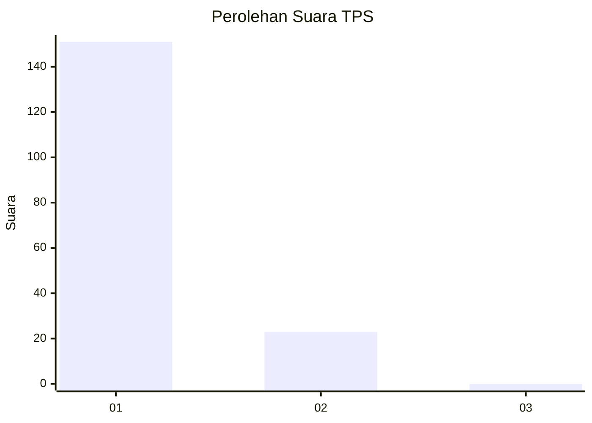
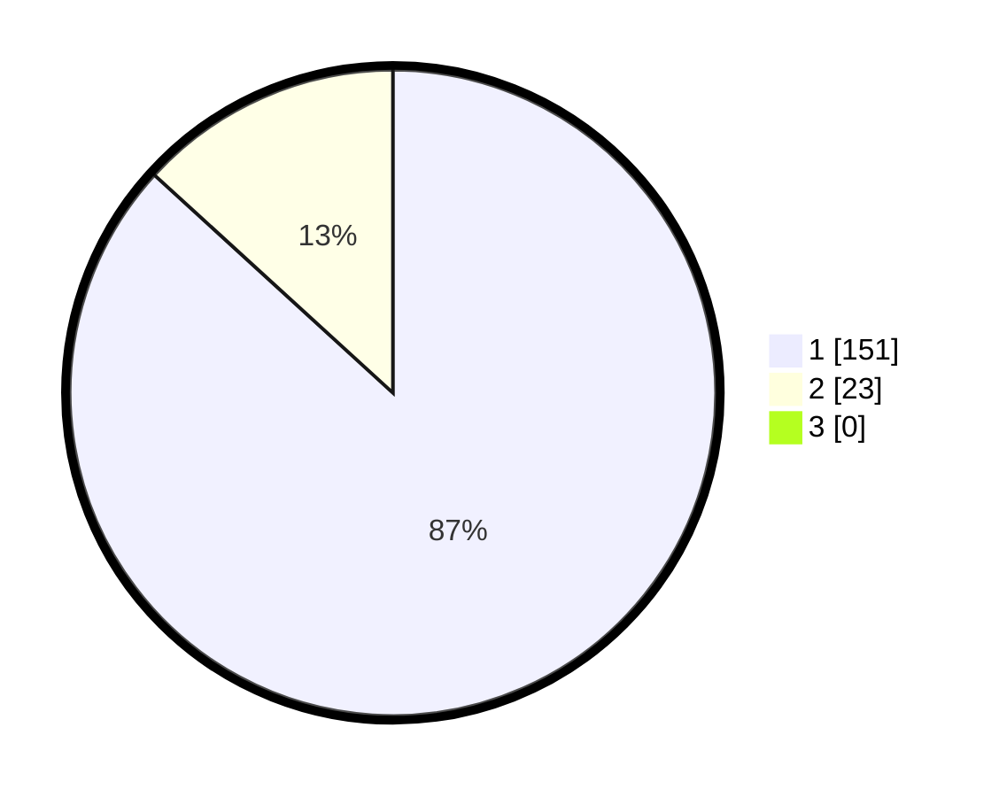

# Hasil

## Grafik

## Tabel

| No. | Nama Paslon    | Suara | Suara (raw) | Persentase |
|:--- |:-------------- | -----:| -----------:| ----------:|
| 1   | ANIES MUHAIMIN | 151   | [151][p-1]  | 86,78      |
| 2   | PRABOWO GIBRAN | 23    | [23][p-2]   | 13,22      |
| 3   | GANJAR MAHFUD  | 0     | [0][p-3]    | 0,00       |

[p-1]: https://github.com/gigit-pemilu/pemilu-2024-11-aceh/blob/main/pilpres/hitung-suara/sub/11-aceh/sub/08-aceh-utara/sub/01-baktiya/sub/2026-meunasah-geudong/sub/001-tps/sub/paslon-1.txt
[p-2]: https://github.com/gigit-pemilu/pemilu-2024-11-aceh/blob/main/pilpres/hitung-suara/sub/11-aceh/sub/08-aceh-utara/sub/01-baktiya/sub/2026-meunasah-geudong/sub/001-tps/sub/paslon-2.txt
[p-3]: https://github.com/gigit-pemilu/pemilu-2024-11-aceh/blob/main/pilpres/hitung-suara/sub/11-aceh/sub/08-aceh-utara/sub/01-baktiya/sub/2026-meunasah-geudong/sub/001-tps/sub/paslon-3.txt

## Foto C Plano

https://sirekap-obj-formc.kpu.go.id/7a80/pemilu/ppwp/11/08/01/20/26/1108012026001-20240223-231258--00b8277d-46af-4945-b7a4-eb07e6cc95d0.jpg

https://sirekap-obj-formc.kpu.go.id/7a80/pemilu/ppwp/11/08/01/20/26/1108012026001-20240223-232649--6035fe03-8c70-46c6-b3ab-2bfbddd07053.jpg

https://sirekap-obj-formc.kpu.go.id/7a80/pemilu/ppwp/11/08/01/20/26/1108012026001-20240215-151439--250904ce-dced-40f9-9ff2-d9ab814f7f98.jpg

## Metadata

| Key        | Value               |
| ---------- | ------------------- |
| Time Stamp | 2024-02-24 22:31:28 |

