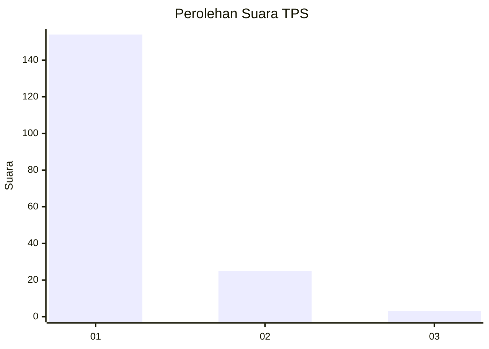
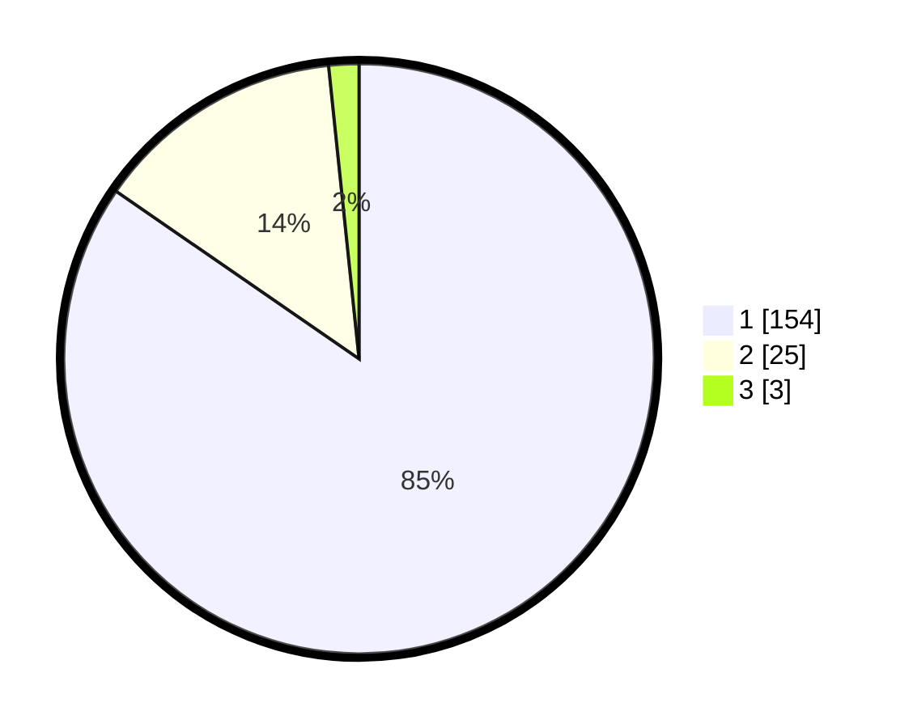

# Hasil

## Grafik

## Tabel

| No. | Nama Paslon    | Suara | Suara (raw) | Persentase |
|:--- |:-------------- | -----:| -----------:| ----------:|
| 1   | ANIES MUHAIMIN | 154   | [154][p-1]  | 84,62      |
| 2   | PRABOWO GIBRAN | 25    | [25][p-2]   | 13,74      |
| 3   | GANJAR MAHFUD  | 3     | [3][p-3]    | 1,65       |

[p-1]: https://github.com/gigit-pemilu/pemilu-2024-11-aceh/blob/main/pilpres/hitung-suara/sub/11-aceh/sub/08-aceh-utara/sub/01-baktiya/sub/2026-meunasah-geudong/sub/002-tps/sub/paslon-1.txt
[p-2]: https://github.com/gigit-pemilu/pemilu-2024-11-aceh/blob/main/pilpres/hitung-suara/sub/11-aceh/sub/08-aceh-utara/sub/01-baktiya/sub/2026-meunasah-geudong/sub/002-tps/sub/paslon-2.txt
[p-3]: https://github.com/gigit-pemilu/pemilu-2024-11-aceh/blob/main/pilpres/hitung-suara/sub/11-aceh/sub/08-aceh-utara/sub/01-baktiya/sub/2026-meunasah-geudong/sub/002-tps/sub/paslon-3.txt

## Foto C Plano

https://sirekap-obj-formc.kpu.go.id/7723/pemilu/ppwp/11/08/01/20/26/1108012026002-20240215-133035--6afb9e60-537c-41fe-a2a2-0f5319f99055.jpg

https://sirekap-obj-formc.kpu.go.id/7723/pemilu/ppwp/11/08/01/20/26/1108012026002-20240215-133134--d6fc7a8c-3463-4b2d-bea8-66ea0f06ca74.jpg

https://sirekap-obj-formc.kpu.go.id/7723/pemilu/ppwp/11/08/01/20/26/1108012026002-20240215-133225--7e37f249-2ee1-48b2-9032-9414d9222c0d.jpg

## Metadata

| Key        | Value               |
| ---------- | ------------------- |
| Time Stamp | 2024-02-15 19:30:26 |

