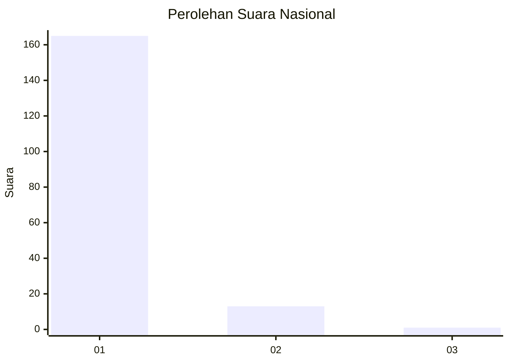
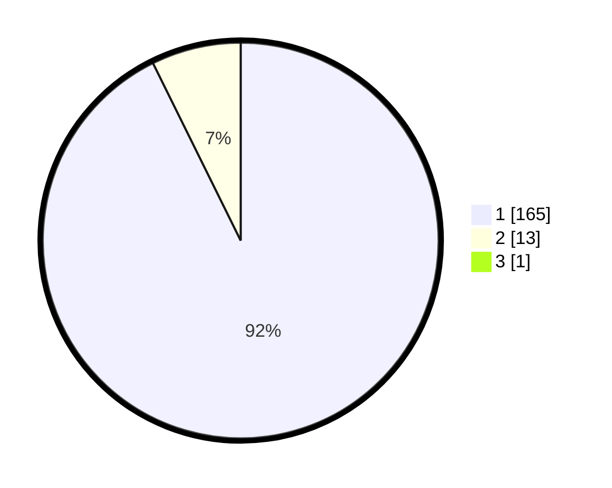

# Hasil

## Grafik

## Tabel

| No. | Nama Paslon    | Suara | Suara (raw) | Persentase |
|:--- |:-------------- | -----:| -----------:| ----------:|
| 1   | ANIES MUHAIMIN | 165   | [165][p-1]  | 92,18      |
| 2   | PRABOWO GIBRAN | 13    | [13][p-2]   | 7,26       |
| 3   | GANJAR MAHFUD  | 1     | [1][p-3]    | 0,56       |

[p-1]: https://github.com/gigit-pemilu/pemilu-2024/blob/main/pilpres/hitung-suara/sub/11-aceh/sub/08-aceh-utara/sub/01-baktiya/sub/2026-meunasah-geudong/sub/004-tps/sub/paslon-1.txt
[p-2]: https://github.com/gigit-pemilu/pemilu-2024/blob/main/pilpres/hitung-suara/sub/11-aceh/sub/08-aceh-utara/sub/01-baktiya/sub/2026-meunasah-geudong/sub/004-tps/sub/paslon-2.txt
[p-3]: https://github.com/gigit-pemilu/pemilu-2024/blob/main/pilpres/hitung-suara/sub/11-aceh/sub/08-aceh-utara/sub/01-baktiya/sub/2026-meunasah-geudong/sub/004-tps/sub/paslon-3.txt

## Foto C Plano

https://sirekap-obj-formc.kpu.go.id/94e1/pemilu/ppwp/11/08/01/20/26/1108012026004-20240215-151735--11ba784c-4a46-4933-b661-388c20a52204.jpg

https://sirekap-obj-formc.kpu.go.id/94e1/pemilu/ppwp/11/08/01/20/26/1108012026004-20240215-151845--0314637c-1a5b-41dd-90b5-944ed85d6924.jpg

https://sirekap-obj-formc.kpu.go.id/94e1/pemilu/ppwp/11/08/01/20/26/1108012026004-20240215-152003--f49a4db8-6e81-4ea7-a62c-53327fdfc3f3.jpg

## Metadata

| Key        | Value               |
| ---------- | ------------------- |
| Time Stamp | 2024-02-16 23:00:00 |

