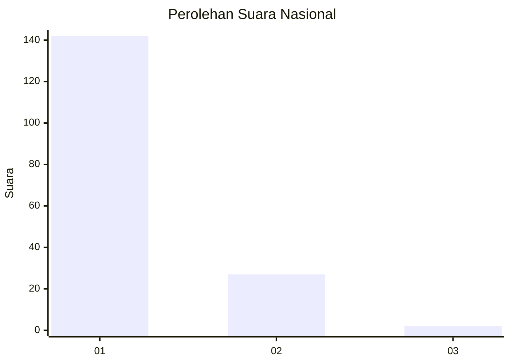
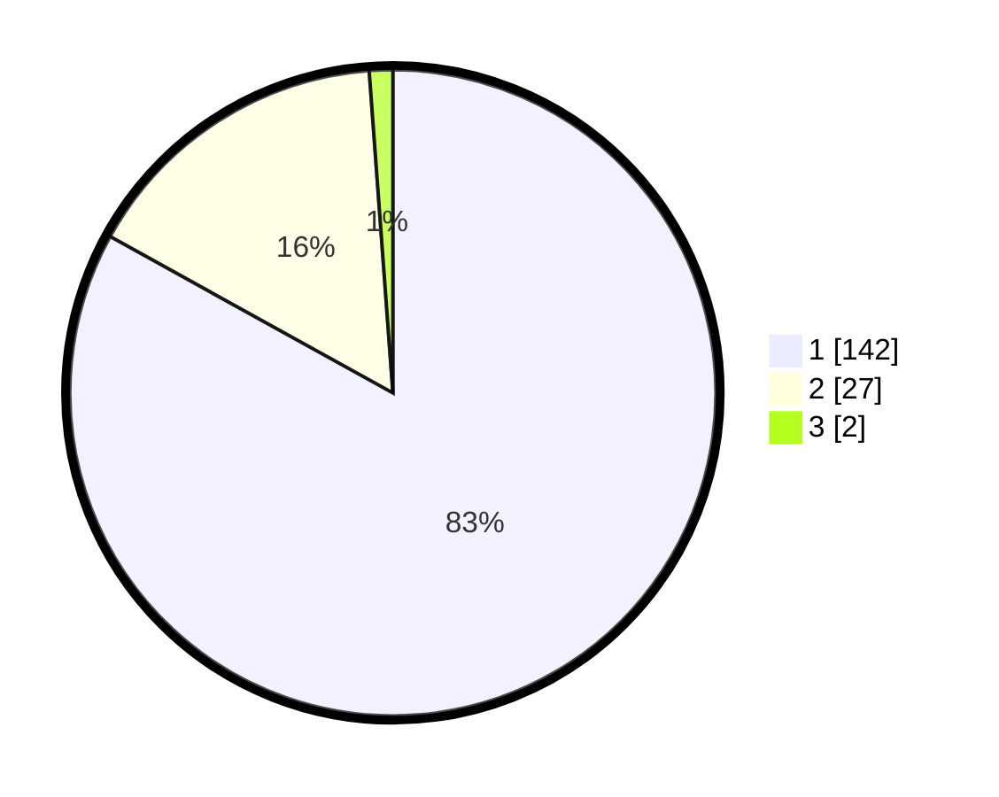

# Hasil

## Grafik

## Tabel

| No. | Nama Paslon    | Suara | Suara (raw) | Persentase |
|:--- |:-------------- | -----:| -----------:| ----------:|
| 1   | ANIES MUHAIMIN | 142   | [142][p-1]  | 83,04      |
| 2   | PRABOWO GIBRAN | 27    | [27][p-2]   | 15,79      |
| 3   | GANJAR MAHFUD  | 2     | [2][p-3]    | 1,17       |

[p-1]: https://github.com/gigit-pemilu/pemilu-2024/blob/main/pilpres/hitung-suara/sub/11-aceh/sub/08-aceh-utara/sub/01-baktiya/sub/2028-krueng-lingka-barat/sub/002-tps/sub/paslon-1.txt
[p-2]: https://github.com/gigit-pemilu/pemilu-2024/blob/main/pilpres/hitung-suara/sub/11-aceh/sub/08-aceh-utara/sub/01-baktiya/sub/2028-krueng-lingka-barat/sub/002-tps/sub/paslon-2.txt
[p-3]: https://github.com/gigit-pemilu/pemilu-2024/blob/main/pilpres/hitung-suara/sub/11-aceh/sub/08-aceh-utara/sub/01-baktiya/sub/2028-krueng-lingka-barat/sub/002-tps/sub/paslon-3.txt

## Foto C Plano

https://sirekap-obj-formc.kpu.go.id/9b86/pemilu/ppwp/11/08/01/20/28/1108012028002-20240215-114140--22ab36a1-e2cd-4d64-adb1-73ddc126d1d0.jpg

https://sirekap-obj-formc.kpu.go.id/9b86/pemilu/ppwp/11/08/01/20/28/1108012028002-20240215-114415--e95bada3-2744-408c-be17-41621e9c9b83.jpg

https://sirekap-obj-formc.kpu.go.id/9b86/pemilu/ppwp/11/08/01/20/28/1108012028002-20240215-114557--ec773d93-bc25-46bd-a3d6-0488925de471.jpg

## Metadata

| Key        | Value               |
| ---------- | ------------------- |
| Time Stamp | 2024-02-15 15:00:29 |

