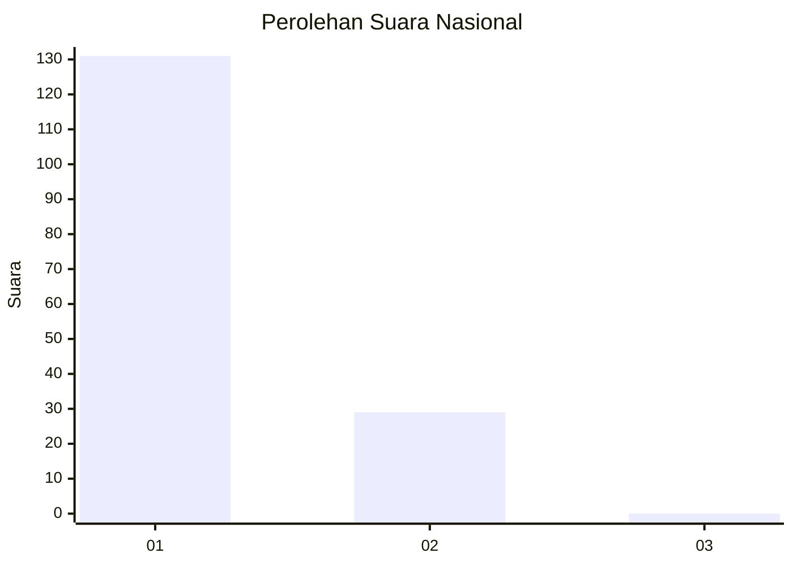
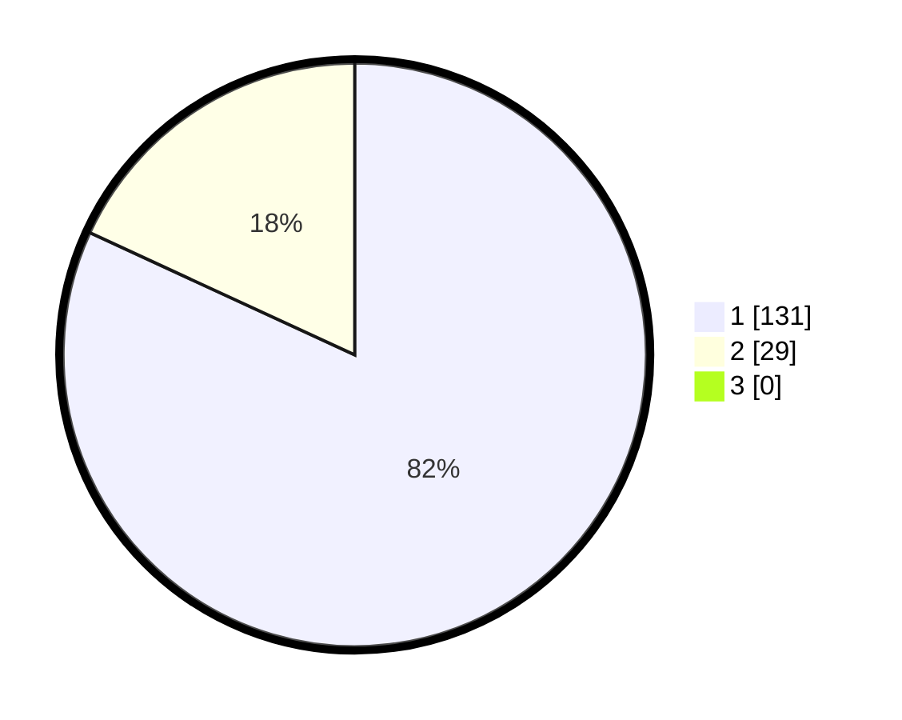

# Hasil

## Grafik

## Tabel

| No. | Nama Paslon    | Suara | Suara (raw) | Persentase |
|:--- |:-------------- | -----:| -----------:| ----------:|
| 1   | ANIES MUHAIMIN | 131   | [131][p-1]  | 81,88      |
| 2   | PRABOWO GIBRAN | 29    | [29][p-2]   | 18,13      |
| 3   | GANJAR MAHFUD  | 0     | [0][p-3]    | 0,00       |

[p-1]: https://github.com/gigit-pemilu/pemilu-2024/blob/main/pilpres/hitung-suara/sub/11-aceh/sub/08-aceh-utara/sub/01-baktiya/sub/2028-krueng-lingka-barat/sub/003-tps/sub/paslon-1.txt
[p-2]: https://github.com/gigit-pemilu/pemilu-2024/blob/main/pilpres/hitung-suara/sub/11-aceh/sub/08-aceh-utara/sub/01-baktiya/sub/2028-krueng-lingka-barat/sub/003-tps/sub/paslon-2.txt
[p-3]: https://github.com/gigit-pemilu/pemilu-2024/blob/main/pilpres/hitung-suara/sub/11-aceh/sub/08-aceh-utara/sub/01-baktiya/sub/2028-krueng-lingka-barat/sub/003-tps/sub/paslon-3.txt

## Foto C Plano

https://sirekap-obj-formc.kpu.go.id/045a/pemilu/ppwp/11/08/01/20/28/1108012028003-20240215-113705--80431945-5761-4836-9846-7a7f0f8769fe.jpg

https://sirekap-obj-formc.kpu.go.id/045a/pemilu/ppwp/11/08/01/20/28/1108012028003-20240215-113936--c7fac398-37cc-40ed-8982-3ef52878066b.jpg

https://sirekap-obj-formc.kpu.go.id/045a/pemilu/ppwp/11/08/01/20/28/1108012028003-20240215-114107--457b5608-5811-4df9-bd92-e3b944b6ebda.jpg

## Metadata

| Key        | Value               |
| ---------- | ------------------- |
| Time Stamp | 2024-02-15 19:00:26 |

