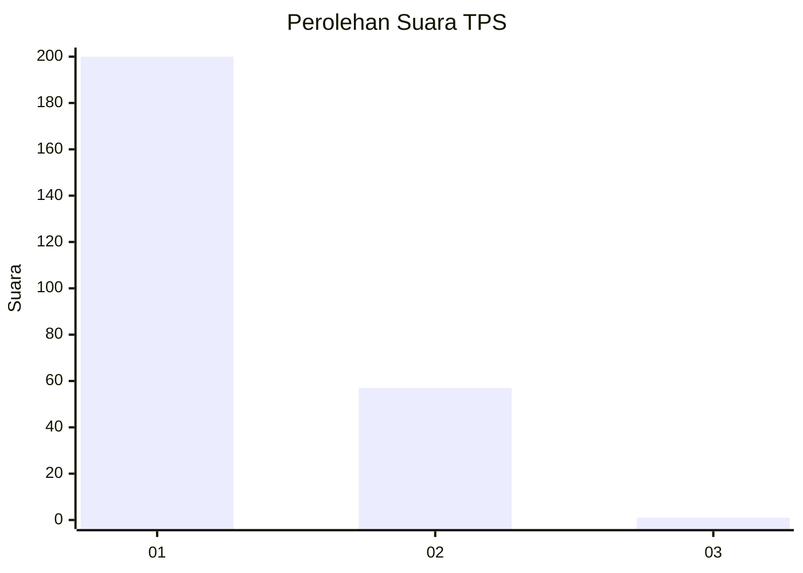
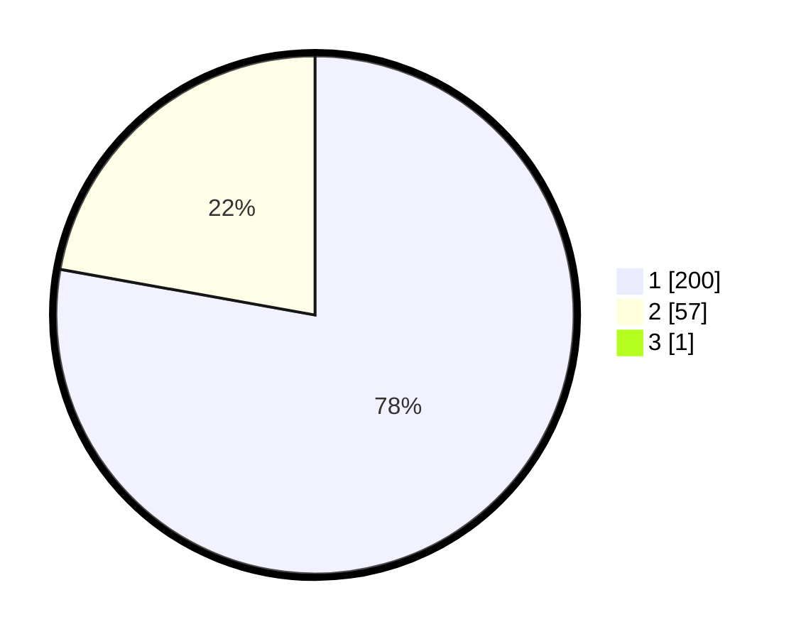

# Hasil

## Grafik

## Tabel

| No. | Nama Paslon    | Suara | Suara (raw) | Persentase |
|:--- |:-------------- | -----:| -----------:| ----------:|
| 1   | ANIES MUHAIMIN | 200   | [200][p-1]  | 77,52      |
| 2   | PRABOWO GIBRAN | 57    | [57][p-2]   | 22,09      |
| 3   | GANJAR MAHFUD  | 1     | [1][p-3]    | 0,39       |

[p-1]: https://github.com/gigit-pemilu/pemilu-2024-11-aceh/blob/main/pilpres/hitung-suara/sub/11-aceh/sub/08-aceh-utara/sub/01-baktiya/sub/2030-alue-jamok/sub/002-tps/sub/paslon-1.txt
[p-2]: https://github.com/gigit-pemilu/pemilu-2024-11-aceh/blob/main/pilpres/hitung-suara/sub/11-aceh/sub/08-aceh-utara/sub/01-baktiya/sub/2030-alue-jamok/sub/002-tps/sub/paslon-2.txt
[p-3]: https://github.com/gigit-pemilu/pemilu-2024-11-aceh/blob/main/pilpres/hitung-suara/sub/11-aceh/sub/08-aceh-utara/sub/01-baktiya/sub/2030-alue-jamok/sub/002-tps/sub/paslon-3.txt

## Foto C Plano

https://sirekap-obj-formc.kpu.go.id/38a8/pemilu/ppwp/11/08/01/20/30/1108012030002-20240221-100618--ae80e1f2-2c84-4aa7-a5f2-913e1c5b9d1c.jpg

https://sirekap-obj-formc.kpu.go.id/38a8/pemilu/ppwp/11/08/01/20/30/1108012030002-20240221-100715--15f9a6eb-f055-44a8-9734-362138229b11.jpg

https://sirekap-obj-formc.kpu.go.id/38a8/pemilu/ppwp/11/08/01/20/30/1108012030002-20240221-100831--07072109-dc26-4012-b8e5-b602a6e3c80a.jpg

## Metadata

| Key        | Value               |
| ---------- | ------------------- |
| Time Stamp | 2024-02-24 22:31:28 |

