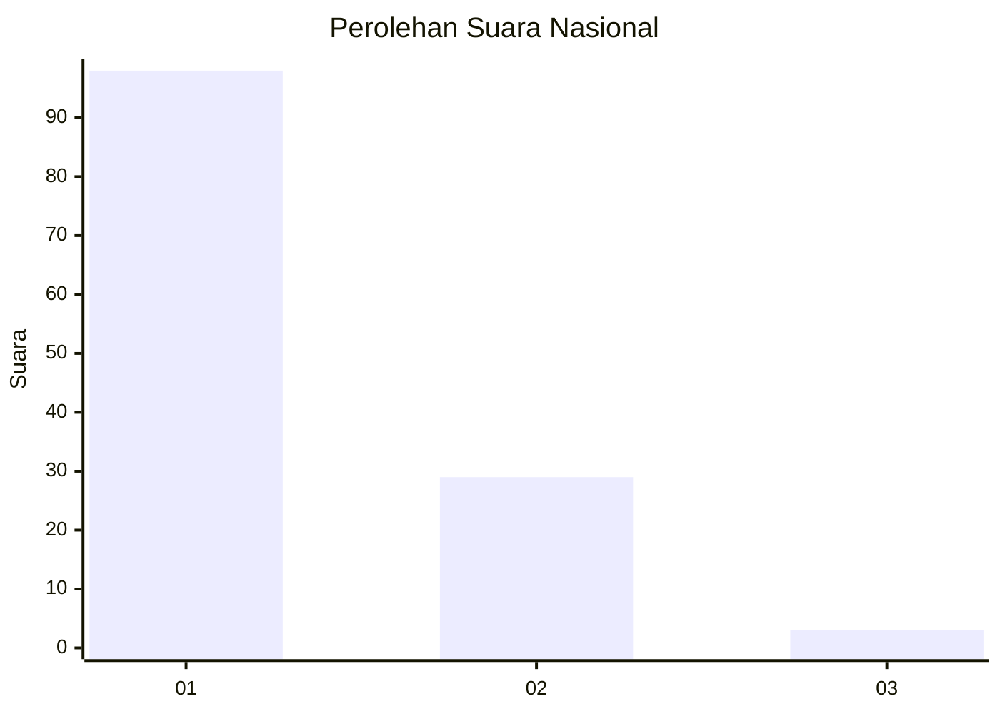
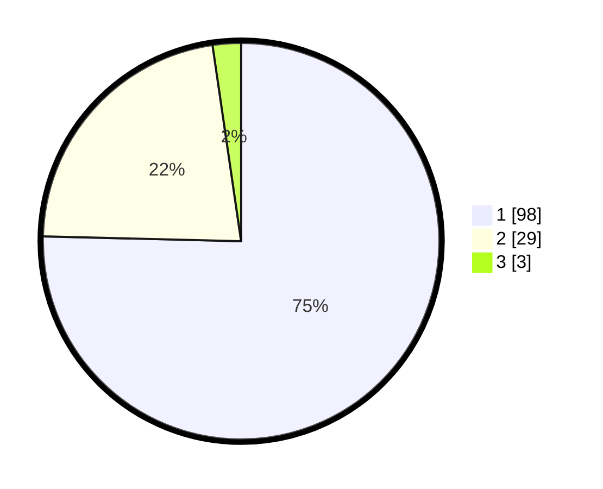

# Hasil

## Grafik

## Tabel

| No. | Nama Paslon    | Suara | Suara (raw) | Persentase |
|:--- |:-------------- | -----:| -----------:| ----------:|
| 1   | ANIES MUHAIMIN | 98    | [98][p-1]   | 75,38      |
| 2   | PRABOWO GIBRAN | 29    | [29][p-2]   | 22,31      |
| 3   | GANJAR MAHFUD  | 3     | [3][p-3]    | 2,31       |

[p-1]: https://github.com/gigit-pemilu/pemilu-2024/blob/main/pilpres/hitung-suara/sub/11-aceh/sub/08-aceh-utara/sub/01-baktiya/sub/2032-lhok-seutuy/sub/001-tps/sub/paslon-1.txt
[p-2]: https://github.com/gigit-pemilu/pemilu-2024/blob/main/pilpres/hitung-suara/sub/11-aceh/sub/08-aceh-utara/sub/01-baktiya/sub/2032-lhok-seutuy/sub/001-tps/sub/paslon-2.txt
[p-3]: https://github.com/gigit-pemilu/pemilu-2024/blob/main/pilpres/hitung-suara/sub/11-aceh/sub/08-aceh-utara/sub/01-baktiya/sub/2032-lhok-seutuy/sub/001-tps/sub/paslon-3.txt

## Foto C Plano

https://sirekap-obj-formc.kpu.go.id/94f3/pemilu/ppwp/11/08/01/20/32/1108012032001-20240221-112542--123624db-3100-4979-a911-2534c8ef4d1c.jpg

https://sirekap-obj-formc.kpu.go.id/94f3/pemilu/ppwp/11/08/01/20/32/1108012032001-20240221-113127--50f8bae7-4b17-4110-9b69-1cb5011027c4.jpg

https://sirekap-obj-formc.kpu.go.id/94f3/pemilu/ppwp/11/08/01/20/32/1108012032001-20240221-112914--eb1186e0-19d9-4780-8a91-748056bce999.jpg

## Metadata

| Key        | Value               |
| ---------- | ------------------- |
| Time Stamp | 2024-02-21 12:00:00 |

## DATA PEMILIH TETAP

Jumlah pemilih dalam DPT: **351**.
 * L: **711**.
 * P: **819**.

## DATA PENGGUNA HAK PILIH

Jumlah pengguna hak pilih dalam DPT: **244**.
 * L: **114**.
 * P: **135**.

Jumlah pengguna hak pilih dalam DPTb: **50**.
 * L: **0**.
 * P: **8**.

Jumlah pengguna hak pilih dalam DPK: **0**.
 * L: **0**.
 * P: **0**.

Jumlah pengguna hak pilih: **299**.
 * L: **114**.
 * P: **130**.

## JUMLAH SUARA SAH DAN TIDAK SAH

JUMLAH SELURUH SUARA SAH: **240**.

JUMLAH SUARA TIDAK SAH: **4**.

JUMLAH SELURUH SUARA SAH DAN SUARA TIDAK SAH: **244**.

