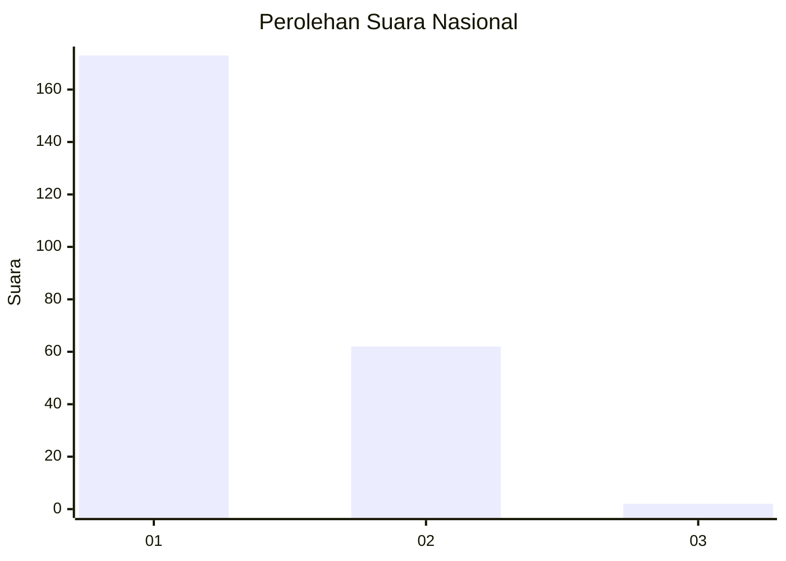
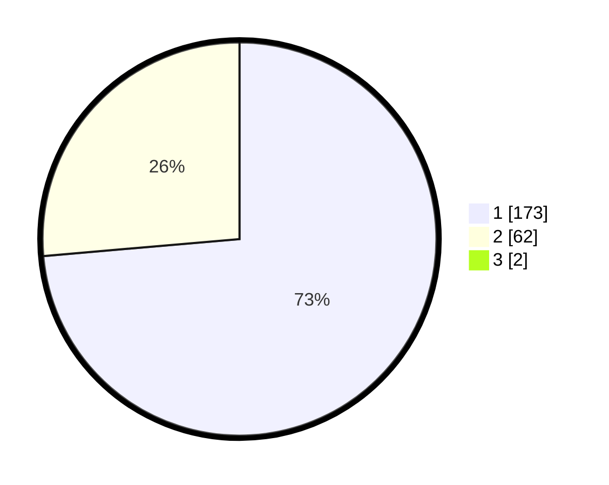

# Hasil

## Grafik

## Tabel

| No. | Nama Paslon    | Suara | Suara (raw) | Persentase |
|:--- |:-------------- | -----:| -----------:| ----------:|
| 1   | ANIES MUHAIMIN | 173   | [173][p-1]  | 73,00      |
| 2   | PRABOWO GIBRAN | 62    | [62][p-2]   | 26,16      |
| 3   | GANJAR MAHFUD  | 2     | [2][p-3]    | 0,84       |

[p-1]: https://github.com/gigit-pemilu/pemilu-2024/blob/main/pilpres/hitung-suara/sub/11-aceh/sub/08-aceh-utara/sub/01-baktiya/sub/2032-lhok-seutuy/sub/002-tps/sub/paslon-1.txt
[p-2]: https://github.com/gigit-pemilu/pemilu-2024/blob/main/pilpres/hitung-suara/sub/11-aceh/sub/08-aceh-utara/sub/01-baktiya/sub/2032-lhok-seutuy/sub/002-tps/sub/paslon-2.txt
[p-3]: https://github.com/gigit-pemilu/pemilu-2024/blob/main/pilpres/hitung-suara/sub/11-aceh/sub/08-aceh-utara/sub/01-baktiya/sub/2032-lhok-seutuy/sub/002-tps/sub/paslon-3.txt

## Foto C Plano

https://sirekap-obj-formc.kpu.go.id/45c5/pemilu/ppwp/11/08/01/20/32/1108012032002-20240221-161320--7024c88e-28f5-418f-9e33-cec98eacf602.jpg

https://sirekap-obj-formc.kpu.go.id/45c5/pemilu/ppwp/11/08/01/20/32/1108012032002-20240221-161647--93f41fa4-487e-4d83-91f0-24b6f1cca186.jpg

https://sirekap-obj-formc.kpu.go.id/45c5/pemilu/ppwp/11/08/01/20/32/1108012032002-20240221-161852--609385f3-b989-4fa5-a023-03fbb4cecb91.jpg

## Metadata

| Key        | Value               |
| ---------- | ------------------- |
| Time Stamp | 2024-02-24 22:31:28 |

