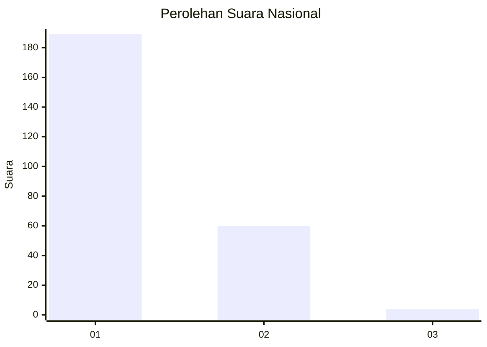
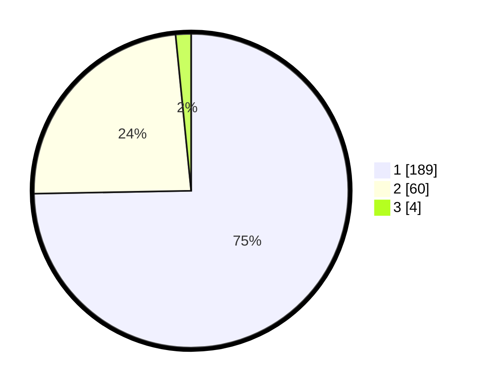

# Hasil

## Grafik

## Tabel

| No. | Nama Paslon    | Suara | Suara (raw) | Persentase |
|:--- |:-------------- | -----:| -----------:| ----------:|
| 1   | ANIES MUHAIMIN | 189   | [189][p-1]  | 74,70      |
| 2   | PRABOWO GIBRAN | 60    | [60][p-2]   | 23,72      |
| 3   | GANJAR MAHFUD  | 4     | [4][p-3]    | 1,58       |

[p-1]: https://github.com/gigit-pemilu/pemilu-2024/blob/main/pilpres/hitung-suara/sub/11-aceh/sub/08-aceh-utara/sub/01-baktiya/sub/2032-lhok-seutuy/sub/003-tps/sub/paslon-1.txt
[p-2]: https://github.com/gigit-pemilu/pemilu-2024/blob/main/pilpres/hitung-suara/sub/11-aceh/sub/08-aceh-utara/sub/01-baktiya/sub/2032-lhok-seutuy/sub/003-tps/sub/paslon-2.txt
[p-3]: https://github.com/gigit-pemilu/pemilu-2024/blob/main/pilpres/hitung-suara/sub/11-aceh/sub/08-aceh-utara/sub/01-baktiya/sub/2032-lhok-seutuy/sub/003-tps/sub/paslon-3.txt

## Foto C Plano

https://sirekap-obj-formc.kpu.go.id/cd4e/pemilu/ppwp/11/08/01/20/32/1108012032003-20240221-140920--0a1b0b0a-7d3c-498b-8bb7-910642ac5270.jpg

https://sirekap-obj-formc.kpu.go.id/cd4e/pemilu/ppwp/11/08/01/20/32/1108012032003-20240221-141517--434695a7-c321-4dd9-8882-c5d33eb64cae.jpg

https://sirekap-obj-formc.kpu.go.id/cd4e/pemilu/ppwp/11/08/01/20/32/1108012032003-20240221-141332--0d2dfab3-ca27-47a7-afa8-8b1b21c2eacd.jpg

## Metadata

| Key        | Value               |
| ---------- | ------------------- |
| Time Stamp | 2024-02-25 22:00:00 |

