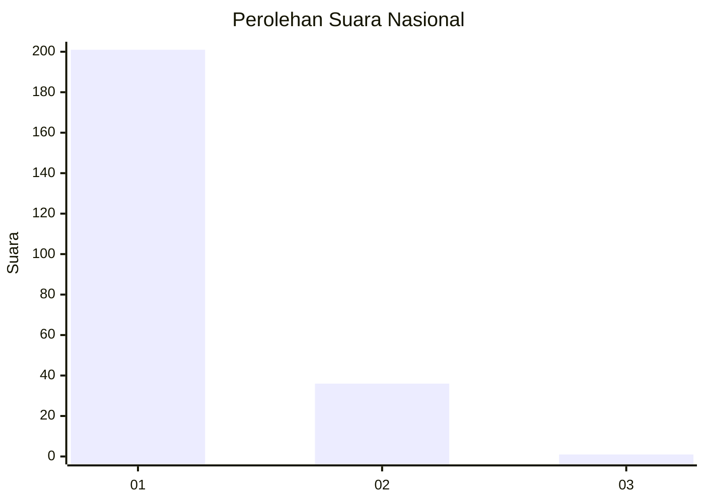
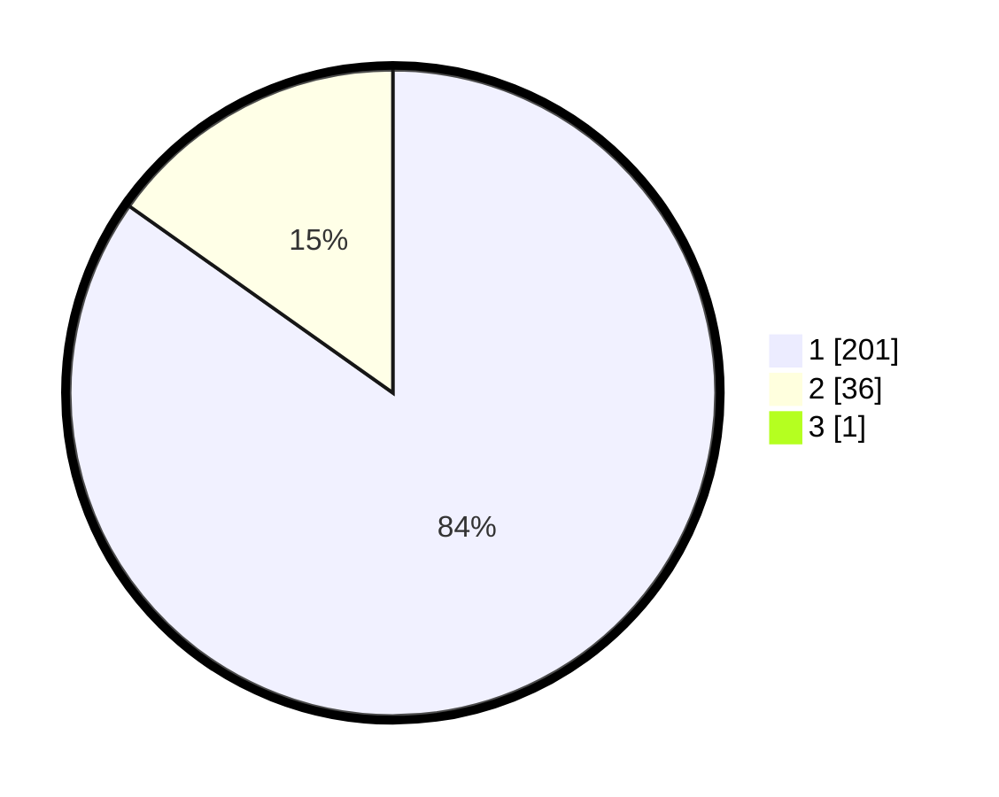

# Hasil

## Grafik

## Tabel

| No. | Nama Paslon    | Suara | Suara (raw) | Persentase |
|:--- |:-------------- | -----:| -----------:| ----------:|
| 1   | ANIES MUHAIMIN | 201   | [201][p-1]  | 84,45      |
| 2   | PRABOWO GIBRAN | 36    | [36][p-2]   | 15,13      |
| 3   | GANJAR MAHFUD  | 1     | [1][p-3]    | 0,42       |

[p-1]: https://github.com/gigit-pemilu/pemilu-2024/blob/main/pilpres/hitung-suara/sub/11-aceh/sub/08-aceh-utara/sub/01-baktiya/sub/2032-lhok-seutuy/sub/004-tps/sub/paslon-1.txt
[p-2]: https://github.com/gigit-pemilu/pemilu-2024/blob/main/pilpres/hitung-suara/sub/11-aceh/sub/08-aceh-utara/sub/01-baktiya/sub/2032-lhok-seutuy/sub/004-tps/sub/paslon-2.txt
[p-3]: https://github.com/gigit-pemilu/pemilu-2024/blob/main/pilpres/hitung-suara/sub/11-aceh/sub/08-aceh-utara/sub/01-baktiya/sub/2032-lhok-seutuy/sub/004-tps/sub/paslon-3.txt

## Foto C Plano

https://sirekap-obj-formc.kpu.go.id/538d/pemilu/ppwp/11/08/01/20/32/1108012032004-20240221-145219--35a7f1fc-b983-488d-81e6-1457cb945623.jpg

https://sirekap-obj-formc.kpu.go.id/538d/pemilu/ppwp/11/08/01/20/32/1108012032004-20240221-144204--ad63422c-ce93-49f3-a92b-5979f1e95989.jpg

https://sirekap-obj-formc.kpu.go.id/538d/pemilu/ppwp/11/08/01/20/32/1108012032004-20240221-144303--a4b17f15-7074-425b-a79a-d193a2931972.jpg

## Metadata

| Key        | Value               |
| ---------- | ------------------- |
| Time Stamp | 2024-02-24 22:31:28 |

