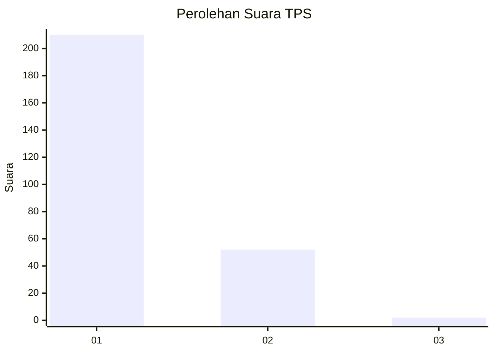
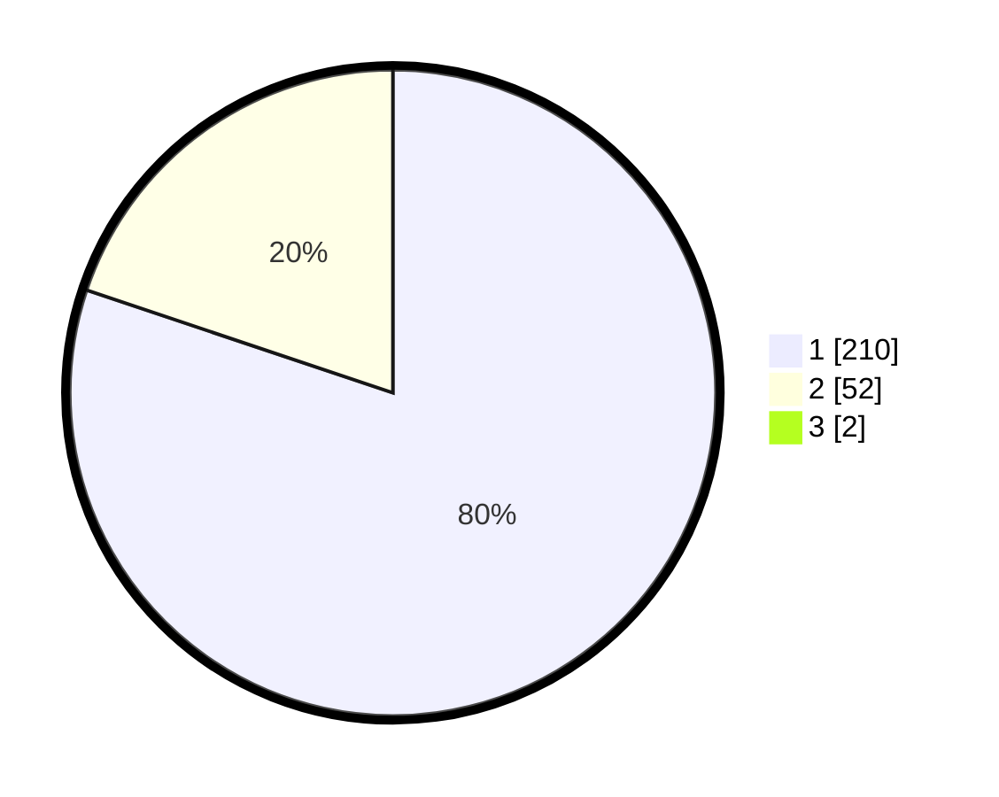

# Hasil

## Grafik

## Tabel

| No. | Nama Paslon    | Suara | Suara (raw) | Persentase |
|:--- |:-------------- | -----:| -----------:| ----------:|
| 1   | ANIES MUHAIMIN | 210   | [210][p-1]  | 79,55      |
| 2   | PRABOWO GIBRAN | 52    | [52][p-2]   | 19,70      |
| 3   | GANJAR MAHFUD  | 2     | [2][p-3]    | 0,76       |

[p-1]: https://github.com/gigit-pemilu/pemilu-2024-11-aceh/blob/main/pilpres/hitung-suara/sub/11-aceh/sub/08-aceh-utara/sub/01-baktiya/sub/2033-alue-bili-rayeuk/sub/001-tps/sub/paslon-1.txt
[p-2]: https://github.com/gigit-pemilu/pemilu-2024-11-aceh/blob/main/pilpres/hitung-suara/sub/11-aceh/sub/08-aceh-utara/sub/01-baktiya/sub/2033-alue-bili-rayeuk/sub/001-tps/sub/paslon-2.txt
[p-3]: https://github.com/gigit-pemilu/pemilu-2024-11-aceh/blob/main/pilpres/hitung-suara/sub/11-aceh/sub/08-aceh-utara/sub/01-baktiya/sub/2033-alue-bili-rayeuk/sub/001-tps/sub/paslon-3.txt

## Foto C Plano

https://sirekap-obj-formc.kpu.go.id/9e20/pemilu/ppwp/11/08/01/20/33/1108012033001-20240221-154455--9f93cb1c-a2d9-4a2c-af4a-a32a34008399.jpg

https://sirekap-obj-formc.kpu.go.id/9e20/pemilu/ppwp/11/08/01/20/33/1108012033001-20240221-154753--69ea2b0a-6189-43f8-80bb-aacdb9a709b6.jpg

https://sirekap-obj-formc.kpu.go.id/9e20/pemilu/ppwp/11/08/01/20/33/1108012033001-20240221-154912--5fa0afab-fd1e-4081-aedb-350846905954.jpg

## Metadata

| Key        | Value               |
| ---------- | ------------------- |
| Time Stamp | 2024-02-24 22:31:28 |

