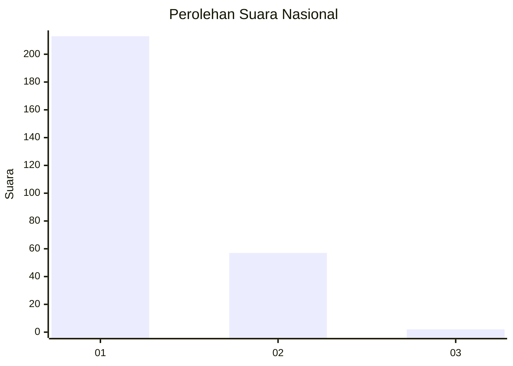
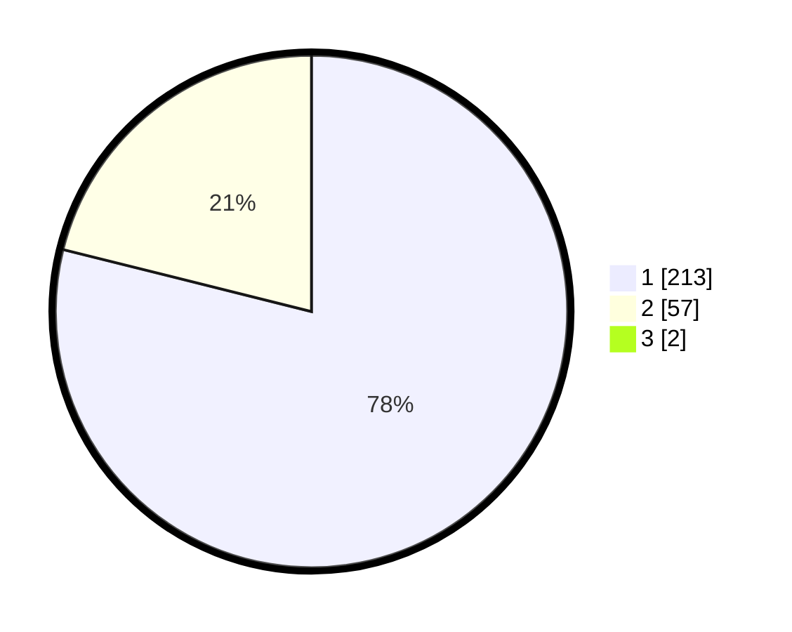

# Hasil

## Grafik

## Tabel

| No. | Nama Paslon    | Suara | Suara (raw) | Persentase |
|:--- |:-------------- | -----:| -----------:| ----------:|
| 1   | ANIES MUHAIMIN | 213   | [213][p-1]  | 78,31      |
| 2   | PRABOWO GIBRAN | 57    | [57][p-2]   | 20,96      |
| 3   | GANJAR MAHFUD  | 2     | [2][p-3]    | 0,74       |

[p-1]: https://github.com/gigit-pemilu/pemilu-2024/blob/main/pilpres/hitung-suara/sub/11-aceh/sub/08-aceh-utara/sub/01-baktiya/sub/2033-alue-bili-rayeuk/sub/003-tps/sub/paslon-1.txt
[p-2]: https://github.com/gigit-pemilu/pemilu-2024/blob/main/pilpres/hitung-suara/sub/11-aceh/sub/08-aceh-utara/sub/01-baktiya/sub/2033-alue-bili-rayeuk/sub/003-tps/sub/paslon-2.txt
[p-3]: https://github.com/gigit-pemilu/pemilu-2024/blob/main/pilpres/hitung-suara/sub/11-aceh/sub/08-aceh-utara/sub/01-baktiya/sub/2033-alue-bili-rayeuk/sub/003-tps/sub/paslon-3.txt

## Foto C Plano

https://sirekap-obj-formc.kpu.go.id/faef/pemilu/ppwp/11/08/01/20/33/1108012033003-20240221-170347--021ae444-5a04-4c38-b0a4-38ad2751e8f1.jpg

https://sirekap-obj-formc.kpu.go.id/faef/pemilu/ppwp/11/08/01/20/33/1108012033003-20240221-170511--07b0cd7c-bf1e-42cc-bfd1-53db2290e8c1.jpg

https://sirekap-obj-formc.kpu.go.id/faef/pemilu/ppwp/11/08/01/20/33/1108012033003-20240221-170705--39037501-8fbf-4145-8432-8a4853f98d57.jpg

## Metadata

| Key        | Value               |
| ---------- | ------------------- |
| Time Stamp | 2024-02-24 22:31:28 |

