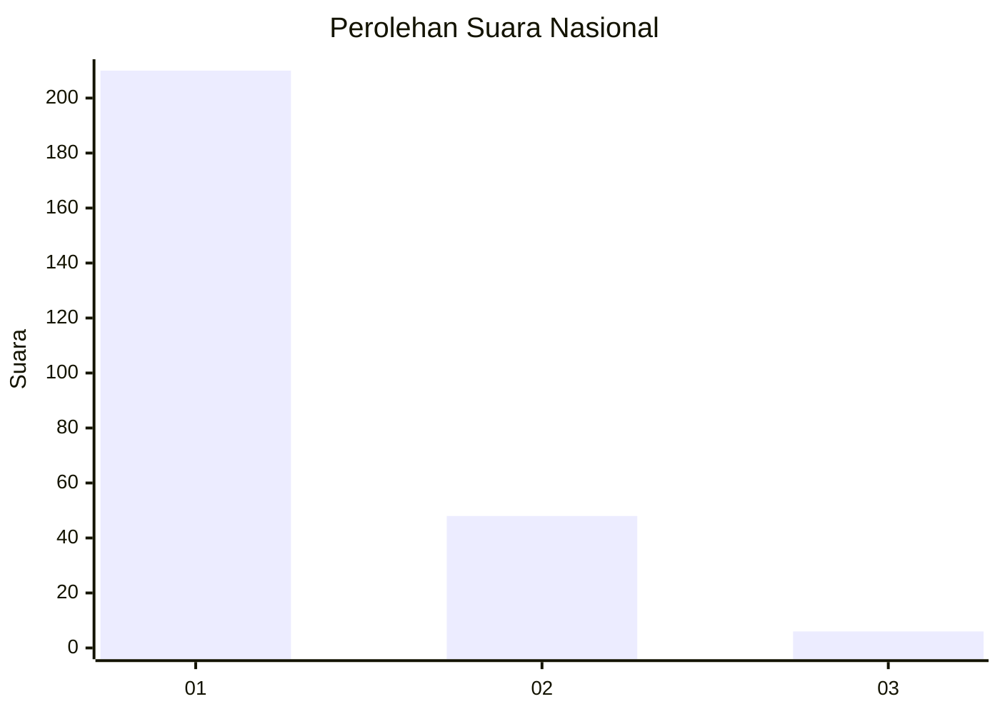
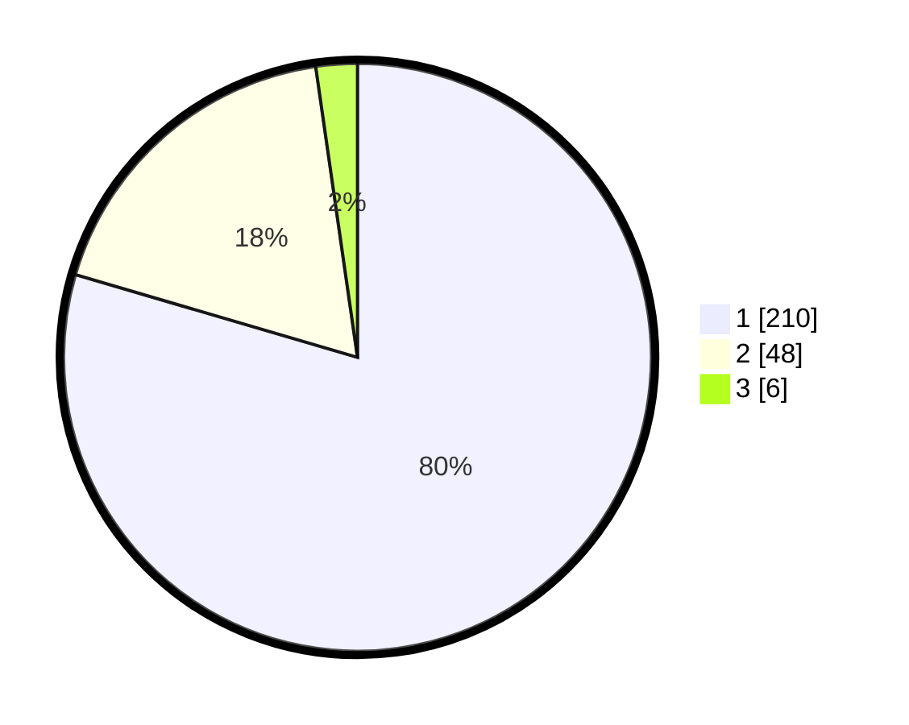

# Hasil

## Grafik

## Tabel

| No. | Nama Paslon    | Suara | Suara (raw) | Persentase |
|:--- |:-------------- | -----:| -----------:| ----------:|
| 1   | ANIES MUHAIMIN | 210   | [210][p-1]  | 79,55      |
| 2   | PRABOWO GIBRAN | 48    | [48][p-2]   | 18,18      |
| 3   | GANJAR MAHFUD  | 6     | [6][p-3]    | 2,27       |

[p-1]: https://github.com/gigit-pemilu/pemilu-2024/blob/main/pilpres/hitung-suara/sub/11-aceh/sub/08-aceh-utara/sub/01-baktiya/sub/2033-alue-bili-rayeuk/sub/004-tps/sub/paslon-1.txt
[p-2]: https://github.com/gigit-pemilu/pemilu-2024/blob/main/pilpres/hitung-suara/sub/11-aceh/sub/08-aceh-utara/sub/01-baktiya/sub/2033-alue-bili-rayeuk/sub/004-tps/sub/paslon-2.txt
[p-3]: https://github.com/gigit-pemilu/pemilu-2024/blob/main/pilpres/hitung-suara/sub/11-aceh/sub/08-aceh-utara/sub/01-baktiya/sub/2033-alue-bili-rayeuk/sub/004-tps/sub/paslon-3.txt

## Foto C Plano

https://sirekap-obj-formc.kpu.go.id/6087/pemilu/ppwp/11/08/01/20/33/1108012033004-20240221-164519--b42695d4-78e4-49e7-8bc2-ab2190645e3e.jpg

https://sirekap-obj-formc.kpu.go.id/6087/pemilu/ppwp/11/08/01/20/33/1108012033004-20240221-164907--b72c65e0-5f1d-4e2e-8379-5ffc0264db6a.jpg

https://sirekap-obj-formc.kpu.go.id/6087/pemilu/ppwp/11/08/01/20/33/1108012033004-20240221-165025--0627f6ca-7858-42e3-80c7-8fd414c046d0.jpg

## Metadata

| Key        | Value               |
| ---------- | ------------------- |
| Time Stamp | 2024-02-24 22:31:28 |

