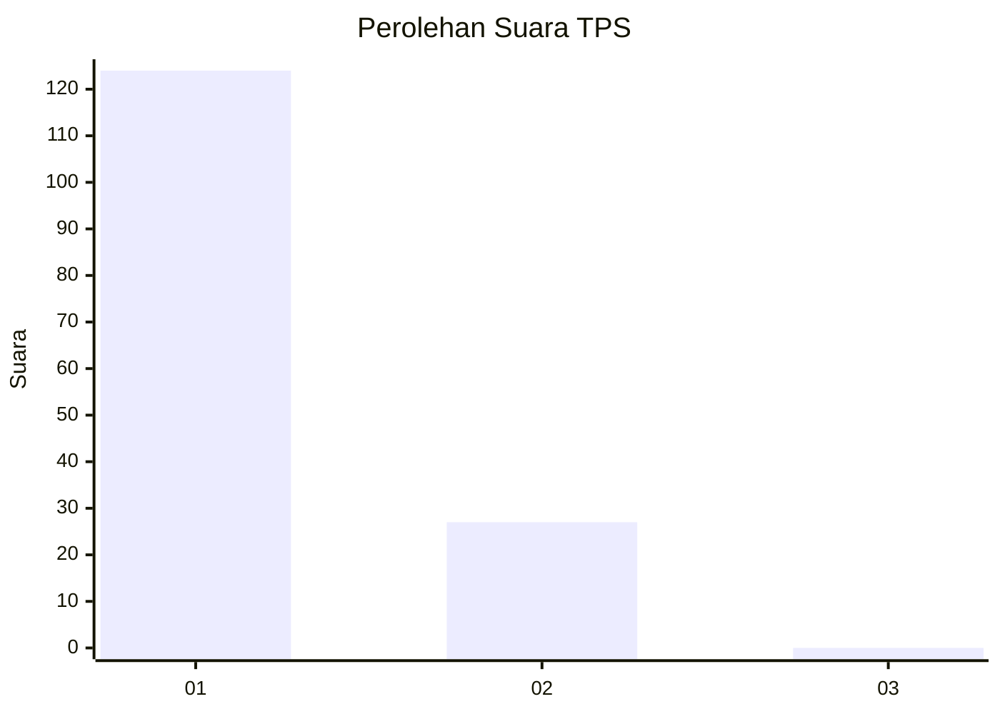
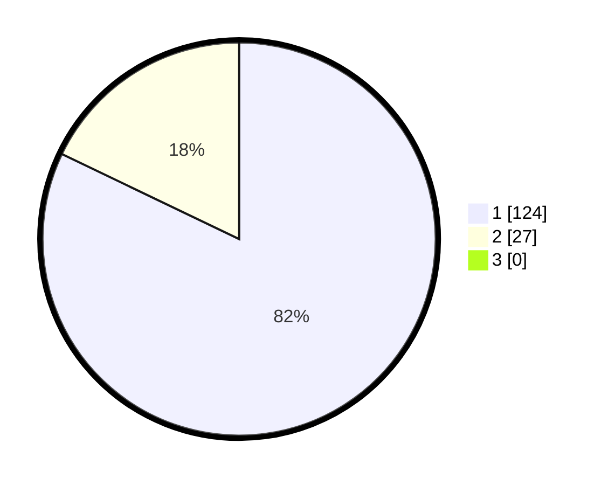

# Hasil

## Grafik

## Tabel

| No. | Nama Paslon    | Suara | Suara (raw) | Persentase |
|:--- |:-------------- | -----:| -----------:| ----------:|
| 1   | ANIES MUHAIMIN | 124   | [124][p-1]  | 82,12      |
| 2   | PRABOWO GIBRAN | 27    | [27][p-2]   | 17,88      |
| 3   | GANJAR MAHFUD  | 0     | [0][p-3]    | 0,00       |

[p-1]: https://github.com/gigit-pemilu/pemilu-2024-11-aceh/blob/main/pilpres/hitung-suara/sub/11-aceh/sub/08-aceh-utara/sub/01-baktiya/sub/2036-matang-rawa/sub/001-tps/sub/paslon-1.txt
[p-2]: https://github.com/gigit-pemilu/pemilu-2024-11-aceh/blob/main/pilpres/hitung-suara/sub/11-aceh/sub/08-aceh-utara/sub/01-baktiya/sub/2036-matang-rawa/sub/001-tps/sub/paslon-2.txt
[p-3]: https://github.com/gigit-pemilu/pemilu-2024-11-aceh/blob/main/pilpres/hitung-suara/sub/11-aceh/sub/08-aceh-utara/sub/01-baktiya/sub/2036-matang-rawa/sub/001-tps/sub/paslon-3.txt

## Foto C Plano

https://sirekap-obj-formc.kpu.go.id/ec18/pemilu/ppwp/11/08/01/20/36/1108012036001-20240220-155316--29372261-7216-402c-a996-e2758cd808cf.jpg

https://sirekap-obj-formc.kpu.go.id/ec18/pemilu/ppwp/11/08/01/20/36/1108012036001-20240220-155403--cb3c9fa2-f1be-44be-bcf4-78d8f26f6df7.jpg

https://sirekap-obj-formc.kpu.go.id/ec18/pemilu/ppwp/11/08/01/20/36/1108012036001-20240220-155434--43f9c8c9-34c3-46c6-a329-cb2cfba49b21.jpg

## Metadata

| Key        | Value               |
| ---------- | ------------------- |
| Time Stamp | 2024-02-24 22:31:28 |

