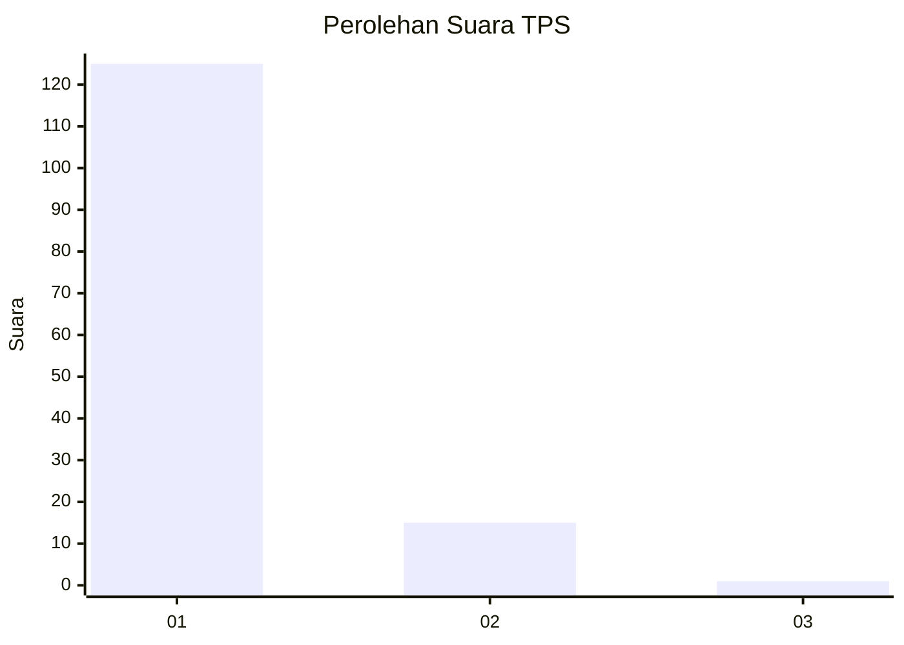
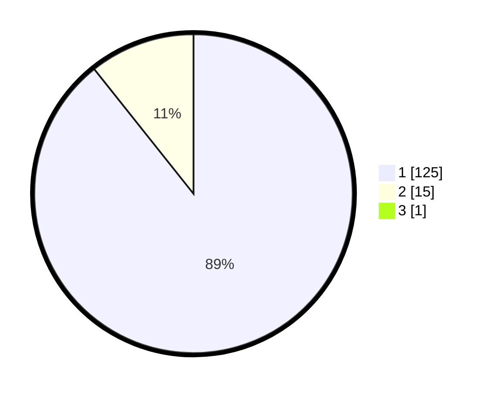

# Hasil

## Grafik

## Tabel

| No. | Nama Paslon    | Suara | Suara (raw) | Persentase |
|:--- |:-------------- | -----:| -----------:| ----------:|
| 1   | ANIES MUHAIMIN | 125   | [125][p-1]  | 88,65      |
| 2   | PRABOWO GIBRAN | 15    | [15][p-2]   | 10,64      |
| 3   | GANJAR MAHFUD  | 1     | [1][p-3]    | 0,71       |

[p-1]: https://github.com/gigit-pemilu/pemilu-2024-11-aceh/blob/main/pilpres/hitung-suara/sub/11-aceh/sub/08-aceh-utara/sub/01-baktiya/sub/2036-matang-rawa/sub/002-tps/sub/paslon-1.txt
[p-2]: https://github.com/gigit-pemilu/pemilu-2024-11-aceh/blob/main/pilpres/hitung-suara/sub/11-aceh/sub/08-aceh-utara/sub/01-baktiya/sub/2036-matang-rawa/sub/002-tps/sub/paslon-2.txt
[p-3]: https://github.com/gigit-pemilu/pemilu-2024-11-aceh/blob/main/pilpres/hitung-suara/sub/11-aceh/sub/08-aceh-utara/sub/01-baktiya/sub/2036-matang-rawa/sub/002-tps/sub/paslon-3.txt

## Foto C Plano

https://sirekap-obj-formc.kpu.go.id/a419/pemilu/ppwp/11/08/01/20/36/1108012036002-20240220-162030--2fcbeba4-5677-4275-a31d-7949c9df73cb.jpg

https://sirekap-obj-formc.kpu.go.id/a419/pemilu/ppwp/11/08/01/20/36/1108012036002-20240220-161349--ed6cb362-6f2c-4a3a-ba44-de9845c33dc7.jpg

https://sirekap-obj-formc.kpu.go.id/a419/pemilu/ppwp/11/08/01/20/36/1108012036002-20240220-161845--dd147a62-dbef-4911-8df7-65fe05269654.jpg

## Metadata

| Key        | Value               |
| ---------- | ------------------- |
| Time Stamp | 2024-02-24 22:31:28 |

