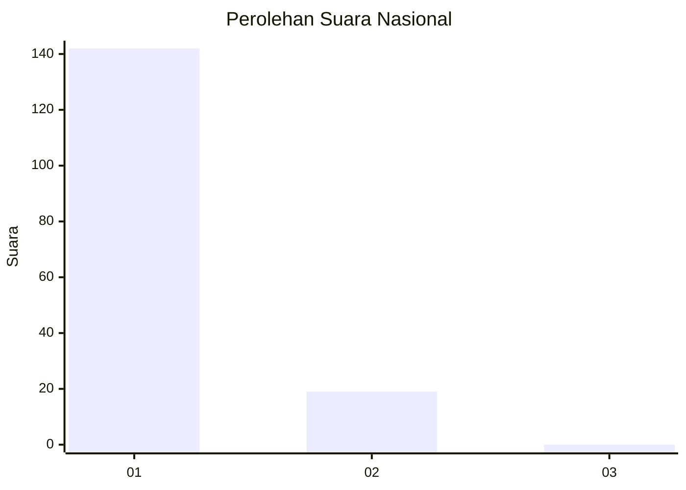
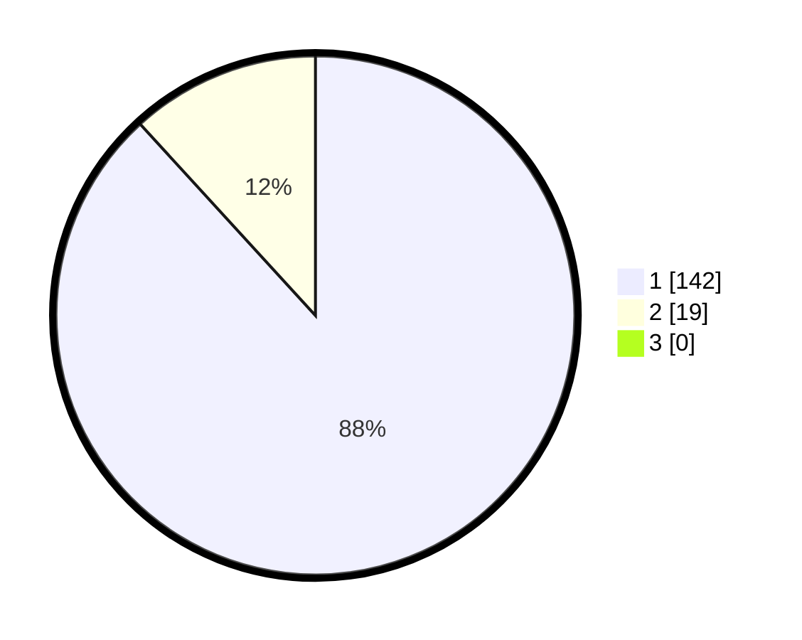

# Hasil

## Grafik

## Tabel

| No. | Nama Paslon    | Suara | Suara (raw) | Persentase |
|:--- |:-------------- | -----:| -----------:| ----------:|
| 1   | ANIES MUHAIMIN | 142   | [142][p-1]  | 88,20      |
| 2   | PRABOWO GIBRAN | 19    | [19][p-2]   | 11,80      |
| 3   | GANJAR MAHFUD  | 0     | [0][p-3]    | 0,00       |

[p-1]: https://github.com/gigit-pemilu/pemilu-2024/blob/main/pilpres/hitung-suara/sub/11-aceh/sub/08-aceh-utara/sub/01-baktiya/sub/2039-matang-reudeup/sub/001-tps/sub/paslon-1.txt
[p-2]: https://github.com/gigit-pemilu/pemilu-2024/blob/main/pilpres/hitung-suara/sub/11-aceh/sub/08-aceh-utara/sub/01-baktiya/sub/2039-matang-reudeup/sub/001-tps/sub/paslon-2.txt
[p-3]: https://github.com/gigit-pemilu/pemilu-2024/blob/main/pilpres/hitung-suara/sub/11-aceh/sub/08-aceh-utara/sub/01-baktiya/sub/2039-matang-reudeup/sub/001-tps/sub/paslon-3.txt

## Foto C Plano

https://sirekap-obj-formc.kpu.go.id/384f/pemilu/ppwp/11/08/01/20/39/1108012039001-20240223-173239--3dadc395-0ab9-4eec-899c-1a7a0c8598ae.jpg

https://sirekap-obj-formc.kpu.go.id/384f/pemilu/ppwp/11/08/01/20/39/1108012039001-20240223-174501--4c9e7841-98be-4967-b370-122aed19e33e.jpg

https://sirekap-obj-formc.kpu.go.id/384f/pemilu/ppwp/11/08/01/20/39/1108012039001-20240223-174809--0870892a-bfde-40e7-9065-0cf454a4c25f.jpg

## Metadata

| Key        | Value               |
| ---------- | ------------------- |
| Time Stamp | 2024-02-24 22:31:28 |

