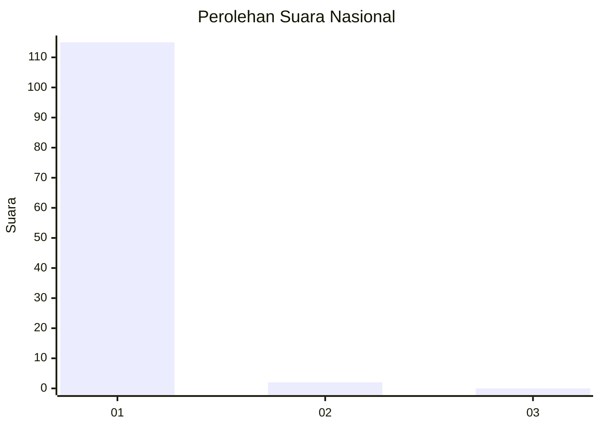
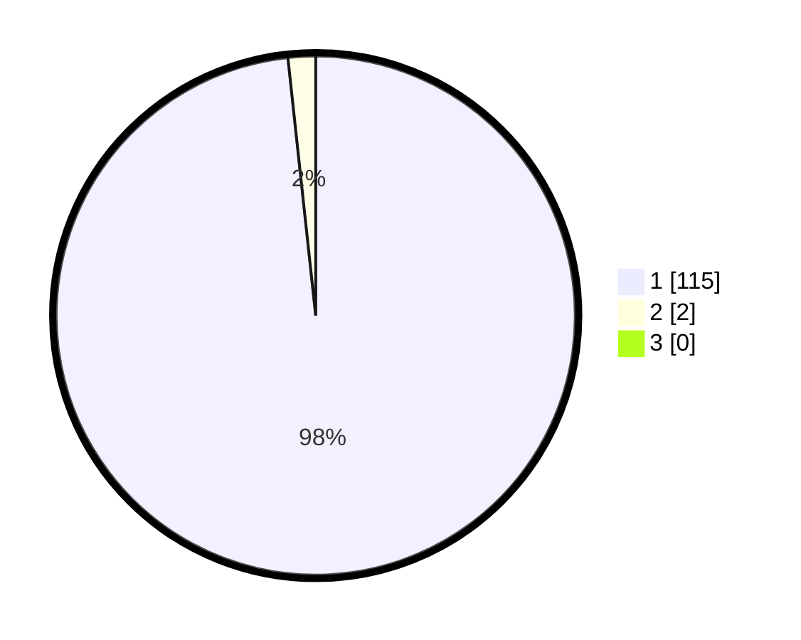

# Hasil

## Grafik

## Tabel

| No. | Nama Paslon    | Suara | Suara (raw) | Persentase |
|:--- |:-------------- | -----:| -----------:| ----------:|
| 1   | ANIES MUHAIMIN | 115   | [115][p-1]  | 98,29      |
| 2   | PRABOWO GIBRAN | 2     | [2][p-2]    | 1,71       |
| 3   | GANJAR MAHFUD  | 0     | [0][p-3]    | 0,00       |

[p-1]: https://github.com/gigit-pemilu/pemilu-2024/blob/main/pilpres/hitung-suara/sub/11-aceh/sub/08-aceh-utara/sub/01-baktiya/sub/2042-matang-beuringen/sub/001-tps/sub/paslon-1.txt
[p-2]: https://github.com/gigit-pemilu/pemilu-2024/blob/main/pilpres/hitung-suara/sub/11-aceh/sub/08-aceh-utara/sub/01-baktiya/sub/2042-matang-beuringen/sub/001-tps/sub/paslon-2.txt
[p-3]: https://github.com/gigit-pemilu/pemilu-2024/blob/main/pilpres/hitung-suara/sub/11-aceh/sub/08-aceh-utara/sub/01-baktiya/sub/2042-matang-beuringen/sub/001-tps/sub/paslon-3.txt

## Foto C Plano

https://sirekap-obj-formc.kpu.go.id/f41a/pemilu/ppwp/11/08/01/20/42/1108012042001-20240221-104213--12d8ecb8-96cf-4901-976e-7f9f1de19acc.jpg

https://sirekap-obj-formc.kpu.go.id/f41a/pemilu/ppwp/11/08/01/20/42/1108012042001-20240221-104344--65432a25-332c-4128-b8f9-6b4ac3b890c8.jpg

https://sirekap-obj-formc.kpu.go.id/f41a/pemilu/ppwp/11/08/01/20/42/1108012042001-20240221-104541--f24ddeac-7f31-4444-aff9-c3b95ad7f966.jpg

## Metadata

| Key        | Value               |
| ---------- | ------------------- |
| Time Stamp | 2024-02-24 22:31:28 |

