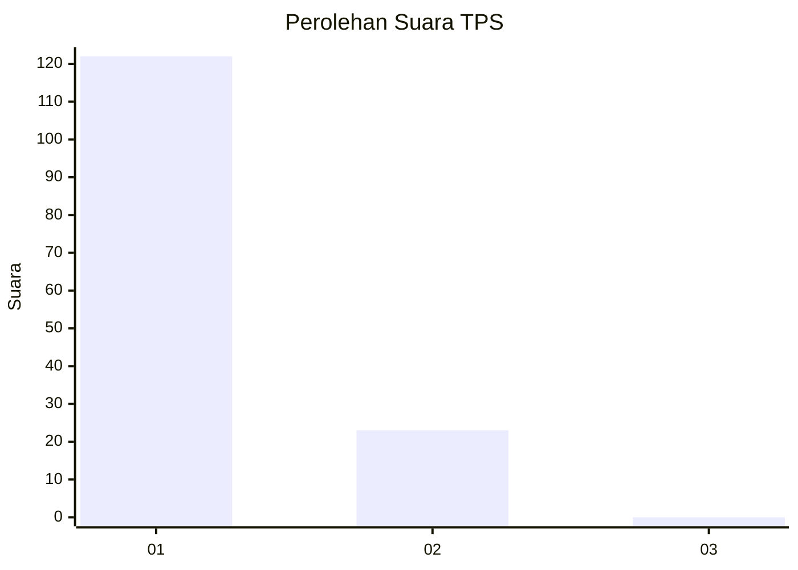
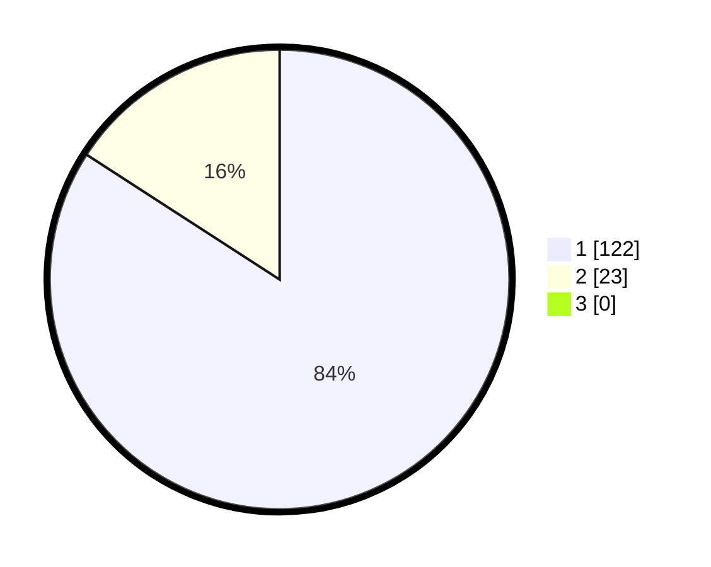

# Hasil

## Grafik

## Tabel

| No. | Nama Paslon    | Suara | Suara (raw) | Persentase |
|:--- |:-------------- | -----:| -----------:| ----------:|
| 1   | ANIES MUHAIMIN | 122   | [122][p-1]  | 84,14      |
| 2   | PRABOWO GIBRAN | 23    | [23][p-2]   | 15,86      |
| 3   | GANJAR MAHFUD  | 0     | [0][p-3]    | 0,00       |

[p-1]: https://github.com/gigit-pemilu/pemilu-2024-11-aceh/blob/main/pilpres/hitung-suara/sub/11-aceh/sub/08-aceh-utara/sub/01-baktiya/sub/2044-alue-ie-tarek/sub/001-tps/sub/paslon-1.txt
[p-2]: https://github.com/gigit-pemilu/pemilu-2024-11-aceh/blob/main/pilpres/hitung-suara/sub/11-aceh/sub/08-aceh-utara/sub/01-baktiya/sub/2044-alue-ie-tarek/sub/001-tps/sub/paslon-2.txt
[p-3]: https://github.com/gigit-pemilu/pemilu-2024-11-aceh/blob/main/pilpres/hitung-suara/sub/11-aceh/sub/08-aceh-utara/sub/01-baktiya/sub/2044-alue-ie-tarek/sub/001-tps/sub/paslon-3.txt

## Foto C Plano

https://sirekap-obj-formc.kpu.go.id/6f6f/pemilu/ppwp/11/08/01/20/44/1108012044001-20240220-164924--e89a52d5-6576-4ff2-bd76-788de22461a8.jpg

https://sirekap-obj-formc.kpu.go.id/6f6f/pemilu/ppwp/11/08/01/20/44/1108012044001-20240220-165051--36120a23-5794-4f50-80e1-445628bb7e71.jpg

https://sirekap-obj-formc.kpu.go.id/6f6f/pemilu/ppwp/11/08/01/20/44/1108012044001-20240220-165218--c6b3069a-7f8f-4fbc-b07e-8dc88bd4cfe7.jpg

## Metadata

| Key        | Value               |
| ---------- | ------------------- |
| Time Stamp | 2024-02-24 22:31:28 |

