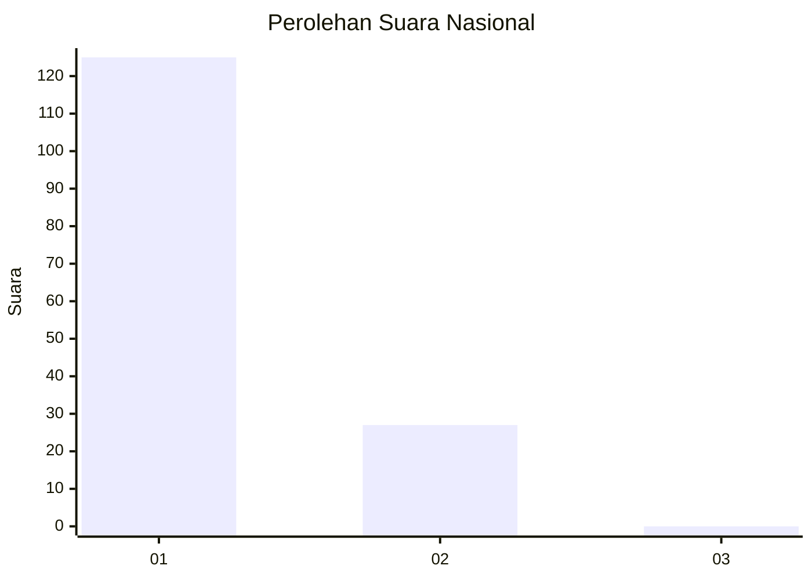
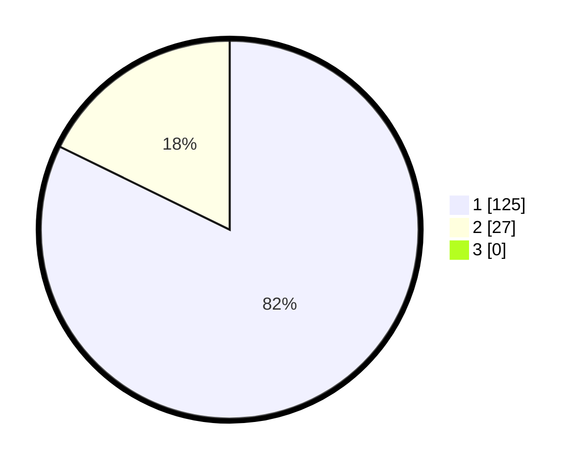

# Hasil

## Grafik

## Tabel

| No. | Nama Paslon    | Suara | Suara (raw) | Persentase |
|:--- |:-------------- | -----:| -----------:| ----------:|
| 1   | ANIES MUHAIMIN | 125   | [125][p-1]  | 82,24      |
| 2   | PRABOWO GIBRAN | 27    | [27][p-2]   | 17,76      |
| 3   | GANJAR MAHFUD  | 0     | [0][p-3]    | 0,00       |

[p-1]: https://github.com/gigit-pemilu/pemilu-2024/blob/main/pilpres/hitung-suara/sub/11-aceh/sub/08-aceh-utara/sub/01-baktiya/sub/2044-alue-ie-tarek/sub/002-tps/sub/paslon-1.txt
[p-2]: https://github.com/gigit-pemilu/pemilu-2024/blob/main/pilpres/hitung-suara/sub/11-aceh/sub/08-aceh-utara/sub/01-baktiya/sub/2044-alue-ie-tarek/sub/002-tps/sub/paslon-2.txt
[p-3]: https://github.com/gigit-pemilu/pemilu-2024/blob/main/pilpres/hitung-suara/sub/11-aceh/sub/08-aceh-utara/sub/01-baktiya/sub/2044-alue-ie-tarek/sub/002-tps/sub/paslon-3.txt

## Foto C Plano

https://sirekap-obj-formc.kpu.go.id/3640/pemilu/ppwp/11/08/01/20/44/1108012044002-20240220-172238--7112e8d0-aede-470d-98cb-ec55bd762504.jpg

https://sirekap-obj-formc.kpu.go.id/3640/pemilu/ppwp/11/08/01/20/44/1108012044002-20240220-172602--bc7916b8-4e57-4ce1-afd7-79d5802bd54b.jpg

https://sirekap-obj-formc.kpu.go.id/3640/pemilu/ppwp/11/08/01/20/44/1108012044002-20240220-172647--e819bb03-8cbc-466d-af2f-a753481df505.jpg

## Metadata

| Key        | Value               |
| ---------- | ------------------- |
| Time Stamp | 2024-02-24 22:31:28 |

