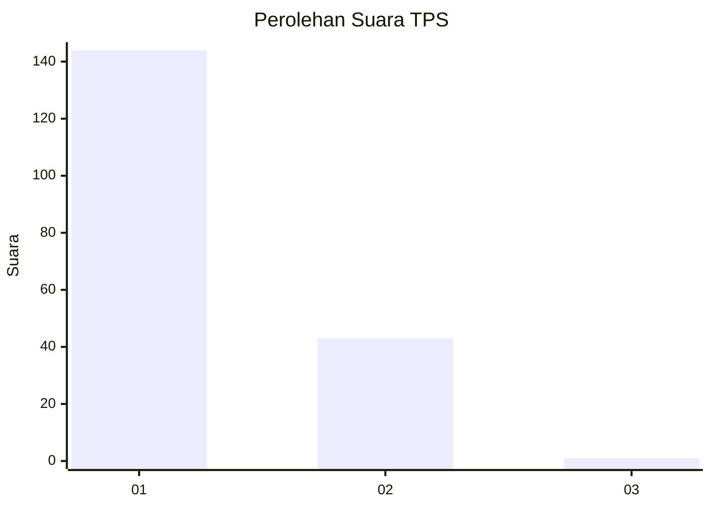
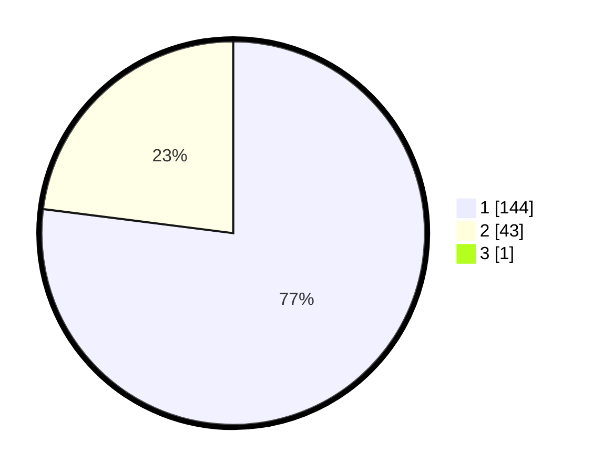

# Hasil

## Grafik

## Tabel

| No. | Nama Paslon    | Suara | Suara (raw) | Persentase |
|:--- |:-------------- | -----:| -----------:| ----------:|
| 1   | ANIES MUHAIMIN | 144   | [144][p-1]  | 76,60      |
| 2   | PRABOWO GIBRAN | 43    | [43][p-2]   | 22,87      |
| 3   | GANJAR MAHFUD  | 1     | [1][p-3]    | 0,53       |

[p-1]: https://github.com/gigit-pemilu/pemilu-2024-11-aceh/blob/main/pilpres/hitung-suara/sub/11-aceh/sub/08-aceh-utara/sub/01-baktiya/sub/2045-alue-rambong/sub/001-tps/sub/paslon-1.txt
[p-2]: https://github.com/gigit-pemilu/pemilu-2024-11-aceh/blob/main/pilpres/hitung-suara/sub/11-aceh/sub/08-aceh-utara/sub/01-baktiya/sub/2045-alue-rambong/sub/001-tps/sub/paslon-2.txt
[p-3]: https://github.com/gigit-pemilu/pemilu-2024-11-aceh/blob/main/pilpres/hitung-suara/sub/11-aceh/sub/08-aceh-utara/sub/01-baktiya/sub/2045-alue-rambong/sub/001-tps/sub/paslon-3.txt

## Foto C Plano

https://sirekap-obj-formc.kpu.go.id/ebe7/pemilu/ppwp/11/08/01/20/45/1108012045001-20240223-211719--14f56074-47e1-411f-abd4-f9d153c83109.jpg

https://sirekap-obj-formc.kpu.go.id/ebe7/pemilu/ppwp/11/08/01/20/45/1108012045001-20240214-185050--1629138f-4a66-4d4d-bdbd-2299c7cf5a29.jpg

https://sirekap-obj-formc.kpu.go.id/ebe7/pemilu/ppwp/11/08/01/20/45/1108012045001-20240223-212602--7ceefbc8-d6a6-4acc-aa45-ed21f141da47.jpg

## Metadata

| Key        | Value               |
| ---------- | ------------------- |
| Time Stamp | 2024-02-24 22:31:28 |

