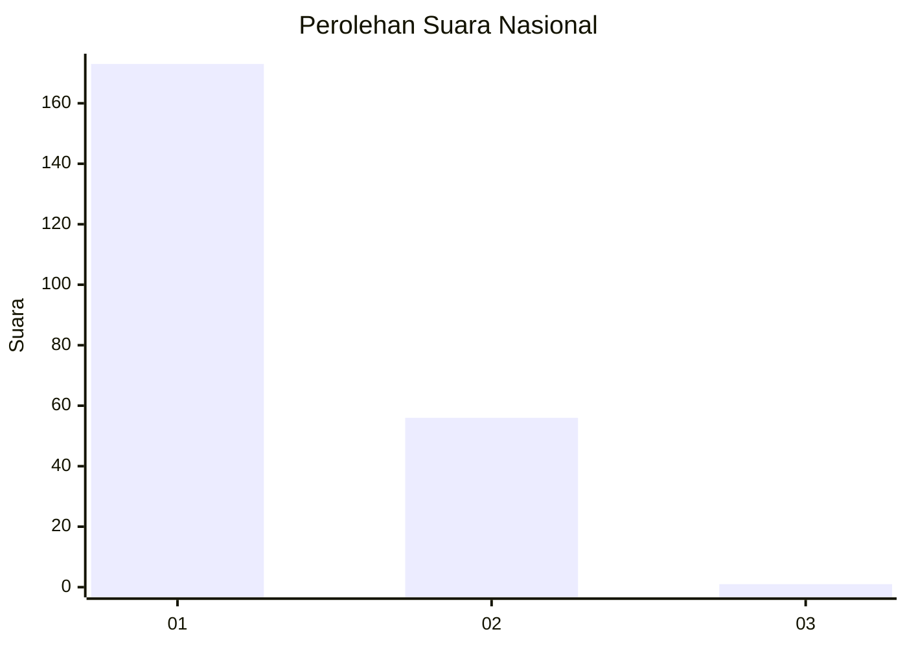
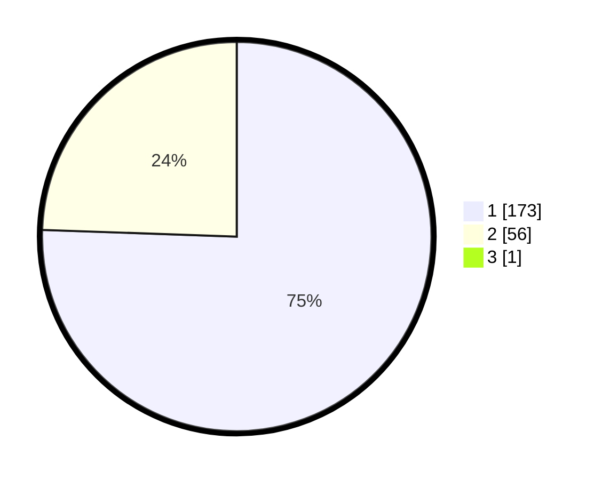

# Hasil

## Grafik

## Tabel

| No. | Nama Paslon    | Suara | Suara (raw) | Persentase |
|:--- |:-------------- | -----:| -----------:| ----------:|
| 1   | ANIES MUHAIMIN | 173   | [173][p-1]  | 75,22      |
| 2   | PRABOWO GIBRAN | 56    | [56][p-2]   | 24,35      |
| 3   | GANJAR MAHFUD  | 1     | [1][p-3]    | 0,43       |

[p-1]: https://github.com/gigit-pemilu/pemilu-2024/blob/main/pilpres/hitung-suara/sub/11-aceh/sub/08-aceh-utara/sub/01-baktiya/sub/2048-glumpang-payong/sub/001-tps/sub/paslon-1.txt
[p-2]: https://github.com/gigit-pemilu/pemilu-2024/blob/main/pilpres/hitung-suara/sub/11-aceh/sub/08-aceh-utara/sub/01-baktiya/sub/2048-glumpang-payong/sub/001-tps/sub/paslon-2.txt
[p-3]: https://github.com/gigit-pemilu/pemilu-2024/blob/main/pilpres/hitung-suara/sub/11-aceh/sub/08-aceh-utara/sub/01-baktiya/sub/2048-glumpang-payong/sub/001-tps/sub/paslon-3.txt

## Foto C Plano

https://sirekap-obj-formc.kpu.go.id/3ebc/pemilu/ppwp/11/08/01/20/48/1108012048001-20240215-113445--df7ea5d6-d3cc-4590-a766-3f721456ccf4.jpg

https://sirekap-obj-formc.kpu.go.id/3ebc/pemilu/ppwp/11/08/01/20/48/1108012048001-20240215-113634--96ffb8aa-f984-4a3c-b657-c05b97b31db7.jpg

https://sirekap-obj-formc.kpu.go.id/3ebc/pemilu/ppwp/11/08/01/20/48/1108012048001-20240215-113754--1775de6c-b65d-4435-a27c-8860445d14d2.jpg

## Metadata

| Key        | Value               |
| ---------- | ------------------- |
| Time Stamp | 2024-02-16 23:00:00 |

