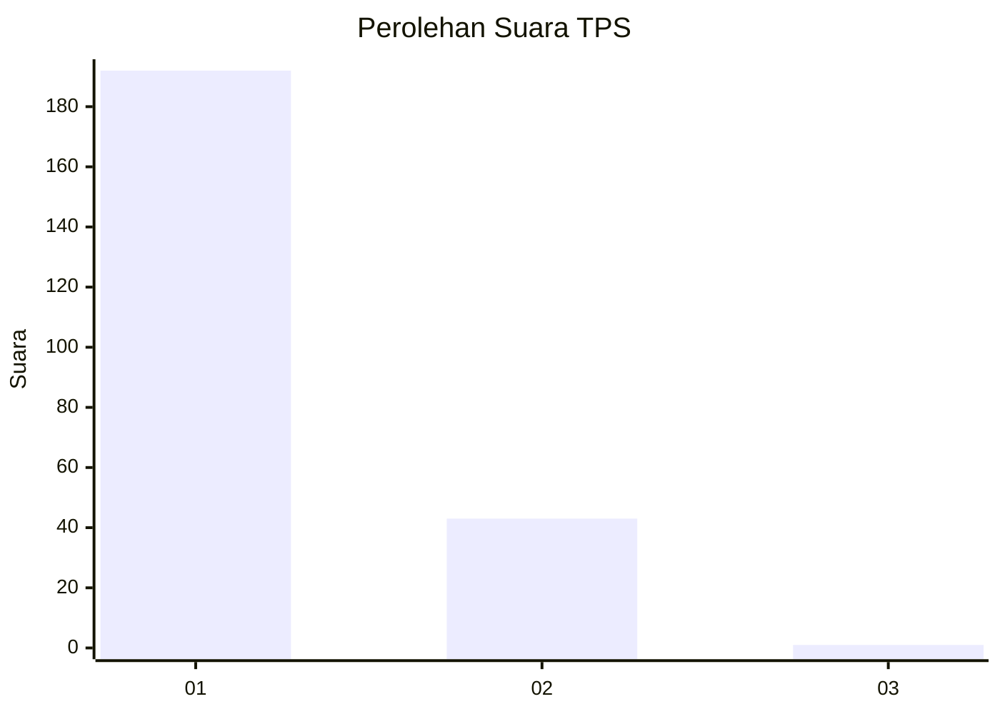
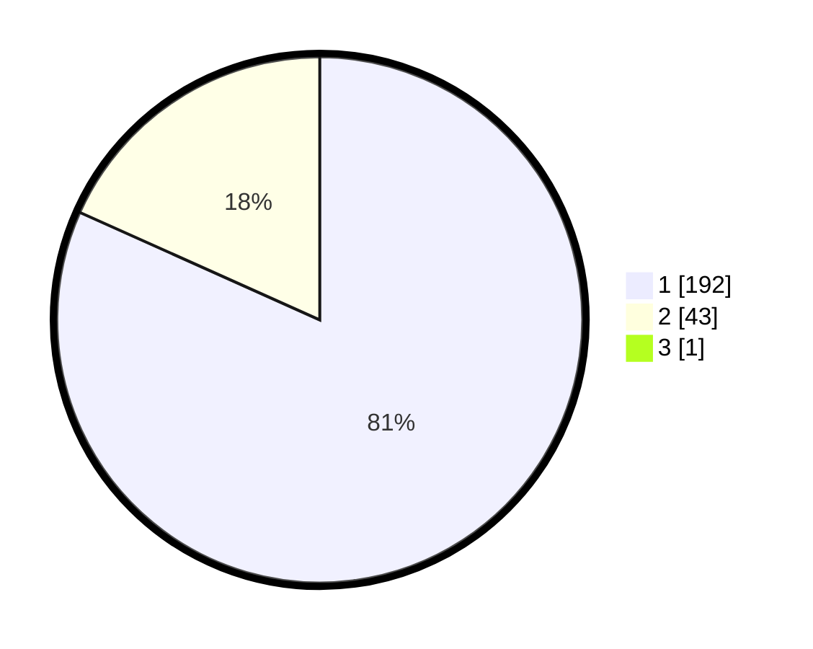

# Hasil

## Grafik

## Tabel

| No. | Nama Paslon    | Suara | Suara (raw) | Persentase |
|:--- |:-------------- | -----:| -----------:| ----------:|
| 1   | ANIES MUHAIMIN | 192   | [192][p-1]  | 81,36      |
| 2   | PRABOWO GIBRAN | 43    | [43][p-2]   | 18,22      |
| 3   | GANJAR MAHFUD  | 1     | [1][p-3]    | 0,42       |

[p-1]: https://github.com/gigit-pemilu/pemilu-2024-11-aceh/blob/main/pilpres/hitung-suara/sub/11-aceh/sub/08-aceh-utara/sub/01-baktiya/sub/2048-glumpang-payong/sub/002-tps/sub/paslon-1.txt
[p-2]: https://github.com/gigit-pemilu/pemilu-2024-11-aceh/blob/main/pilpres/hitung-suara/sub/11-aceh/sub/08-aceh-utara/sub/01-baktiya/sub/2048-glumpang-payong/sub/002-tps/sub/paslon-2.txt
[p-3]: https://github.com/gigit-pemilu/pemilu-2024-11-aceh/blob/main/pilpres/hitung-suara/sub/11-aceh/sub/08-aceh-utara/sub/01-baktiya/sub/2048-glumpang-payong/sub/002-tps/sub/paslon-3.txt

## Foto C Plano

https://sirekap-obj-formc.kpu.go.id/8340/pemilu/ppwp/11/08/01/20/48/1108012048002-20240215-114238--98a85b6c-30e9-4837-aa5f-78ad17c1f926.jpg

https://sirekap-obj-formc.kpu.go.id/8340/pemilu/ppwp/11/08/01/20/48/1108012048002-20240215-114419--be3e4ff3-95cb-4752-bc9a-8c35e25be1d6.jpg

https://sirekap-obj-formc.kpu.go.id/8340/pemilu/ppwp/11/08/01/20/48/1108012048002-20240215-114532--4e1a73ea-7e16-44af-b005-83d568760b94.jpg

## Metadata

| Key        | Value               |
| ---------- | ------------------- |
| Time Stamp | 2024-02-16 23:00:00 |

