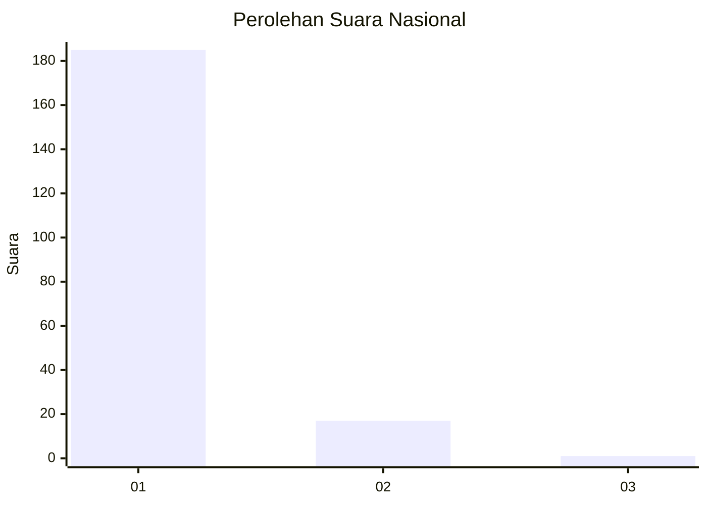
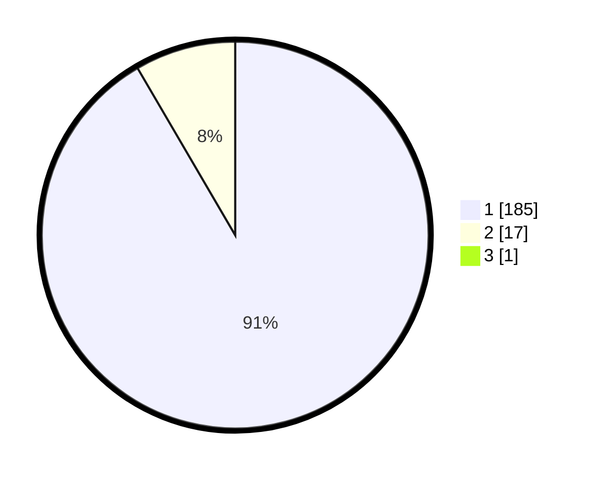

# Hasil

## Grafik

## Tabel

| No. | Nama Paslon    | Suara | Suara (raw) | Persentase |
|:--- |:-------------- | -----:| -----------:| ----------:|
| 1   | ANIES MUHAIMIN | 185   | [185][p-1]  | 91,13      |
| 2   | PRABOWO GIBRAN | 17    | [17][p-2]   | 8,37       |
| 3   | GANJAR MAHFUD  | 1     | [1][p-3]    | 0,49       |

[p-1]: https://github.com/gigit-pemilu/pemilu-2024/blob/main/pilpres/hitung-suara/sub/11-aceh/sub/08-aceh-utara/sub/01-baktiya/sub/2049-mon-sukon/sub/001-tps/sub/paslon-1.txt
[p-2]: https://github.com/gigit-pemilu/pemilu-2024/blob/main/pilpres/hitung-suara/sub/11-aceh/sub/08-aceh-utara/sub/01-baktiya/sub/2049-mon-sukon/sub/001-tps/sub/paslon-2.txt
[p-3]: https://github.com/gigit-pemilu/pemilu-2024/blob/main/pilpres/hitung-suara/sub/11-aceh/sub/08-aceh-utara/sub/01-baktiya/sub/2049-mon-sukon/sub/001-tps/sub/paslon-3.txt

## Foto C Plano

https://sirekap-obj-formc.kpu.go.id/392c/pemilu/ppwp/11/08/01/20/49/1108012049001-20240223-210809--9d01e542-67fd-4475-95e4-55129f770ff7.jpg

https://sirekap-obj-formc.kpu.go.id/392c/pemilu/ppwp/11/08/01/20/49/1108012049001-20240223-211119--6c321e93-3b3d-47a1-ae5a-2a615346b197.jpg

https://sirekap-obj-formc.kpu.go.id/392c/pemilu/ppwp/11/08/01/20/49/1108012049001-20240223-211224--71ddf761-52d2-4a15-9395-286dd0e29550.jpg

## Metadata

| Key        | Value               |
| ---------- | ------------------- |
| Time Stamp | 2024-02-25 16:00:00 |

