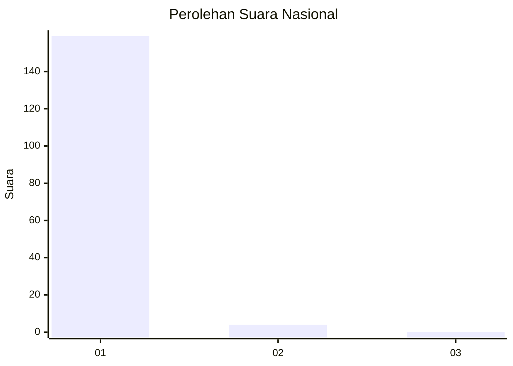
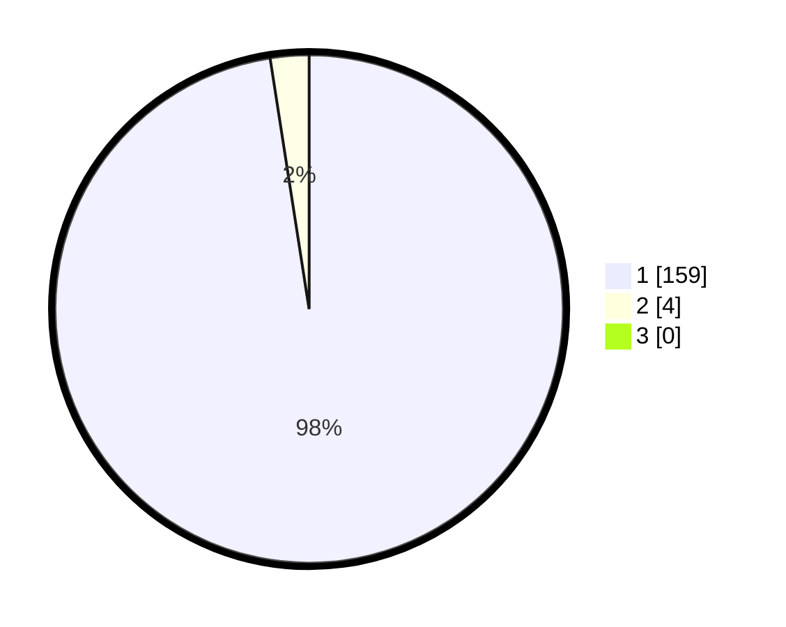

# Hasil

## Grafik

## Tabel

| No. | Nama Paslon    | Suara | Suara (raw) | Persentase |
|:--- |:-------------- | -----:| -----------:| ----------:|
| 1   | ANIES MUHAIMIN | 159   | [159][p-1]  | 97,55      |
| 2   | PRABOWO GIBRAN | 4     | [4][p-2]    | 2,45       |
| 3   | GANJAR MAHFUD  | 0     | [0][p-3]    | 0,00       |

[p-1]: https://github.com/gigit-pemilu/pemilu-2024/blob/main/pilpres/hitung-suara/sub/11-aceh/sub/08-aceh-utara/sub/01-baktiya/sub/2052-buket-dara-baro/sub/001-tps/sub/paslon-1.txt
[p-2]: https://github.com/gigit-pemilu/pemilu-2024/blob/main/pilpres/hitung-suara/sub/11-aceh/sub/08-aceh-utara/sub/01-baktiya/sub/2052-buket-dara-baro/sub/001-tps/sub/paslon-2.txt
[p-3]: https://github.com/gigit-pemilu/pemilu-2024/blob/main/pilpres/hitung-suara/sub/11-aceh/sub/08-aceh-utara/sub/01-baktiya/sub/2052-buket-dara-baro/sub/001-tps/sub/paslon-3.txt

## Foto C Plano

https://sirekap-obj-formc.kpu.go.id/db50/pemilu/ppwp/11/08/01/20/52/1108012052001-20240223-144406--9a1adc7a-d103-4f21-97ac-87e214dba42a.jpg

https://sirekap-obj-formc.kpu.go.id/db50/pemilu/ppwp/11/08/01/20/52/1108012052001-20240223-144441--f794524e-90e0-4350-9996-8757dcc9d30b.jpg

https://sirekap-obj-formc.kpu.go.id/db50/pemilu/ppwp/11/08/01/20/52/1108012052001-20240223-144635--0b7b76b4-6d3f-4d3e-9fc1-36274c4e514b.jpg

## Metadata

| Key        | Value               |
| ---------- | ------------------- |
| Time Stamp | 2024-02-24 22:31:28 |

