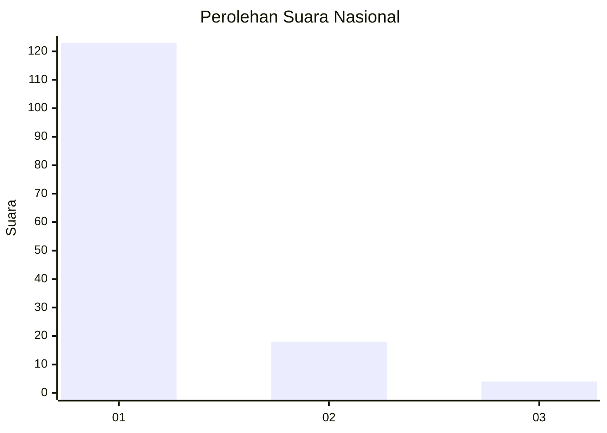
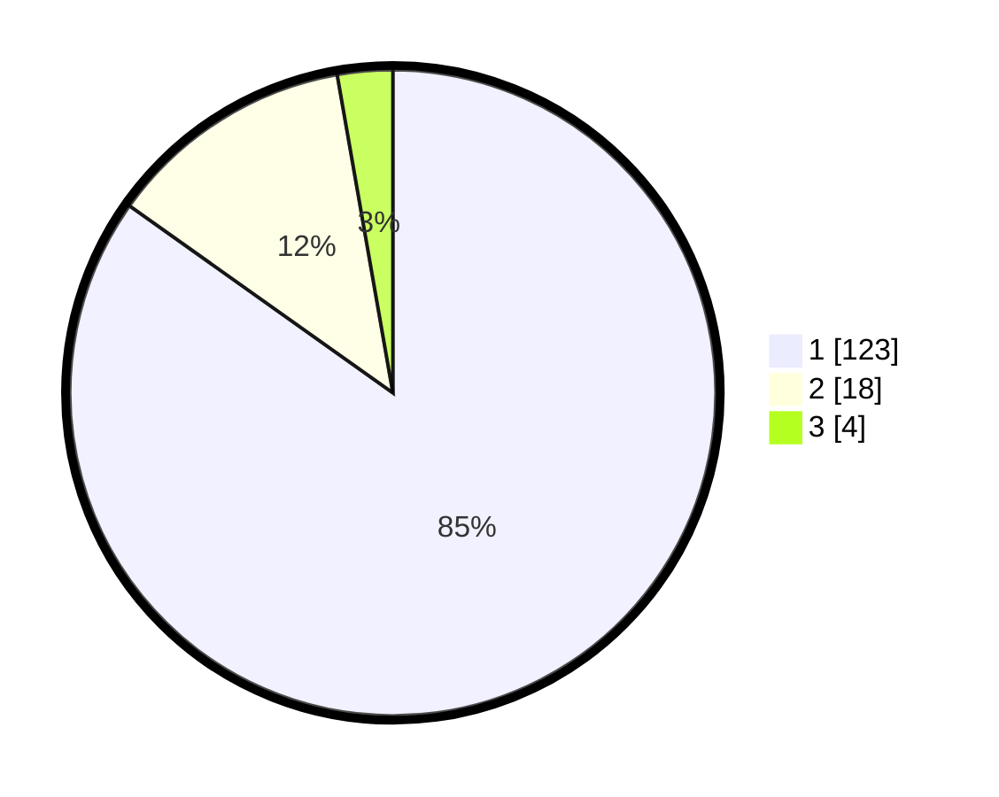

# Hasil

## Grafik

## Tabel

| No. | Nama Paslon    | Suara | Suara (raw) | Persentase |
|:--- |:-------------- | -----:| -----------:| ----------:|
| 1   | ANIES MUHAIMIN | 123   | [123][p-1]  | 84,83      |
| 2   | PRABOWO GIBRAN | 18    | [18][p-2]   | 12,41      |
| 3   | GANJAR MAHFUD  | 4     | [4][p-3]    | 2,76       |

[p-1]: https://github.com/gigit-pemilu/pemilu-2024/blob/main/pilpres/hitung-suara/sub/11-aceh/sub/08-aceh-utara/sub/01-baktiya/sub/2053-matang-pineung/sub/002-tps/sub/paslon-1.txt
[p-2]: https://github.com/gigit-pemilu/pemilu-2024/blob/main/pilpres/hitung-suara/sub/11-aceh/sub/08-aceh-utara/sub/01-baktiya/sub/2053-matang-pineung/sub/002-tps/sub/paslon-2.txt
[p-3]: https://github.com/gigit-pemilu/pemilu-2024/blob/main/pilpres/hitung-suara/sub/11-aceh/sub/08-aceh-utara/sub/01-baktiya/sub/2053-matang-pineung/sub/002-tps/sub/paslon-3.txt

## Foto C Plano

https://sirekap-obj-formc.kpu.go.id/d373/pemilu/ppwp/11/08/01/20/53/1108012053002-20240223-164353--ad01d74e-0e43-4d09-895c-e281105271eb.jpg

https://sirekap-obj-formc.kpu.go.id/d373/pemilu/ppwp/11/08/01/20/53/1108012053002-20240223-165007--81f7dead-c5ef-4932-b92e-8243b04afaee.jpg

https://sirekap-obj-formc.kpu.go.id/d373/pemilu/ppwp/11/08/01/20/53/1108012053002-20240223-170113--5a2e3834-a5a0-46d3-92b6-42bb97221ae4.jpg

## Metadata

| Key        | Value               |
| ---------- | ------------------- |
| Time Stamp | 2024-02-24 22:31:28 |

