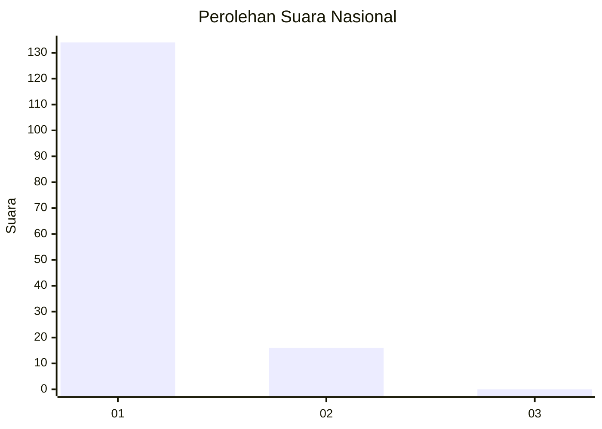
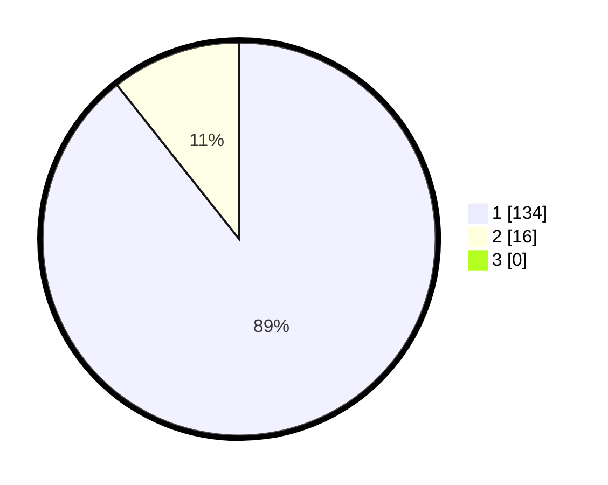

# Hasil

## Grafik

## Tabel

| No. | Nama Paslon    | Suara | Suara (raw) | Persentase |
|:--- |:-------------- | -----:| -----------:| ----------:|
| 1   | ANIES MUHAIMIN | 134   | [134][p-1]  | 89,33      |
| 2   | PRABOWO GIBRAN | 16    | [16][p-2]   | 10,67      |
| 3   | GANJAR MAHFUD  | 0     | [0][p-3]    | 0,00       |

[p-1]: https://github.com/gigit-pemilu/pemilu-2024/blob/main/pilpres/hitung-suara/sub/11-aceh/sub/08-aceh-utara/sub/01-baktiya/sub/2054-matang-baro/sub/001-tps/sub/paslon-1.txt
[p-2]: https://github.com/gigit-pemilu/pemilu-2024/blob/main/pilpres/hitung-suara/sub/11-aceh/sub/08-aceh-utara/sub/01-baktiya/sub/2054-matang-baro/sub/001-tps/sub/paslon-2.txt
[p-3]: https://github.com/gigit-pemilu/pemilu-2024/blob/main/pilpres/hitung-suara/sub/11-aceh/sub/08-aceh-utara/sub/01-baktiya/sub/2054-matang-baro/sub/001-tps/sub/paslon-3.txt

## Foto C Plano

https://sirekap-obj-formc.kpu.go.id/be3d/pemilu/ppwp/11/08/01/20/54/1108012054001-20240223-223112--a789833d-4dd9-4b1e-8f42-7bc77981de25.jpg

https://sirekap-obj-formc.kpu.go.id/be3d/pemilu/ppwp/11/08/01/20/54/1108012054001-20240223-223852--6373b641-fdc7-43e0-9edf-987b644287ac.jpg

https://sirekap-obj-formc.kpu.go.id/be3d/pemilu/ppwp/11/08/01/20/54/1108012054001-20240223-224044--ee959e8c-2181-4162-aa6c-5922488e6f1f.jpg

## Metadata

| Key        | Value               |
| ---------- | ------------------- |
| Time Stamp | 2024-02-25 22:00:00 |

