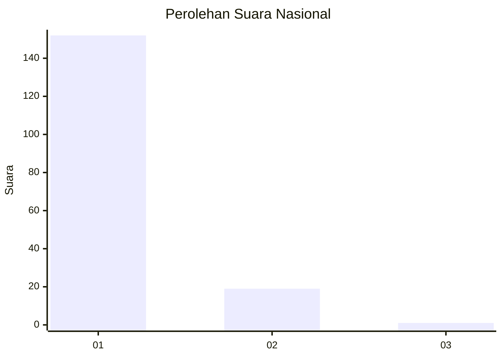
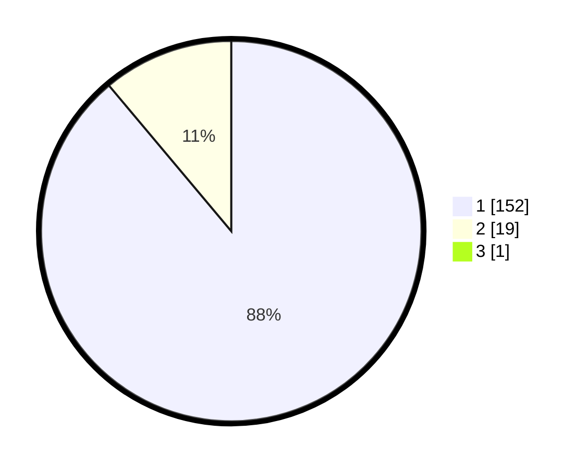

# Hasil

## Grafik

## Tabel

| No. | Nama Paslon    | Suara | Suara (raw) | Persentase |
|:--- |:-------------- | -----:| -----------:| ----------:|
| 1   | ANIES MUHAIMIN | 152   | [152][p-1]  | 88,37      |
| 2   | PRABOWO GIBRAN | 19    | [19][p-2]   | 11,05      |
| 3   | GANJAR MAHFUD  | 1     | [1][p-3]    | 0,58       |

[p-1]: https://github.com/gigit-pemilu/pemilu-2024/blob/main/pilpres/hitung-suara/sub/11-aceh/sub/08-aceh-utara/sub/01-baktiya/sub/2054-matang-baro/sub/002-tps/sub/paslon-1.txt
[p-2]: https://github.com/gigit-pemilu/pemilu-2024/blob/main/pilpres/hitung-suara/sub/11-aceh/sub/08-aceh-utara/sub/01-baktiya/sub/2054-matang-baro/sub/002-tps/sub/paslon-2.txt
[p-3]: https://github.com/gigit-pemilu/pemilu-2024/blob/main/pilpres/hitung-suara/sub/11-aceh/sub/08-aceh-utara/sub/01-baktiya/sub/2054-matang-baro/sub/002-tps/sub/paslon-3.txt

## Foto C Plano

https://sirekap-obj-formc.kpu.go.id/782f/pemilu/ppwp/11/08/01/20/54/1108012054002-20240223-222546--2bd14699-f96a-4eb0-a00b-5eb3c9871cf3.jpg

https://sirekap-obj-formc.kpu.go.id/782f/pemilu/ppwp/11/08/01/20/54/1108012054002-20240223-222801--2994af6c-deca-4369-99fd-ffda9e6e190e.jpg

https://sirekap-obj-formc.kpu.go.id/782f/pemilu/ppwp/11/08/01/20/54/1108012054002-20240223-223734--40a077bc-9088-43ee-87f5-711282c9256d.jpg

## Metadata

| Key        | Value               |
| ---------- | ------------------- |
| Time Stamp | 2024-02-24 22:31:28 |

