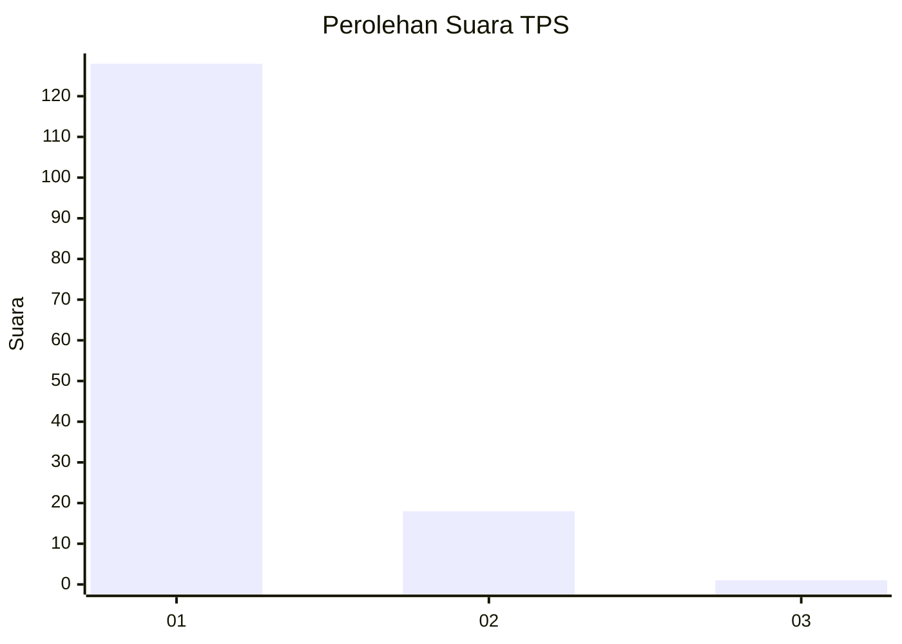
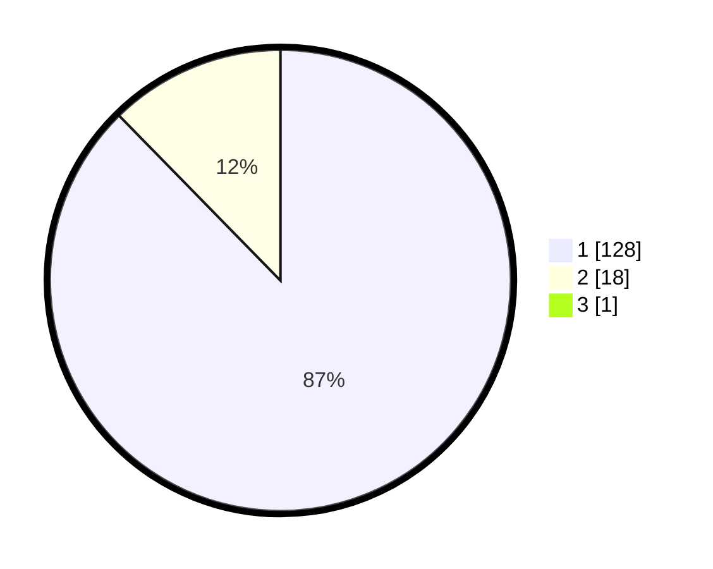

# Hasil

## Grafik

## Tabel

| No. | Nama Paslon    | Suara | Suara (raw) | Persentase |
|:--- |:-------------- | -----:| -----------:| ----------:|
| 1   | ANIES MUHAIMIN | 128   | [128][p-1]  | 87,07      |
| 2   | PRABOWO GIBRAN | 18    | [18][p-2]   | 12,24      |
| 3   | GANJAR MAHFUD  | 1     | [1][p-3]    | 0,68       |

[p-1]: https://github.com/gigit-pemilu/pemilu-2024-11-aceh/blob/main/pilpres/hitung-suara/sub/11-aceh/sub/08-aceh-utara/sub/01-baktiya/sub/2055-ujong-dama/sub/001-tps/sub/paslon-1.txt
[p-2]: https://github.com/gigit-pemilu/pemilu-2024-11-aceh/blob/main/pilpres/hitung-suara/sub/11-aceh/sub/08-aceh-utara/sub/01-baktiya/sub/2055-ujong-dama/sub/001-tps/sub/paslon-2.txt
[p-3]: https://github.com/gigit-pemilu/pemilu-2024-11-aceh/blob/main/pilpres/hitung-suara/sub/11-aceh/sub/08-aceh-utara/sub/01-baktiya/sub/2055-ujong-dama/sub/001-tps/sub/paslon-3.txt

## Foto C Plano

https://sirekap-obj-formc.kpu.go.id/9002/pemilu/ppwp/11/08/01/20/55/1108012055001-20240223-104640--4c46bde4-e44a-40d1-ab17-11fef951e814.jpg

https://sirekap-obj-formc.kpu.go.id/9002/pemilu/ppwp/11/08/01/20/55/1108012055001-20240223-103943--ceb8a3fc-858d-47d6-ad61-d4759565670a.jpg

https://sirekap-obj-formc.kpu.go.id/9002/pemilu/ppwp/11/08/01/20/55/1108012055001-20240223-104232--52003d36-3a46-4782-b350-c80285b5ae0d.jpg

## Metadata

| Key        | Value               |
| ---------- | ------------------- |
| Time Stamp | 2024-02-24 22:31:28 |

