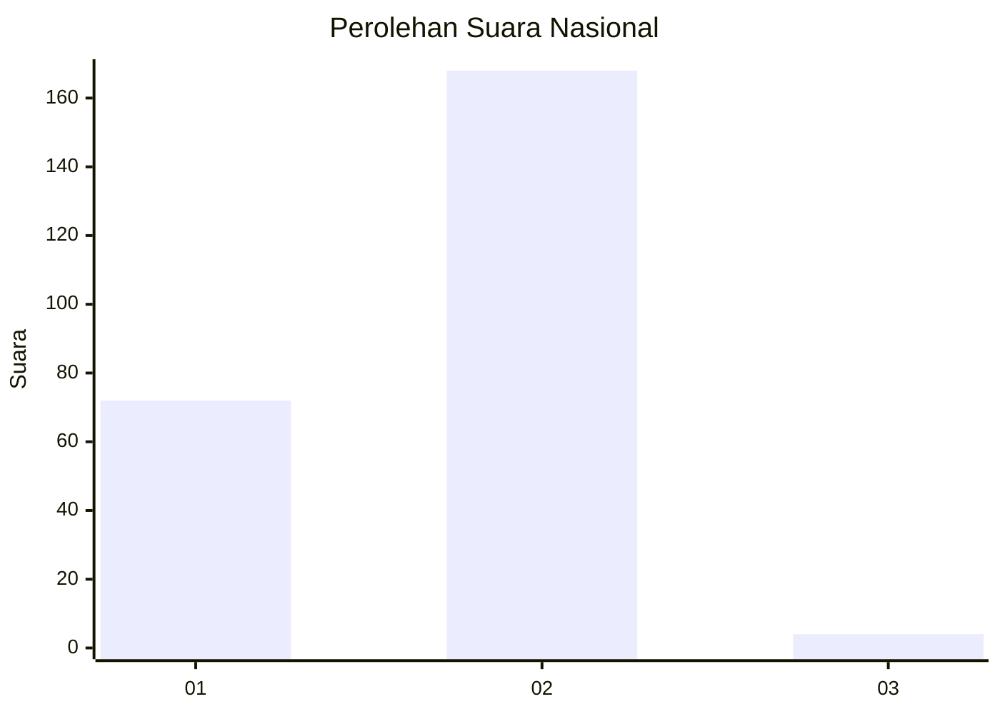
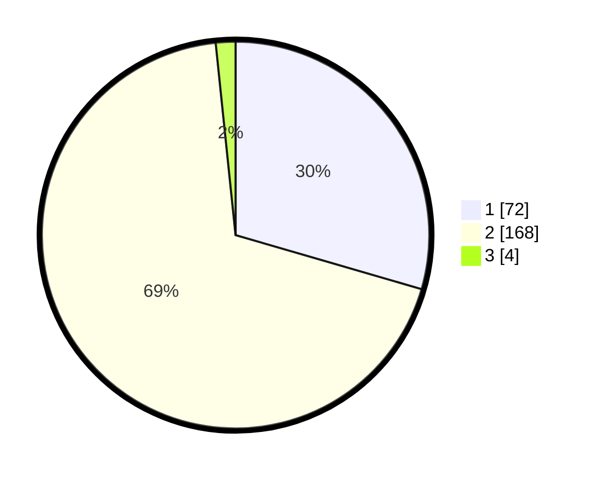

# Hasil

## Grafik

## Tabel

| No. | Nama Paslon    | Suara | Suara (raw) | Persentase |
|:--- |:-------------- | -----:| -----------:| ----------:|
| 1   | ANIES MUHAIMIN | 72    | [72][p-1]   | 29,51      |
| 2   | PRABOWO GIBRAN | 168   | [168][p-2]  | 68,85      |
| 3   | GANJAR MAHFUD  | 4     | [4][p-3]    | 1,64       |

[p-1]: https://github.com/gigit-pemilu/pemilu-2024/blob/main/pilpres/hitung-suara/sub/11-aceh/sub/08-aceh-utara/sub/01-baktiya/sub/2057-cinta-makmur/sub/001-tps/sub/paslon-1.txt
[p-2]: https://github.com/gigit-pemilu/pemilu-2024/blob/main/pilpres/hitung-suara/sub/11-aceh/sub/08-aceh-utara/sub/01-baktiya/sub/2057-cinta-makmur/sub/001-tps/sub/paslon-2.txt
[p-3]: https://github.com/gigit-pemilu/pemilu-2024/blob/main/pilpres/hitung-suara/sub/11-aceh/sub/08-aceh-utara/sub/01-baktiya/sub/2057-cinta-makmur/sub/001-tps/sub/paslon-3.txt

## Foto C Plano

https://sirekap-obj-formc.kpu.go.id/b920/pemilu/ppwp/11/08/01/20/57/1108012057001-20240223-093425--e12927e6-5c2e-4d1d-b53e-b5c9443b8579.jpg

https://sirekap-obj-formc.kpu.go.id/b920/pemilu/ppwp/11/08/01/20/57/1108012057001-20240223-093627--5ec94ac6-7efb-4694-83d0-da9a06b764ec.jpg

https://sirekap-obj-formc.kpu.go.id/b920/pemilu/ppwp/11/08/01/20/57/1108012057001-20240223-093737--4f31b28e-1082-4cd1-bb1d-c3b8b77d0eab.jpg

## Metadata

| Key        | Value               |
| ---------- | ------------------- |
| Time Stamp | 2024-02-24 22:31:28 |

