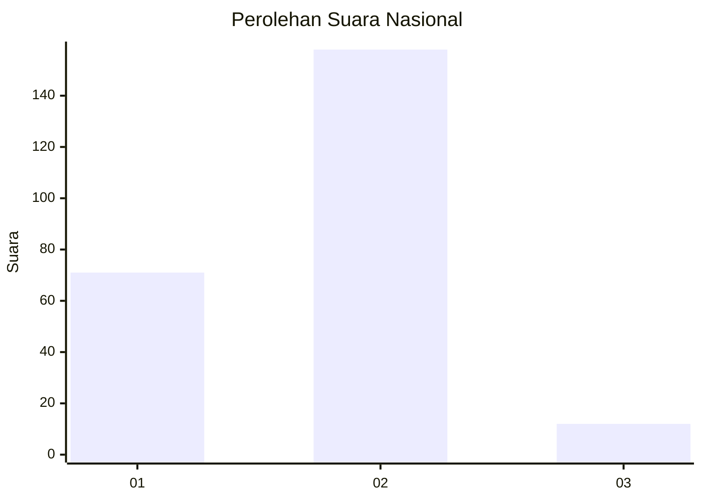
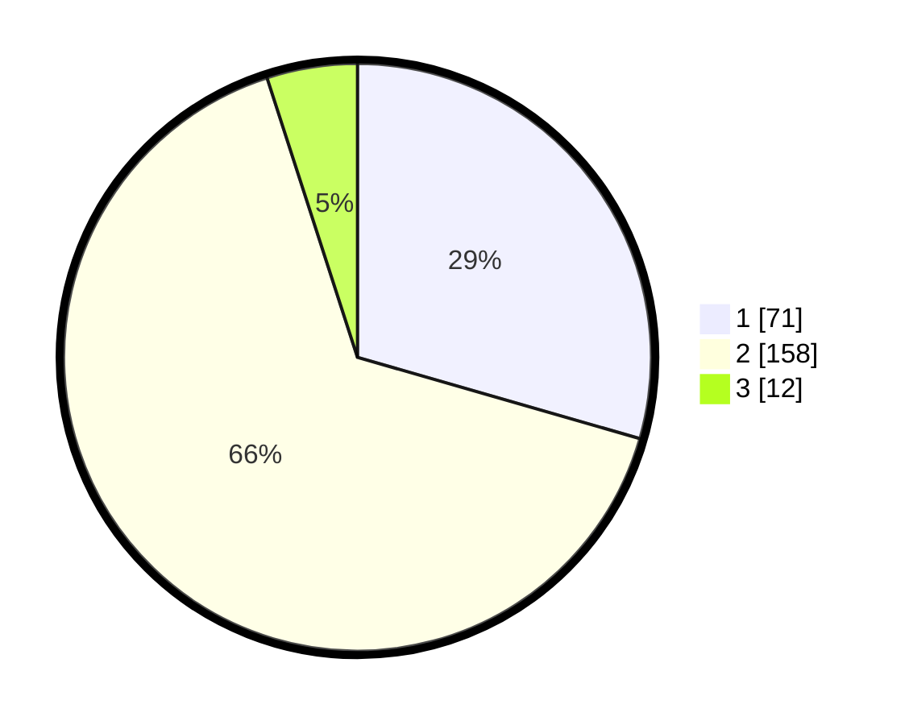

# Hasil

## Grafik

## Tabel

| No. | Nama Paslon    | Suara | Suara (raw) | Persentase |
|:--- |:-------------- | -----:| -----------:| ----------:|
| 1   | ANIES MUHAIMIN | 71    | [71][p-1]   | 29,46      |
| 2   | PRABOWO GIBRAN | 158   | [158][p-2]  | 65,56      |
| 3   | GANJAR MAHFUD  | 12    | [12][p-3]   | 4,98       |

[p-1]: https://github.com/gigit-pemilu/pemilu-2024/blob/main/pilpres/hitung-suara/sub/11-aceh/sub/08-aceh-utara/sub/01-baktiya/sub/2057-cinta-makmur/sub/002-tps/sub/paslon-1.txt
[p-2]: https://github.com/gigit-pemilu/pemilu-2024/blob/main/pilpres/hitung-suara/sub/11-aceh/sub/08-aceh-utara/sub/01-baktiya/sub/2057-cinta-makmur/sub/002-tps/sub/paslon-2.txt
[p-3]: https://github.com/gigit-pemilu/pemilu-2024/blob/main/pilpres/hitung-suara/sub/11-aceh/sub/08-aceh-utara/sub/01-baktiya/sub/2057-cinta-makmur/sub/002-tps/sub/paslon-3.txt

## Foto C Plano

https://sirekap-obj-formc.kpu.go.id/00a0/pemilu/ppwp/11/08/01/20/57/1108012057002-20240214-192419--bb11e2b6-12d8-45e0-988d-92fbc520442d.jpg

https://sirekap-obj-formc.kpu.go.id/00a0/pemilu/ppwp/11/08/01/20/57/1108012057002-20240214-192411--90c99b54-113f-457e-a85d-984e3d841c7c.jpg

https://sirekap-obj-formc.kpu.go.id/00a0/pemilu/ppwp/11/08/01/20/57/1108012057002-20240223-112836--c9c75c2e-4ab4-4fb4-9374-1b9e1a5940d1.jpg

## Metadata

| Key        | Value               |
| ---------- | ------------------- |
| Time Stamp | 2024-02-24 22:31:28 |

