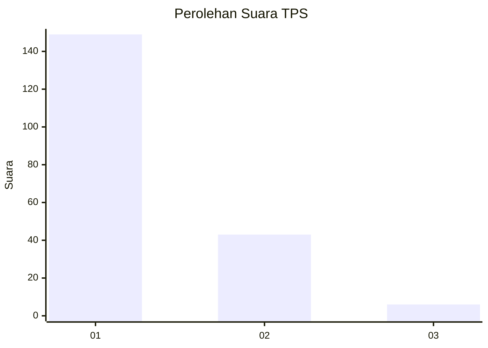
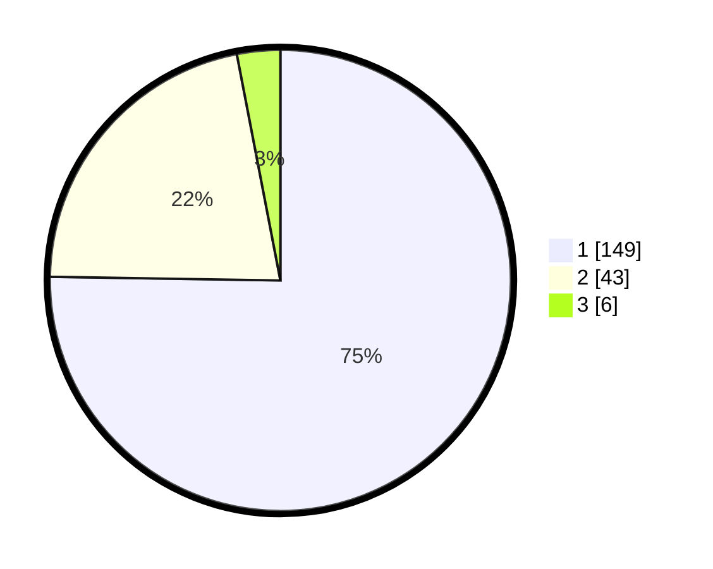

# Hasil

## Grafik

## Tabel

| No. | Nama Paslon    | Suara | Suara (raw) | Persentase |
|:--- |:-------------- | -----:| -----------:| ----------:|
| 1   | ANIES MUHAIMIN | 149   | [149][p-1]  | 75,25      |
| 2   | PRABOWO GIBRAN | 43    | [43][p-2]   | 21,72      |
| 3   | GANJAR MAHFUD  | 6     | [6][p-3]    | 3,03       |

[p-1]: https://github.com/gigit-pemilu/pemilu-2024-11-aceh/blob/main/pilpres/hitung-suara/sub/11-aceh/sub/08-aceh-utara/sub/02-dewantara/sub/2001-keude-krueng-geukueh/sub/002-tps/sub/paslon-1.txt
[p-2]: https://github.com/gigit-pemilu/pemilu-2024-11-aceh/blob/main/pilpres/hitung-suara/sub/11-aceh/sub/08-aceh-utara/sub/02-dewantara/sub/2001-keude-krueng-geukueh/sub/002-tps/sub/paslon-2.txt
[p-3]: https://github.com/gigit-pemilu/pemilu-2024-11-aceh/blob/main/pilpres/hitung-suara/sub/11-aceh/sub/08-aceh-utara/sub/02-dewantara/sub/2001-keude-krueng-geukueh/sub/002-tps/sub/paslon-3.txt

## Foto C Plano

https://sirekap-obj-formc.kpu.go.id/7bdc/pemilu/ppwp/11/08/02/20/01/1108022001002-20240215-014648--98911c9e-0119-4988-804b-029c96c8af65.jpg

https://sirekap-obj-formc.kpu.go.id/7bdc/pemilu/ppwp/11/08/02/20/01/1108022001002-20240215-014755--a71c4ecb-4cb4-455e-b1aa-201d4a82a864.jpg

https://sirekap-obj-formc.kpu.go.id/7bdc/pemilu/ppwp/11/08/02/20/01/1108022001002-20240215-014857--ab7e7919-d13e-49fc-ba49-32444adb7b69.jpg

## Metadata

| Key        | Value               |
| ---------- | ------------------- |
| Time Stamp | 2024-02-16 22:30:00 |

## DATA PEMILIH TETAP

Jumlah pemilih dalam DPT: **245**.
 * L: **125**.
 * P: **120**.

## DATA PENGGUNA HAK PILIH

Jumlah pengguna hak pilih dalam DPT: **202**.
 * L: **100**.
 * P: **102**.

Jumlah pengguna hak pilih dalam DPTb: **0**.
 * L: **0**.
 * P: **0**.

Jumlah pengguna hak pilih dalam DPK: **0**.
 * L: **0**.
 * P: **0**.

Jumlah pengguna hak pilih: **202**.
 * L: **100**.
 * P: **102**.

## JUMLAH SUARA SAH DAN TIDAK SAH

JUMLAH SELURUH SUARA SAH: **198**.

JUMLAH SUARA TIDAK SAH: **4**.

JUMLAH SELURUH SUARA SAH DAN SUARA TIDAK SAH: **202**.

