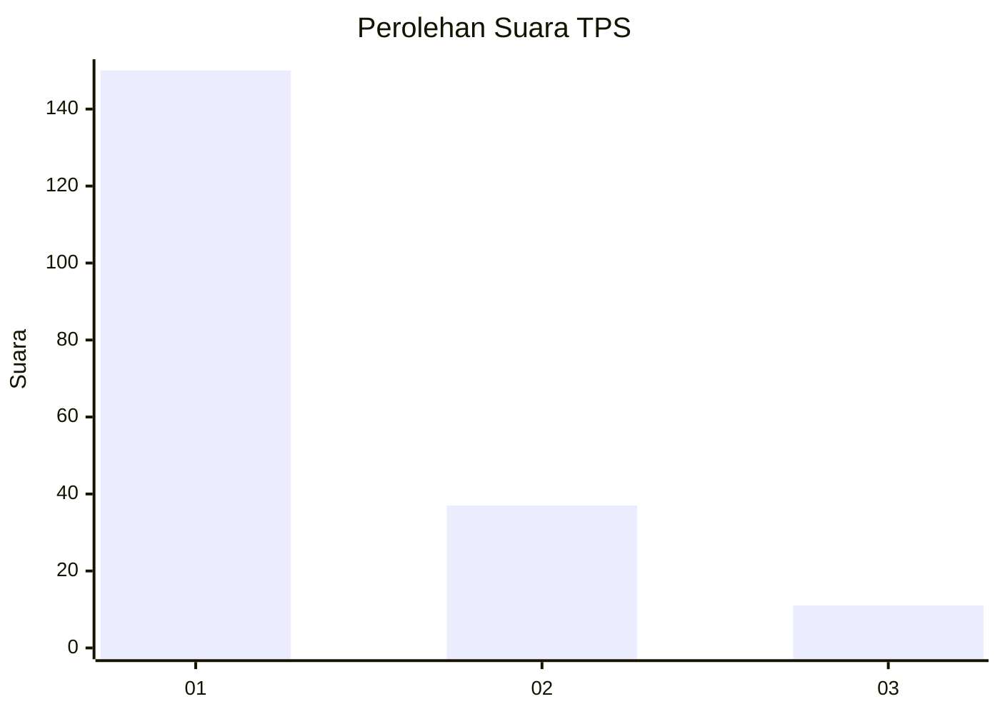
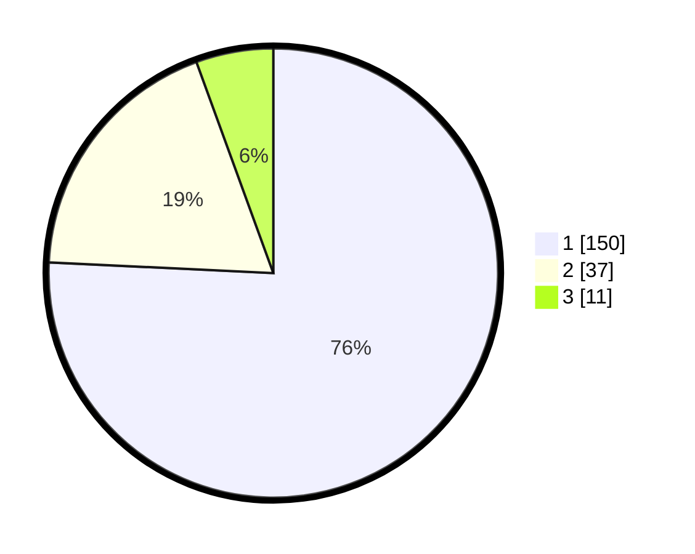

# Hasil

## Grafik

## Tabel

| No. | Nama Paslon    | Suara | Suara (raw) | Persentase |
|:--- |:-------------- | -----:| -----------:| ----------:|
| 1   | ANIES MUHAIMIN | 150   | [150][p-1]  | 75,76      |
| 2   | PRABOWO GIBRAN | 37    | [37][p-2]   | 18,69      |
| 3   | GANJAR MAHFUD  | 11    | [11][p-3]   | 5,56       |

[p-1]: https://github.com/gigit-pemilu/pemilu-2024-11-aceh/blob/main/pilpres/hitung-suara/sub/11-aceh/sub/08-aceh-utara/sub/02-dewantara/sub/2001-keude-krueng-geukueh/sub/006-tps/sub/paslon-1.txt
[p-2]: https://github.com/gigit-pemilu/pemilu-2024-11-aceh/blob/main/pilpres/hitung-suara/sub/11-aceh/sub/08-aceh-utara/sub/02-dewantara/sub/2001-keude-krueng-geukueh/sub/006-tps/sub/paslon-2.txt
[p-3]: https://github.com/gigit-pemilu/pemilu-2024-11-aceh/blob/main/pilpres/hitung-suara/sub/11-aceh/sub/08-aceh-utara/sub/02-dewantara/sub/2001-keude-krueng-geukueh/sub/006-tps/sub/paslon-3.txt

## Foto C Plano

https://sirekap-obj-formc.kpu.go.id/b3d7/pemilu/ppwp/11/08/02/20/01/1108022001006-20240215-035847--e5bd8a8b-d792-4c4a-a8ce-7b8ab71ec242.jpg

https://sirekap-obj-formc.kpu.go.id/b3d7/pemilu/ppwp/11/08/02/20/01/1108022001006-20240215-035310--fff0b365-9a6b-4a0b-bebc-b1e9fe72b5d2.jpg

https://sirekap-obj-formc.kpu.go.id/b3d7/pemilu/ppwp/11/08/02/20/01/1108022001006-20240215-035411--84e78571-a2f1-4c1b-8182-db1062ccea56.jpg

## Metadata

| Key        | Value               |
| ---------- | ------------------- |
| Time Stamp | 2024-02-15 16:00:26 |

