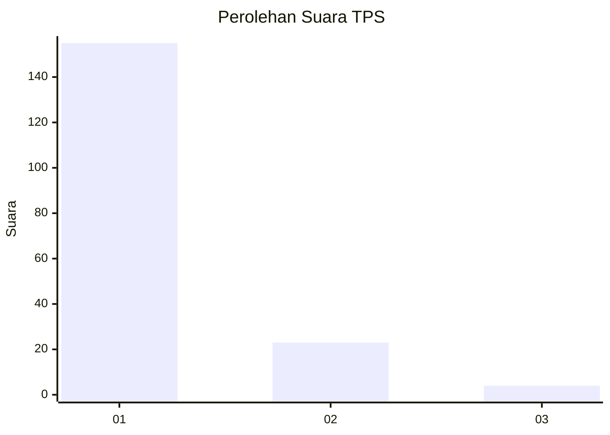
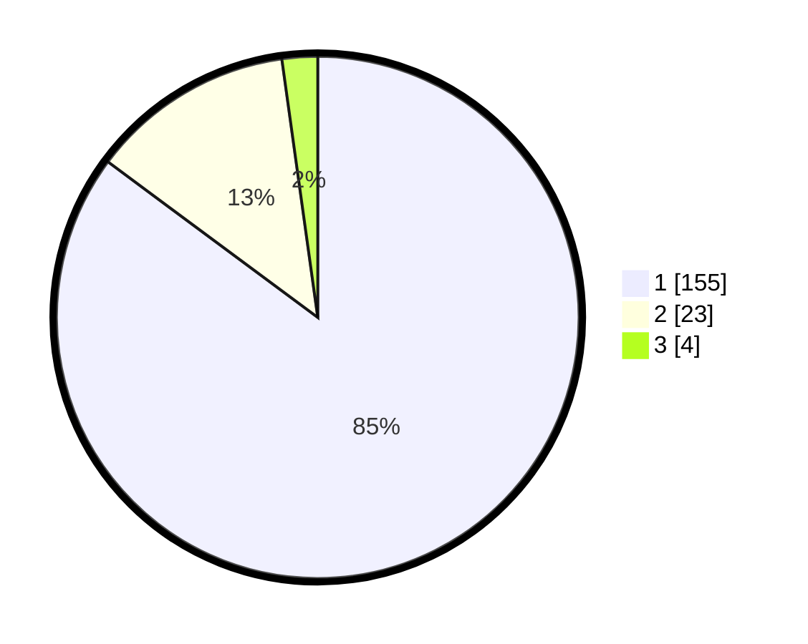

# Hasil

## Grafik

## Tabel

| No. | Nama Paslon    | Suara | Suara (raw) | Persentase |
|:--- |:-------------- | -----:| -----------:| ----------:|
| 1   | ANIES MUHAIMIN | 155   | [155][p-1]  | 85,16      |
| 2   | PRABOWO GIBRAN | 23    | [23][p-2]   | 12,64      |
| 3   | GANJAR MAHFUD  | 4     | [4][p-3]    | 2,20       |

[p-1]: https://github.com/gigit-pemilu/pemilu-2024-11-aceh/blob/main/pilpres/hitung-suara/sub/11-aceh/sub/08-aceh-utara/sub/02-dewantara/sub/2003-tambon-tunong/sub/007-tps/sub/paslon-1.txt
[p-2]: https://github.com/gigit-pemilu/pemilu-2024-11-aceh/blob/main/pilpres/hitung-suara/sub/11-aceh/sub/08-aceh-utara/sub/02-dewantara/sub/2003-tambon-tunong/sub/007-tps/sub/paslon-2.txt
[p-3]: https://github.com/gigit-pemilu/pemilu-2024-11-aceh/blob/main/pilpres/hitung-suara/sub/11-aceh/sub/08-aceh-utara/sub/02-dewantara/sub/2003-tambon-tunong/sub/007-tps/sub/paslon-3.txt

## Foto C Plano

https://sirekap-obj-formc.kpu.go.id/2ee9/pemilu/ppwp/11/08/02/20/03/1108022003007-20240215-015320--53a31b4c-5997-4910-9a7e-9125ba2b6ca5.jpg

https://sirekap-obj-formc.kpu.go.id/2ee9/pemilu/ppwp/11/08/02/20/03/1108022003007-20240215-015430--ac177a4c-5b07-4404-b7f0-e59817dfb426.jpg

## Metadata

| Key        | Value               |
| ---------- | ------------------- |
| Time Stamp | 2024-02-16 23:00:00 |

