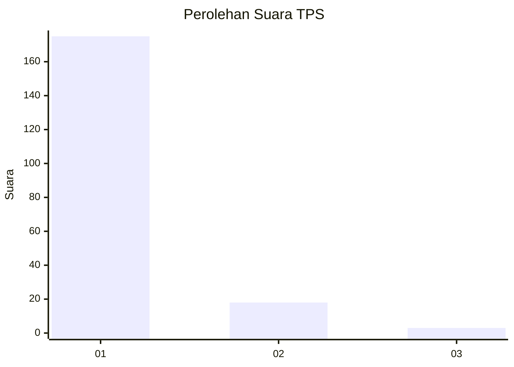
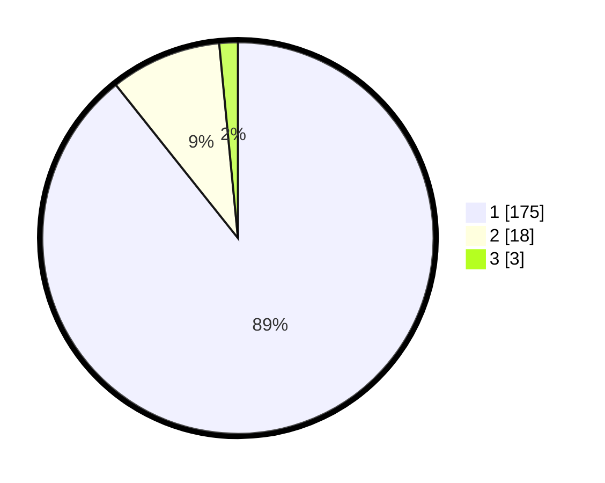

# Hasil

## Grafik

## Tabel

| No. | Nama Paslon    | Suara | Suara (raw) | Persentase |
|:--- |:-------------- | -----:| -----------:| ----------:|
| 1   | ANIES MUHAIMIN | 175   | [175][p-1]  | 89,29      |
| 2   | PRABOWO GIBRAN | 18    | [18][p-2]   | 9,18       |
| 3   | GANJAR MAHFUD  | 3     | [3][p-3]    | 1,53       |

[p-1]: https://github.com/gigit-pemilu/pemilu-2024-11-aceh/blob/main/pilpres/hitung-suara/sub/11-aceh/sub/08-aceh-utara/sub/02-dewantara/sub/2003-tambon-tunong/sub/009-tps/sub/paslon-1.txt
[p-2]: https://github.com/gigit-pemilu/pemilu-2024-11-aceh/blob/main/pilpres/hitung-suara/sub/11-aceh/sub/08-aceh-utara/sub/02-dewantara/sub/2003-tambon-tunong/sub/009-tps/sub/paslon-2.txt
[p-3]: https://github.com/gigit-pemilu/pemilu-2024-11-aceh/blob/main/pilpres/hitung-suara/sub/11-aceh/sub/08-aceh-utara/sub/02-dewantara/sub/2003-tambon-tunong/sub/009-tps/sub/paslon-3.txt

## Foto C Plano

https://sirekap-obj-formc.kpu.go.id/6010/pemilu/ppwp/11/08/02/20/03/1108022003009-20240223-223018--a013b227-e792-4ab4-aaba-555fc0d4f1cf.jpg

https://sirekap-obj-formc.kpu.go.id/6010/pemilu/ppwp/11/08/02/20/03/1108022003009-20240223-223805--185bd70d-9e20-47d4-9a62-bc27d695f72f.jpg

https://sirekap-obj-formc.kpu.go.id/6010/pemilu/ppwp/11/08/02/20/03/1108022003009-20240223-223924--98062dbc-9bf4-4b93-a948-27387d8d62ae.jpg

## Metadata

| Key        | Value               |
| ---------- | ------------------- |
| Time Stamp | 2024-02-24 22:31:28 |

