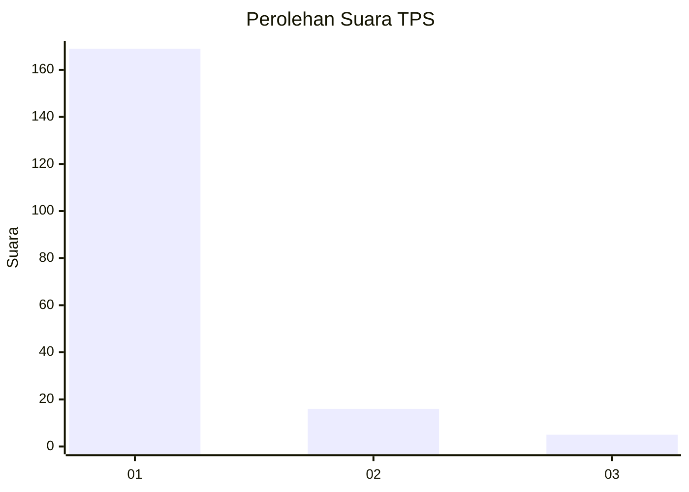
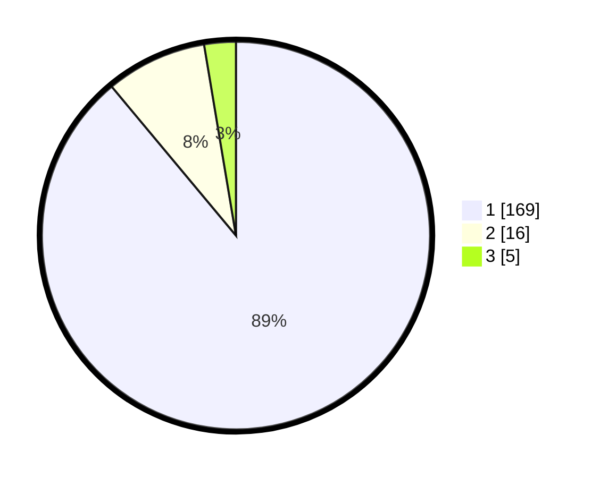

# Hasil

## Grafik

## Tabel

| No. | Nama Paslon    | Suara | Suara (raw) | Persentase |
|:--- |:-------------- | -----:| -----------:| ----------:|
| 1   | ANIES MUHAIMIN | 169   | [169][p-1]  | 88,95      |
| 2   | PRABOWO GIBRAN | 16    | [16][p-2]   | 8,42       |
| 3   | GANJAR MAHFUD  | 5     | [5][p-3]    | 2,63       |

[p-1]: https://github.com/gigit-pemilu/pemilu-2024-11-aceh/blob/main/pilpres/hitung-suara/sub/11-aceh/sub/08-aceh-utara/sub/02-dewantara/sub/2003-tambon-tunong/sub/011-tps/sub/paslon-1.txt
[p-2]: https://github.com/gigit-pemilu/pemilu-2024-11-aceh/blob/main/pilpres/hitung-suara/sub/11-aceh/sub/08-aceh-utara/sub/02-dewantara/sub/2003-tambon-tunong/sub/011-tps/sub/paslon-2.txt
[p-3]: https://github.com/gigit-pemilu/pemilu-2024-11-aceh/blob/main/pilpres/hitung-suara/sub/11-aceh/sub/08-aceh-utara/sub/02-dewantara/sub/2003-tambon-tunong/sub/011-tps/sub/paslon-3.txt

## Foto C Plano

https://sirekap-obj-formc.kpu.go.id/9d94/pemilu/ppwp/11/08/02/20/03/1108022003011-20240215-111659--43bc1b33-a810-49c2-a016-d8b581d7aff3.jpg

https://sirekap-obj-formc.kpu.go.id/9d94/pemilu/ppwp/11/08/02/20/03/1108022003011-20240215-111951--ba9d331f-93d2-424f-ab39-a2207e385343.jpg

https://sirekap-obj-formc.kpu.go.id/9d94/pemilu/ppwp/11/08/02/20/03/1108022003011-20240215-112956--a2c1c524-850f-4b10-ae62-63db548fe3c6.jpg

## Metadata

| Key        | Value               |
| ---------- | ------------------- |
| Time Stamp | 2024-02-16 22:30:00 |

