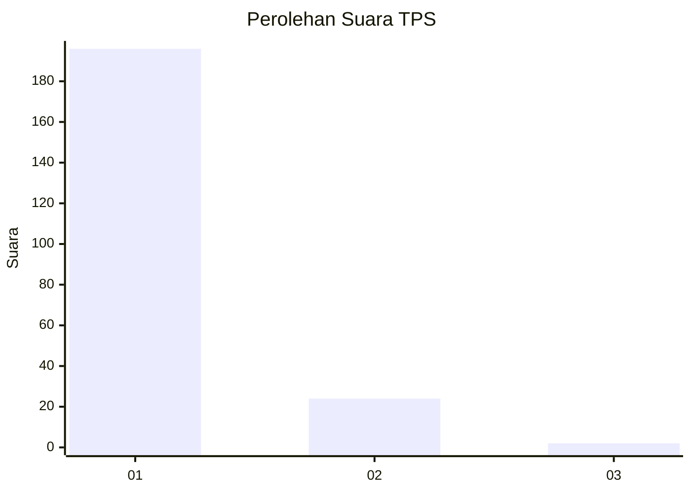
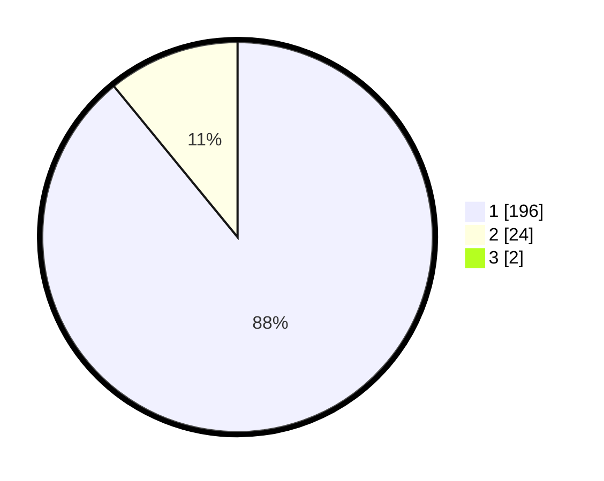

# Hasil

## Grafik

## Tabel

| No. | Nama Paslon    | Suara | Suara (raw) | Persentase |
|:--- |:-------------- | -----:| -----------:| ----------:|
| 1   | ANIES MUHAIMIN | 196   | [196][p-1]  | 88,29      |
| 2   | PRABOWO GIBRAN | 24    | [24][p-2]   | 10,81      |
| 3   | GANJAR MAHFUD  | 2     | [2][p-3]    | 0,90       |

[p-1]: https://github.com/gigit-pemilu/pemilu-2024-11-aceh/blob/main/pilpres/hitung-suara/sub/11-aceh/sub/08-aceh-utara/sub/02-dewantara/sub/2004-paloh-gadeng/sub/008-tps/sub/paslon-1.txt
[p-2]: https://github.com/gigit-pemilu/pemilu-2024-11-aceh/blob/main/pilpres/hitung-suara/sub/11-aceh/sub/08-aceh-utara/sub/02-dewantara/sub/2004-paloh-gadeng/sub/008-tps/sub/paslon-2.txt
[p-3]: https://github.com/gigit-pemilu/pemilu-2024-11-aceh/blob/main/pilpres/hitung-suara/sub/11-aceh/sub/08-aceh-utara/sub/02-dewantara/sub/2004-paloh-gadeng/sub/008-tps/sub/paslon-3.txt

## Foto C Plano

https://sirekap-obj-formc.kpu.go.id/d288/pemilu/ppwp/11/08/02/20/04/1108022004008-20240215-131030--59797760-019f-4de7-b61c-f7202a43374f.jpg

https://sirekap-obj-formc.kpu.go.id/d288/pemilu/ppwp/11/08/02/20/04/1108022004008-20240215-085244--e40983b9-b891-45c0-91f3-7476e4c6773e.jpg

https://sirekap-obj-formc.kpu.go.id/d288/pemilu/ppwp/11/08/02/20/04/1108022004008-20240215-095127--e7bdf649-00e6-4868-a963-7e28bac4f911.jpg

## Metadata

| Key        | Value               |
| ---------- | ------------------- |
| Time Stamp | 2024-02-16 23:00:00 |

