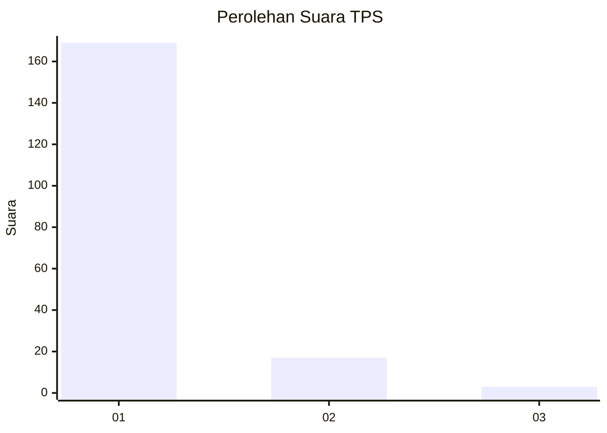
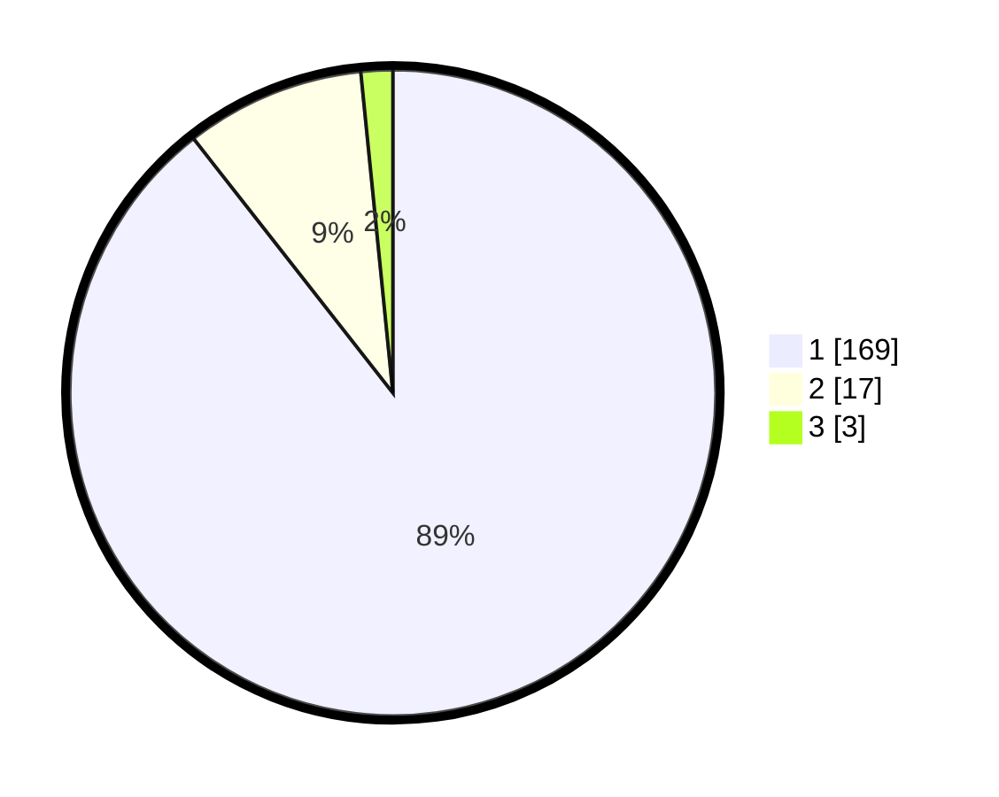

# Hasil

## Grafik

## Tabel

| No. | Nama Paslon    | Suara | Suara (raw) | Persentase |
|:--- |:-------------- | -----:| -----------:| ----------:|
| 1   | ANIES MUHAIMIN | 169   | [169][p-1]  | 89,42      |
| 2   | PRABOWO GIBRAN | 17    | [17][p-2]   | 8,99       |
| 3   | GANJAR MAHFUD  | 3     | [3][p-3]    | 1,59       |

[p-1]: https://github.com/gigit-pemilu/pemilu-2024-11-aceh/blob/main/pilpres/hitung-suara/sub/11-aceh/sub/08-aceh-utara/sub/02-dewantara/sub/2007-pulo-rungkom/sub/003-tps/sub/paslon-1.txt
[p-2]: https://github.com/gigit-pemilu/pemilu-2024-11-aceh/blob/main/pilpres/hitung-suara/sub/11-aceh/sub/08-aceh-utara/sub/02-dewantara/sub/2007-pulo-rungkom/sub/003-tps/sub/paslon-2.txt
[p-3]: https://github.com/gigit-pemilu/pemilu-2024-11-aceh/blob/main/pilpres/hitung-suara/sub/11-aceh/sub/08-aceh-utara/sub/02-dewantara/sub/2007-pulo-rungkom/sub/003-tps/sub/paslon-3.txt

## Foto C Plano

https://sirekap-obj-formc.kpu.go.id/fccf/pemilu/ppwp/11/08/02/20/07/1108022007003-20240214-233043--02b36c4b-3c83-44b2-8bc1-658b7d175264.jpg

https://sirekap-obj-formc.kpu.go.id/fccf/pemilu/ppwp/11/08/02/20/07/1108022007003-20240214-233104--915832f3-affb-40f9-94b7-5fd584f043ba.jpg

https://sirekap-obj-formc.kpu.go.id/fccf/pemilu/ppwp/11/08/02/20/07/1108022007003-20240214-233136--c0a55635-6e1d-41c1-b0cd-5f20c2c847a6.jpg

## Metadata

| Key        | Value               |
| ---------- | ------------------- |
| Time Stamp | 2024-02-16 23:30:00 |

