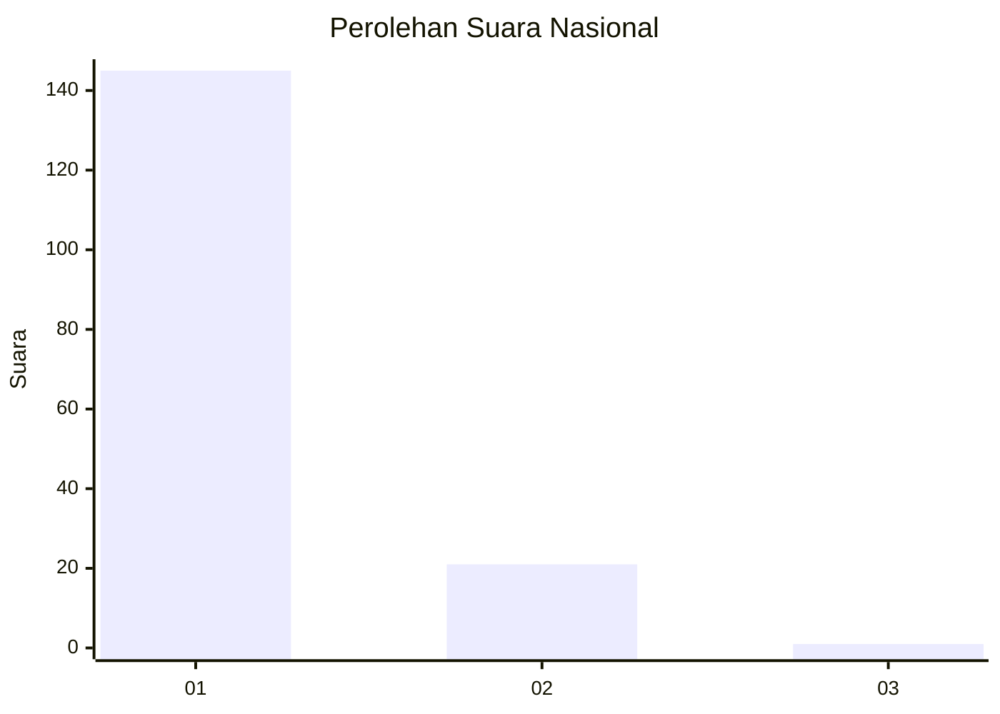
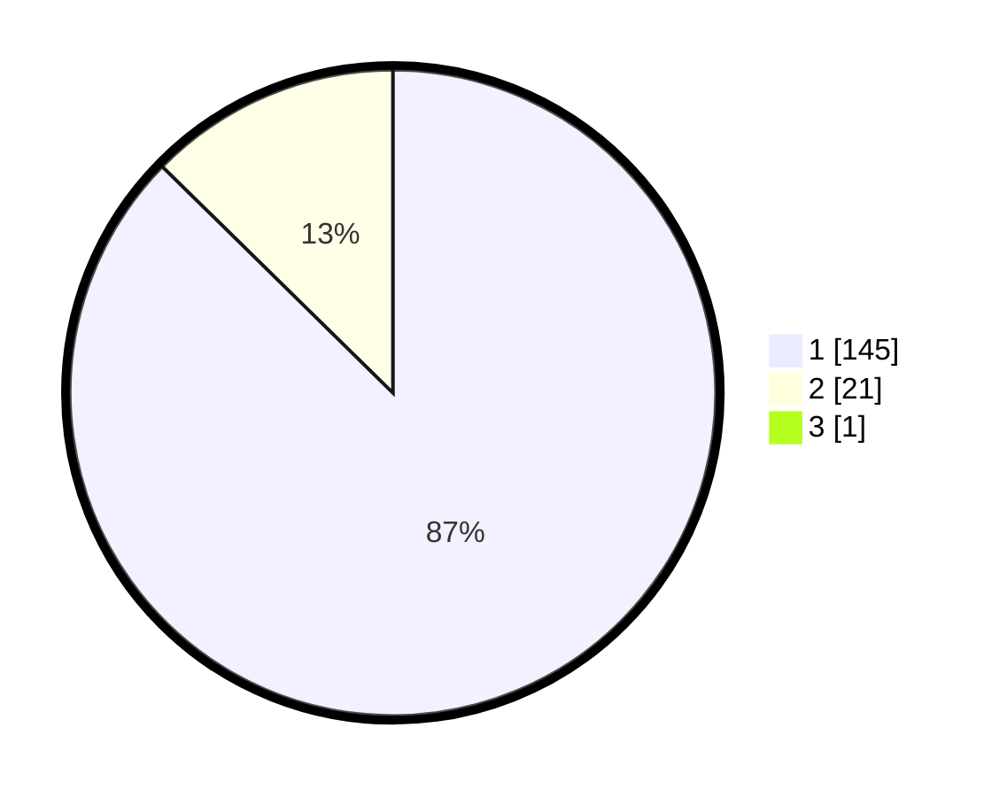

# Hasil

## Grafik

## Tabel

| No. | Nama Paslon    | Suara | Suara (raw) | Persentase |
|:--- |:-------------- | -----:| -----------:| ----------:|
| 1   | ANIES MUHAIMIN | 145   | [145][p-1]  | 86,83      |
| 2   | PRABOWO GIBRAN | 21    | [21][p-2]   | 12,57      |
| 3   | GANJAR MAHFUD  | 1     | [1][p-3]    | 0,60       |

[p-1]: https://github.com/gigit-pemilu/pemilu-2024/blob/main/pilpres/hitung-suara/sub/11-aceh/sub/08-aceh-utara/sub/02-dewantara/sub/2011-ulee-reuleung/sub/004-tps/sub/paslon-1.txt
[p-2]: https://github.com/gigit-pemilu/pemilu-2024/blob/main/pilpres/hitung-suara/sub/11-aceh/sub/08-aceh-utara/sub/02-dewantara/sub/2011-ulee-reuleung/sub/004-tps/sub/paslon-2.txt
[p-3]: https://github.com/gigit-pemilu/pemilu-2024/blob/main/pilpres/hitung-suara/sub/11-aceh/sub/08-aceh-utara/sub/02-dewantara/sub/2011-ulee-reuleung/sub/004-tps/sub/paslon-3.txt

## Foto C Plano

https://sirekap-obj-formc.kpu.go.id/35dd/pemilu/ppwp/11/08/02/20/11/1108022011004-20240215-142151--dfa63dd2-0993-42c2-be81-50c1454564b2.jpg

https://sirekap-obj-formc.kpu.go.id/35dd/pemilu/ppwp/11/08/02/20/11/1108022011004-20240215-142306--74d6f51b-5d74-4cf9-a486-b8a2293f6620.jpg

https://sirekap-obj-formc.kpu.go.id/35dd/pemilu/ppwp/11/08/02/20/11/1108022011004-20240215-142356--cc8f99ca-a3de-4835-8287-bb83198a2532.jpg

## Metadata

| Key        | Value               |
| ---------- | ------------------- |
| Time Stamp | 2024-02-16 23:30:00 |

