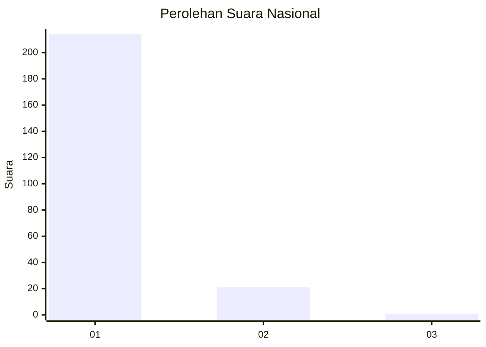
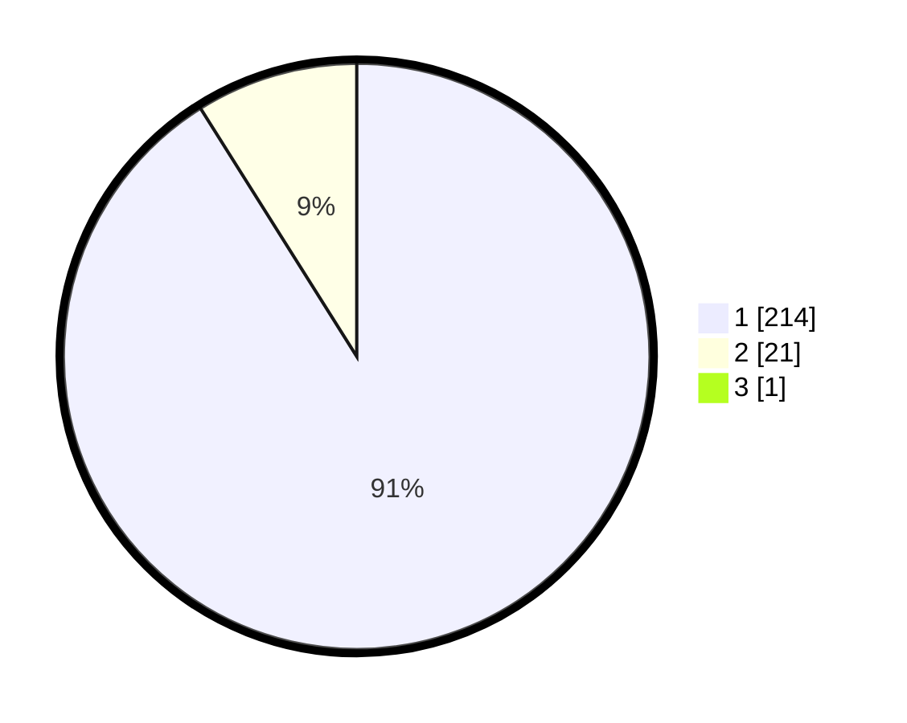

# Hasil

## Grafik

## Tabel

| No. | Nama Paslon    | Suara | Suara (raw) | Persentase |
|:--- |:-------------- | -----:| -----------:| ----------:|
| 1   | ANIES MUHAIMIN | 214   | [214][p-1]  | 90,68      |
| 2   | PRABOWO GIBRAN | 21    | [21][p-2]   | 8,90       |
| 3   | GANJAR MAHFUD  | 1     | [1][p-3]    | 0,42       |

[p-1]: https://github.com/gigit-pemilu/pemilu-2024/blob/main/pilpres/hitung-suara/sub/11-aceh/sub/08-aceh-utara/sub/02-dewantara/sub/2012-geulumpang-sulu-timu/sub/001-tps/sub/paslon-1.txt
[p-2]: https://github.com/gigit-pemilu/pemilu-2024/blob/main/pilpres/hitung-suara/sub/11-aceh/sub/08-aceh-utara/sub/02-dewantara/sub/2012-geulumpang-sulu-timu/sub/001-tps/sub/paslon-2.txt
[p-3]: https://github.com/gigit-pemilu/pemilu-2024/blob/main/pilpres/hitung-suara/sub/11-aceh/sub/08-aceh-utara/sub/02-dewantara/sub/2012-geulumpang-sulu-timu/sub/001-tps/sub/paslon-3.txt

## Foto C Plano

https://sirekap-obj-formc.kpu.go.id/005a/pemilu/ppwp/11/08/02/20/12/1108022012001-20240215-124546--d6a68b64-d0e7-4aec-89ff-346747021614.jpg

https://sirekap-obj-formc.kpu.go.id/005a/pemilu/ppwp/11/08/02/20/12/1108022012001-20240222-213616--6fecb3f9-979b-4ced-aaf8-a073076610b8.jpg

https://sirekap-obj-formc.kpu.go.id/005a/pemilu/ppwp/11/08/02/20/12/1108022012001-20240222-213615--655312c5-cb4c-461c-87f6-0088f29f90eb.jpg

## Metadata

| Key        | Value               |
| ---------- | ------------------- |
| Time Stamp | 2024-02-24 22:31:28 |

