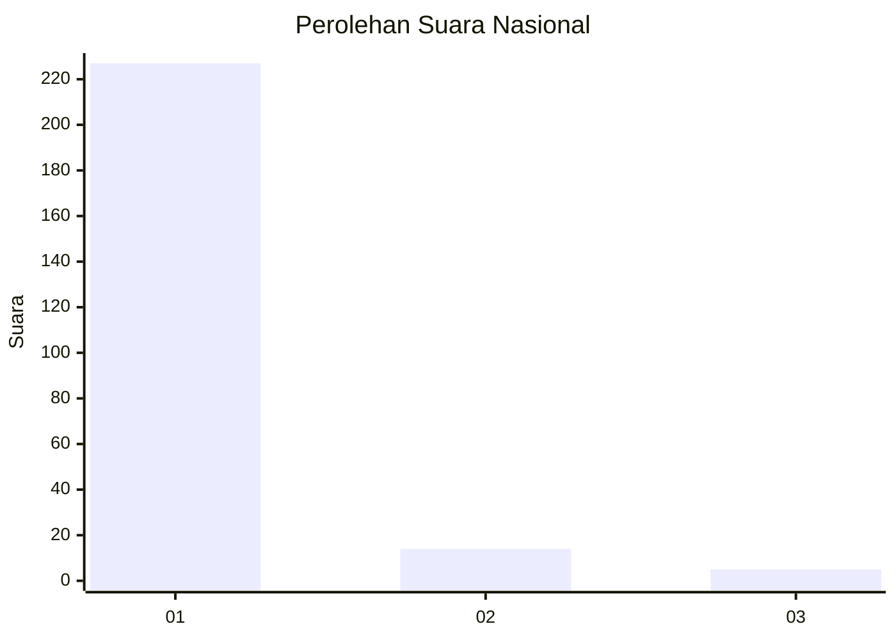
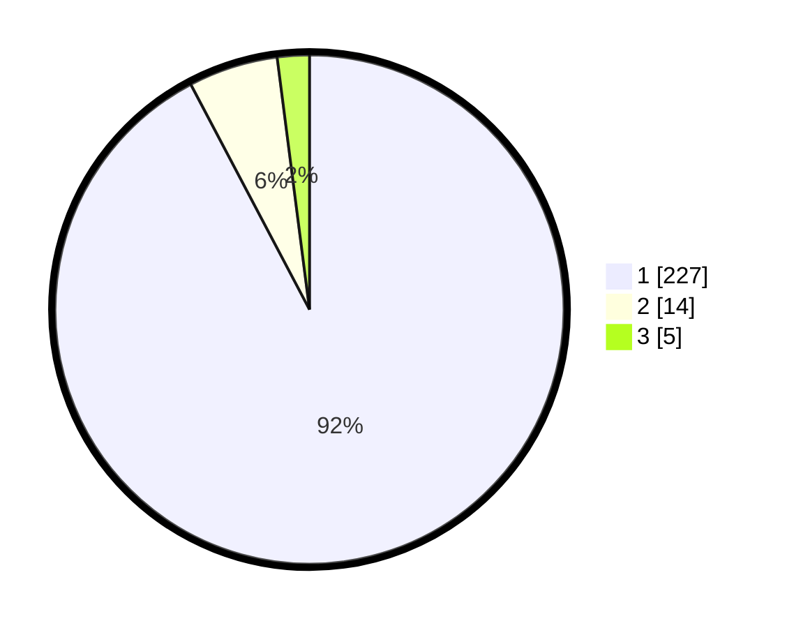

# Hasil

## Grafik

## Tabel

| No. | Nama Paslon    | Suara | Suara (raw) | Persentase |
|:--- |:-------------- | -----:| -----------:| ----------:|
| 1   | ANIES MUHAIMIN | 227   | [227][p-1]  | 92,28      |
| 2   | PRABOWO GIBRAN | 14    | [14][p-2]   | 5,69       |
| 3   | GANJAR MAHFUD  | 5     | [5][p-3]    | 2,03       |

[p-1]: https://github.com/gigit-pemilu/pemilu-2024/blob/main/pilpres/hitung-suara/sub/11-aceh/sub/08-aceh-utara/sub/02-dewantara/sub/2012-geulumpang-sulu-timu/sub/004-tps/sub/paslon-1.txt
[p-2]: https://github.com/gigit-pemilu/pemilu-2024/blob/main/pilpres/hitung-suara/sub/11-aceh/sub/08-aceh-utara/sub/02-dewantara/sub/2012-geulumpang-sulu-timu/sub/004-tps/sub/paslon-2.txt
[p-3]: https://github.com/gigit-pemilu/pemilu-2024/blob/main/pilpres/hitung-suara/sub/11-aceh/sub/08-aceh-utara/sub/02-dewantara/sub/2012-geulumpang-sulu-timu/sub/004-tps/sub/paslon-3.txt

## Foto C Plano

https://sirekap-obj-formc.kpu.go.id/307f/pemilu/ppwp/11/08/02/20/12/1108022012004-20240222-231914--fa4c2269-e0ad-4879-adef-583cc902c141.jpg

https://sirekap-obj-formc.kpu.go.id/307f/pemilu/ppwp/11/08/02/20/12/1108022012004-20240222-232522--c606efba-893d-4378-b260-d1b351380129.jpg

https://sirekap-obj-formc.kpu.go.id/307f/pemilu/ppwp/11/08/02/20/12/1108022012004-20240222-232632--834f0e86-9e0d-4dc9-a627-319628536c19.jpg

## Metadata

| Key        | Value               |
| ---------- | ------------------- |
| Time Stamp | 2024-02-24 22:31:28 |

## DATA PEMILIH TETAP

Jumlah pemilih dalam DPT: **277**.
 * L: **132**.
 * P: **145**.

## DATA PENGGUNA HAK PILIH

Jumlah pengguna hak pilih dalam DPT: **230**.
 * L: **100**.
 * P: **130**.

Jumlah pengguna hak pilih dalam DPTb: **0**.
 * L: **0**.
 * P: **0**.

Jumlah pengguna hak pilih dalam DPK: **14**.
 * L: **10**.
 * P: **4**.

Jumlah pengguna hak pilih: **244**.
 * L: **110**.
 * P: **134**.

## JUMLAH SUARA SAH DAN TIDAK SAH

JUMLAH SELURUH SUARA SAH: **243**.

JUMLAH SUARA TIDAK SAH: **1**.

JUMLAH SELURUH SUARA SAH DAN SUARA TIDAK SAH: **244**.

