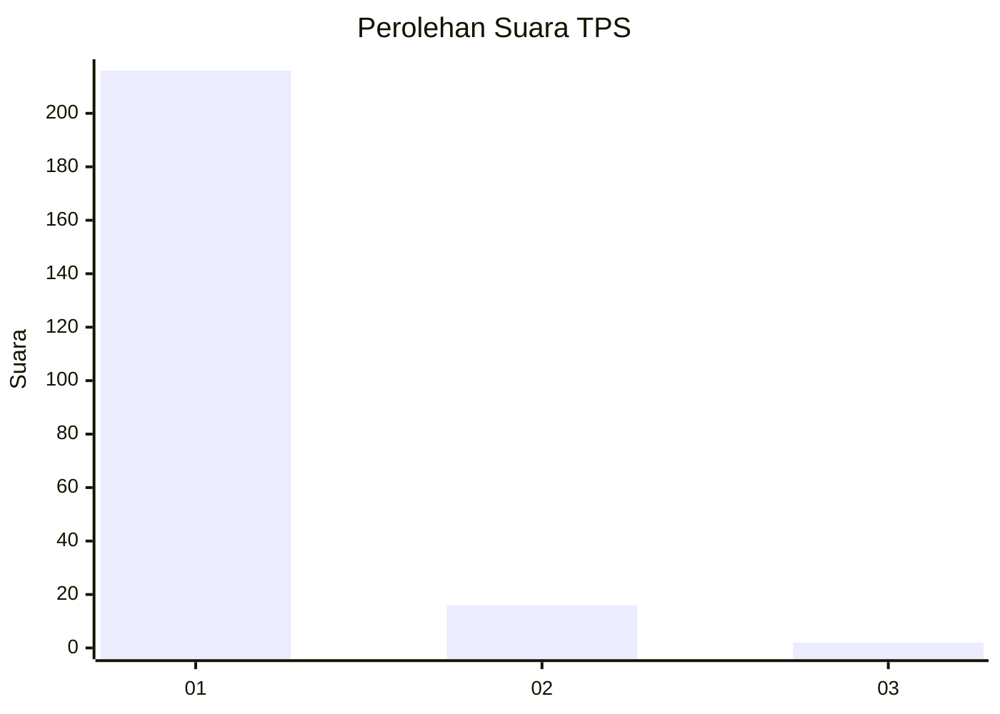
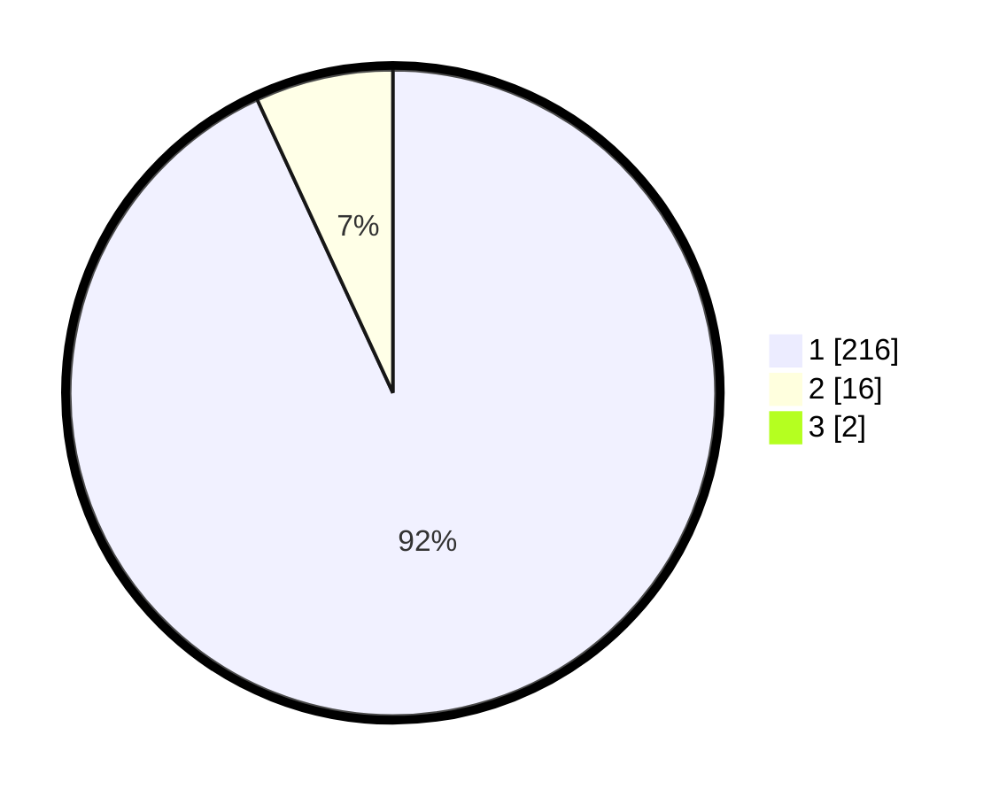

# Hasil

## Grafik

## Tabel

| No. | Nama Paslon    | Suara | Suara (raw) | Persentase |
|:--- |:-------------- | -----:| -----------:| ----------:|
| 1   | ANIES MUHAIMIN | 216   | [216][p-1]  | 92,31      |
| 2   | PRABOWO GIBRAN | 16    | [16][p-2]   | 6,84       |
| 3   | GANJAR MAHFUD  | 2     | [2][p-3]    | 0,85       |

[p-1]: https://github.com/gigit-pemilu/pemilu-2024-11-aceh/blob/main/pilpres/hitung-suara/sub/11-aceh/sub/08-aceh-utara/sub/02-dewantara/sub/2013-geulumpang-sulu-barat/sub/002-tps/sub/paslon-1.txt
[p-2]: https://github.com/gigit-pemilu/pemilu-2024-11-aceh/blob/main/pilpres/hitung-suara/sub/11-aceh/sub/08-aceh-utara/sub/02-dewantara/sub/2013-geulumpang-sulu-barat/sub/002-tps/sub/paslon-2.txt
[p-3]: https://github.com/gigit-pemilu/pemilu-2024-11-aceh/blob/main/pilpres/hitung-suara/sub/11-aceh/sub/08-aceh-utara/sub/02-dewantara/sub/2013-geulumpang-sulu-barat/sub/002-tps/sub/paslon-3.txt

## Foto C Plano

https://sirekap-obj-formc.kpu.go.id/cc80/pemilu/ppwp/11/08/02/20/13/1108022013002-20240215-113750--b9bdc5d8-6e17-450d-ac60-8a49c8640859.jpg

https://sirekap-obj-formc.kpu.go.id/cc80/pemilu/ppwp/11/08/02/20/13/1108022013002-20240215-113945--bae91ba3-ee9c-4054-a4d4-ded757da8b78.jpg

https://sirekap-obj-formc.kpu.go.id/cc80/pemilu/ppwp/11/08/02/20/13/1108022013002-20240215-114054--25bd456e-dfa1-41e8-aee9-74b76e873b61.jpg

## Metadata

| Key        | Value               |
| ---------- | ------------------- |
| Time Stamp | 2024-02-15 20:00:44 |

