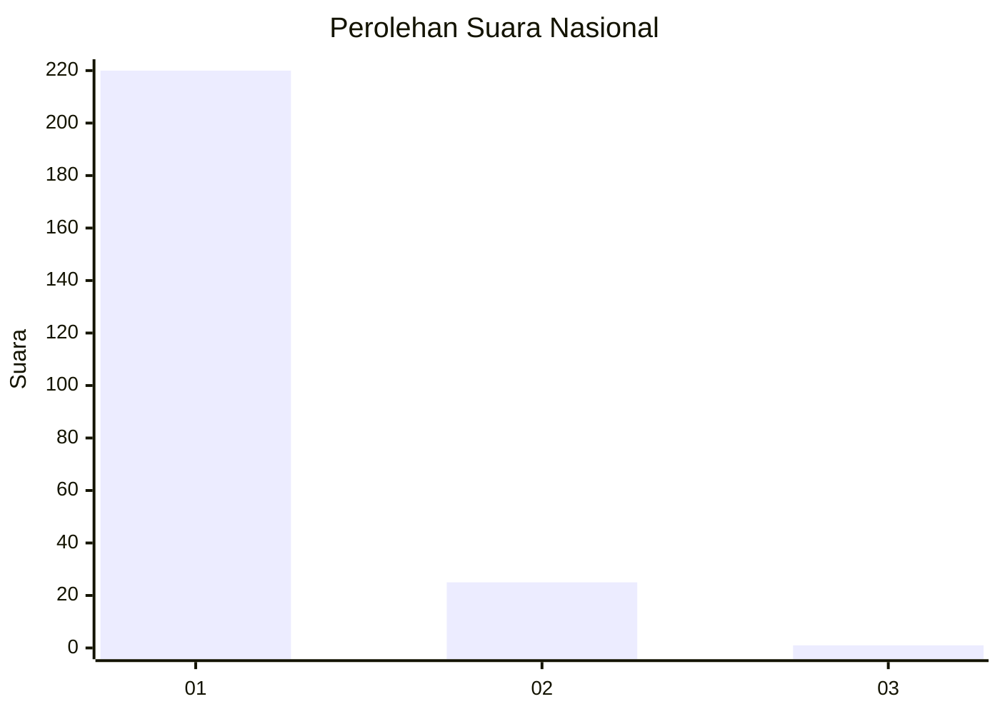
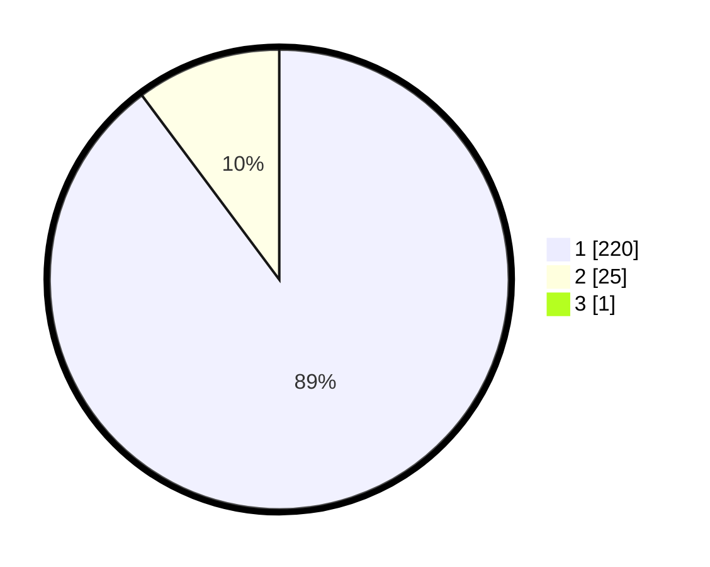

# Hasil

## Grafik

## Tabel

| No. | Nama Paslon    | Suara | Suara (raw) | Persentase |
|:--- |:-------------- | -----:| -----------:| ----------:|
| 1   | ANIES MUHAIMIN | 220   | [220][p-1]  | 89,43      |
| 2   | PRABOWO GIBRAN | 25    | [25][p-2]   | 10,16      |
| 3   | GANJAR MAHFUD  | 1     | [1][p-3]    | 0,41       |

[p-1]: https://github.com/gigit-pemilu/pemilu-2024/blob/main/pilpres/hitung-suara/sub/11-aceh/sub/08-aceh-utara/sub/02-dewantara/sub/2013-geulumpang-sulu-barat/sub/003-tps/sub/paslon-1.txt
[p-2]: https://github.com/gigit-pemilu/pemilu-2024/blob/main/pilpres/hitung-suara/sub/11-aceh/sub/08-aceh-utara/sub/02-dewantara/sub/2013-geulumpang-sulu-barat/sub/003-tps/sub/paslon-2.txt
[p-3]: https://github.com/gigit-pemilu/pemilu-2024/blob/main/pilpres/hitung-suara/sub/11-aceh/sub/08-aceh-utara/sub/02-dewantara/sub/2013-geulumpang-sulu-barat/sub/003-tps/sub/paslon-3.txt

## Foto C Plano

https://sirekap-obj-formc.kpu.go.id/2f0b/pemilu/ppwp/11/08/02/20/13/1108022013003-20240215-092249--1b662c6b-b888-4dfb-9961-3718f11a330d.jpg

https://sirekap-obj-formc.kpu.go.id/2f0b/pemilu/ppwp/11/08/02/20/13/1108022013003-20240215-092350--929d1238-8618-45e8-b740-2dbcf7e7fa2a.jpg

https://sirekap-obj-formc.kpu.go.id/2f0b/pemilu/ppwp/11/08/02/20/13/1108022013003-20240215-092433--03ae21f9-39f1-4005-ab01-a6b228ab89da.jpg

## Metadata

| Key        | Value               |
| ---------- | ------------------- |
| Time Stamp | 2024-02-16 23:00:00 |

