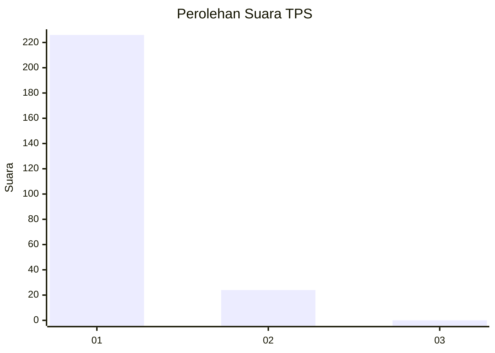
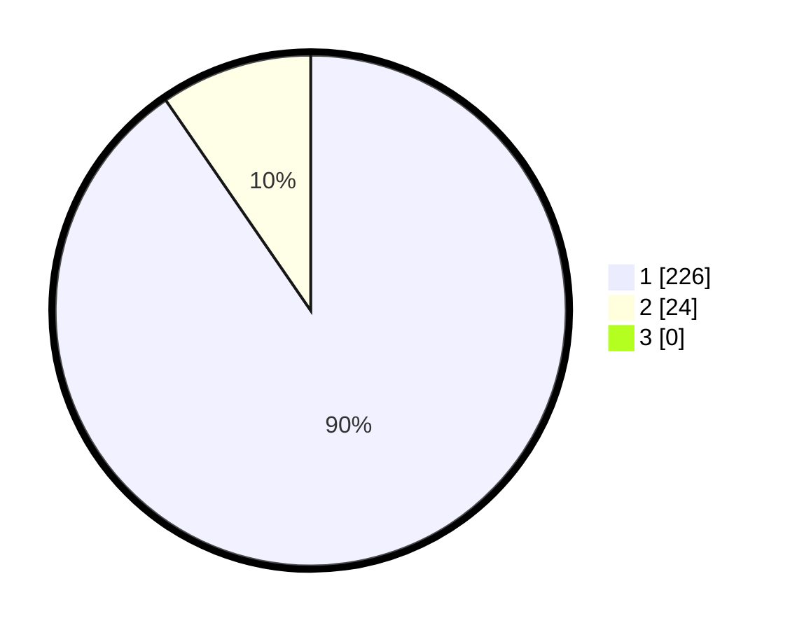

# Hasil

## Grafik

## Tabel

| No. | Nama Paslon    | Suara | Suara (raw) | Persentase |
|:--- |:-------------- | -----:| -----------:| ----------:|
| 1   | ANIES MUHAIMIN | 226   | [226][p-1]  | 90,40      |
| 2   | PRABOWO GIBRAN | 24    | [24][p-2]   | 9,60       |
| 3   | GANJAR MAHFUD  | 0     | [0][p-3]    | 0,00       |

[p-1]: https://github.com/gigit-pemilu/pemilu-2024-11-aceh/blob/main/pilpres/hitung-suara/sub/11-aceh/sub/08-aceh-utara/sub/02-dewantara/sub/2013-geulumpang-sulu-barat/sub/004-tps/sub/paslon-1.txt
[p-2]: https://github.com/gigit-pemilu/pemilu-2024-11-aceh/blob/main/pilpres/hitung-suara/sub/11-aceh/sub/08-aceh-utara/sub/02-dewantara/sub/2013-geulumpang-sulu-barat/sub/004-tps/sub/paslon-2.txt
[p-3]: https://github.com/gigit-pemilu/pemilu-2024-11-aceh/blob/main/pilpres/hitung-suara/sub/11-aceh/sub/08-aceh-utara/sub/02-dewantara/sub/2013-geulumpang-sulu-barat/sub/004-tps/sub/paslon-3.txt

## Foto C Plano

https://sirekap-obj-formc.kpu.go.id/4a62/pemilu/ppwp/11/08/02/20/13/1108022013004-20240215-085436--581c155c-6735-4300-9f56-b976a2e2244e.jpg

https://sirekap-obj-formc.kpu.go.id/4a62/pemilu/ppwp/11/08/02/20/13/1108022013004-20240215-085539--0c46b686-8528-4efb-8890-240ade9ad69a.jpg

https://sirekap-obj-formc.kpu.go.id/4a62/pemilu/ppwp/11/08/02/20/13/1108022013004-20240215-090029--31fbdbaf-8bcf-4493-8197-ee543898d838.jpg

## Metadata

| Key        | Value               |
| ---------- | ------------------- |
| Time Stamp | 2024-02-15 18:00:26 |

