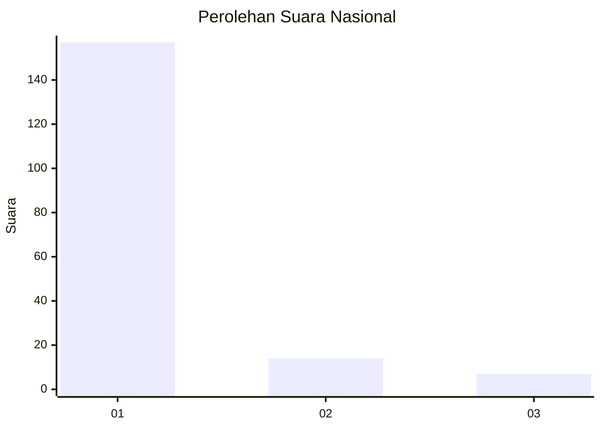
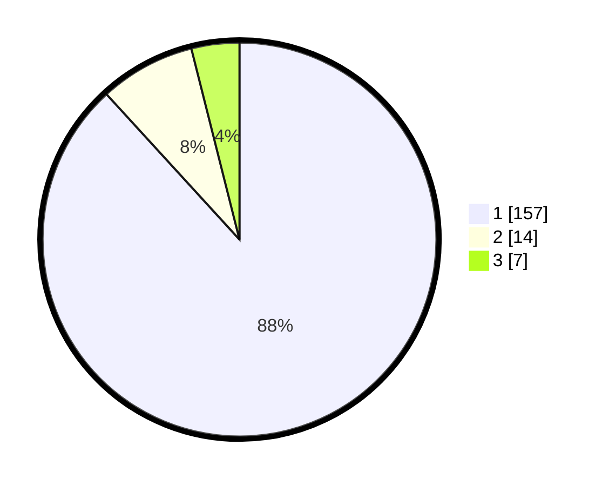

# Hasil

## Grafik

## Tabel

| No. | Nama Paslon    | Suara | Suara (raw) | Persentase |
|:--- |:-------------- | -----:| -----------:| ----------:|
| 1   | ANIES MUHAIMIN | 157   | [157][p-1]  | 88,20      |
| 2   | PRABOWO GIBRAN | 14    | [14][p-2]   | 7,87       |
| 3   | GANJAR MAHFUD  | 7     | [7][p-3]    | 3,93       |

[p-1]: https://github.com/gigit-pemilu/pemilu-2024/blob/main/pilpres/hitung-suara/sub/11-aceh/sub/08-aceh-utara/sub/03-kuta-makmur/sub/2001-meunasah-blang-ara/sub/001-tps/sub/paslon-1.txt
[p-2]: https://github.com/gigit-pemilu/pemilu-2024/blob/main/pilpres/hitung-suara/sub/11-aceh/sub/08-aceh-utara/sub/03-kuta-makmur/sub/2001-meunasah-blang-ara/sub/001-tps/sub/paslon-2.txt
[p-3]: https://github.com/gigit-pemilu/pemilu-2024/blob/main/pilpres/hitung-suara/sub/11-aceh/sub/08-aceh-utara/sub/03-kuta-makmur/sub/2001-meunasah-blang-ara/sub/001-tps/sub/paslon-3.txt

## Foto C Plano

https://sirekap-obj-formc.kpu.go.id/4467/pemilu/ppwp/11/08/03/20/01/1108032001001-20240214-202441--adaa8f97-9eab-4708-83cb-3e9bdc462f81.jpg

https://sirekap-obj-formc.kpu.go.id/4467/pemilu/ppwp/11/08/03/20/01/1108032001001-20240214-195742--f3d2967a-04bf-4d3b-a81e-0d4bd9722334.jpg

https://sirekap-obj-formc.kpu.go.id/4467/pemilu/ppwp/11/08/03/20/01/1108032001001-20240214-195931--ea43d3c7-8874-48fb-8550-48eb05e92a4c.jpg

## Metadata

| Key        | Value               |
| ---------- | ------------------- |
| Time Stamp | 2024-02-15 03:06:03 |

## DATA PEMILIH TETAP

Jumlah pemilih dalam DPT: **182**.
 * L: **100**.
 * P: **82**.

## DATA PENGGUNA HAK PILIH

Jumlah pengguna hak pilih dalam DPT: **179**.
 * L: **98**.
 * P: **81**.

Jumlah pengguna hak pilih dalam DPTb: **0**.
 * L: **0**.
 * P: **0**.

Jumlah pengguna hak pilih dalam DPK: **0**.
 * L: **0**.
 * P: **0**.

Jumlah pengguna hak pilih: **179**.
 * L: **98**.
 * P: **81**.

## JUMLAH SUARA SAH DAN TIDAK SAH

JUMLAH SELURUH SUARA SAH: **178**.

JUMLAH SUARA TIDAK SAH: **1**.

JUMLAH SELURUH SUARA SAH DAN SUARA TIDAK SAH: **179**.

