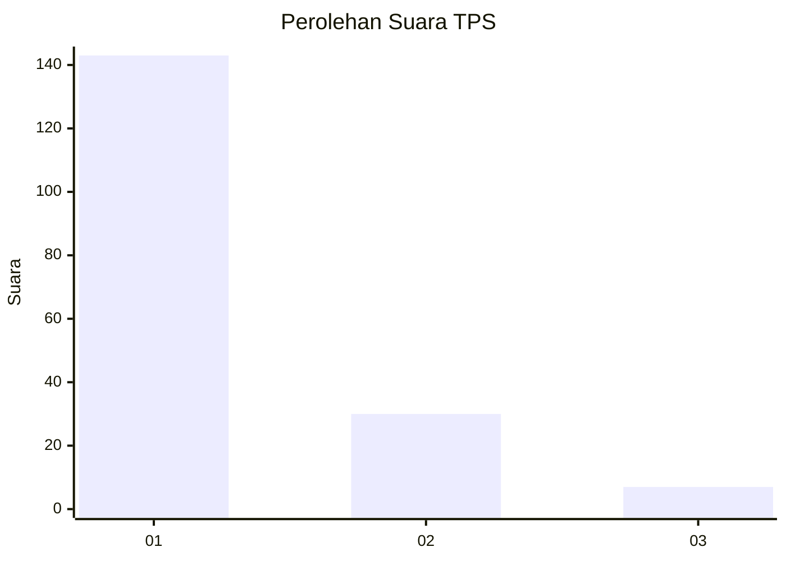
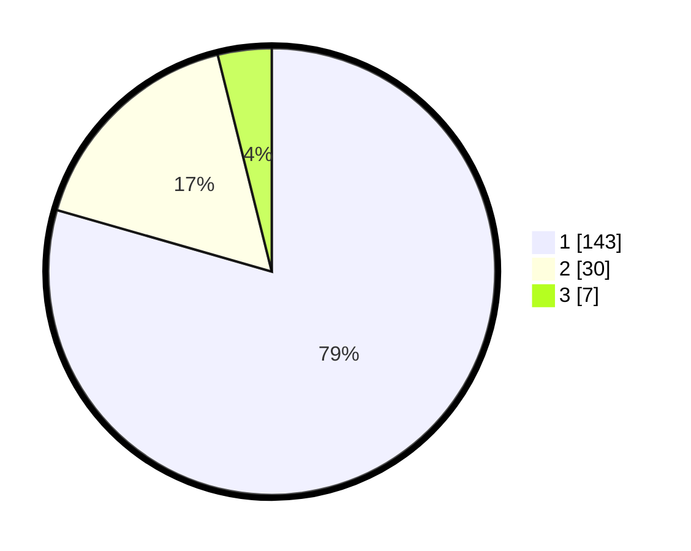

# Hasil

## Grafik

## Tabel

| No. | Nama Paslon    | Suara | Suara (raw) | Persentase |
|:--- |:-------------- | -----:| -----------:| ----------:|
| 1   | ANIES MUHAIMIN | 143   | [143][p-1]  | 79,44      |
| 2   | PRABOWO GIBRAN | 30    | [30][p-2]   | 16,67      |
| 3   | GANJAR MAHFUD  | 7     | [7][p-3]    | 3,89       |

[p-1]: https://github.com/gigit-pemilu/pemilu-2024-11-aceh/blob/main/pilpres/hitung-suara/sub/11-aceh/sub/08-aceh-utara/sub/03-kuta-makmur/sub/2001-meunasah-blang-ara/sub/002-tps/sub/paslon-1.txt
[p-2]: https://github.com/gigit-pemilu/pemilu-2024-11-aceh/blob/main/pilpres/hitung-suara/sub/11-aceh/sub/08-aceh-utara/sub/03-kuta-makmur/sub/2001-meunasah-blang-ara/sub/002-tps/sub/paslon-2.txt
[p-3]: https://github.com/gigit-pemilu/pemilu-2024-11-aceh/blob/main/pilpres/hitung-suara/sub/11-aceh/sub/08-aceh-utara/sub/03-kuta-makmur/sub/2001-meunasah-blang-ara/sub/002-tps/sub/paslon-3.txt

## Foto C Plano

https://sirekap-obj-formc.kpu.go.id/6300/pemilu/ppwp/11/08/03/20/01/1108032001002-20240219-124619--999d0d81-9f6f-4a39-b056-1044af09b5bf.jpg

https://sirekap-obj-formc.kpu.go.id/6300/pemilu/ppwp/11/08/03/20/01/1108032001002-20240219-124941--0115f060-1292-4a08-89ed-361844fb781e.jpg

https://sirekap-obj-formc.kpu.go.id/6300/pemilu/ppwp/11/08/03/20/01/1108032001002-20240219-125108--7bb58ab3-8083-4468-94f2-503a99db65fd.jpg

## Metadata

| Key        | Value               |
| ---------- | ------------------- |
| Time Stamp | 2024-02-19 13:00:00 |

## DATA PEMILIH TETAP

Jumlah pemilih dalam DPT: **179**.
 * L: **85**.
 * P: **94**.

## DATA PENGGUNA HAK PILIH

Jumlah pengguna hak pilih dalam DPT: **179**.
 * L: **85**.
 * P: **94**.

Jumlah pengguna hak pilih dalam DPTb: **0**.
 * L: **0**.
 * P: **0**.

Jumlah pengguna hak pilih dalam DPK: **3**.
 * L: **1**.
 * P: **2**.

Jumlah pengguna hak pilih: **182**.
 * L: **86**.
 * P: **96**.

## JUMLAH SUARA SAH DAN TIDAK SAH

JUMLAH SELURUH SUARA SAH: **180**.

JUMLAH SUARA TIDAK SAH: **2**.

JUMLAH SELURUH SUARA SAH DAN SUARA TIDAK SAH: **182**.

