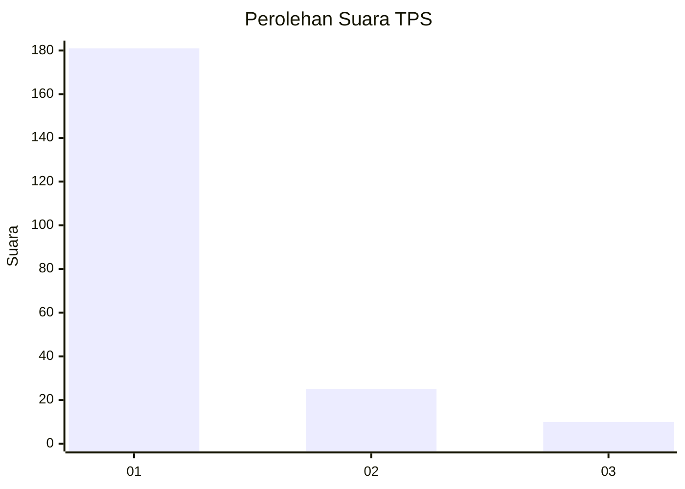
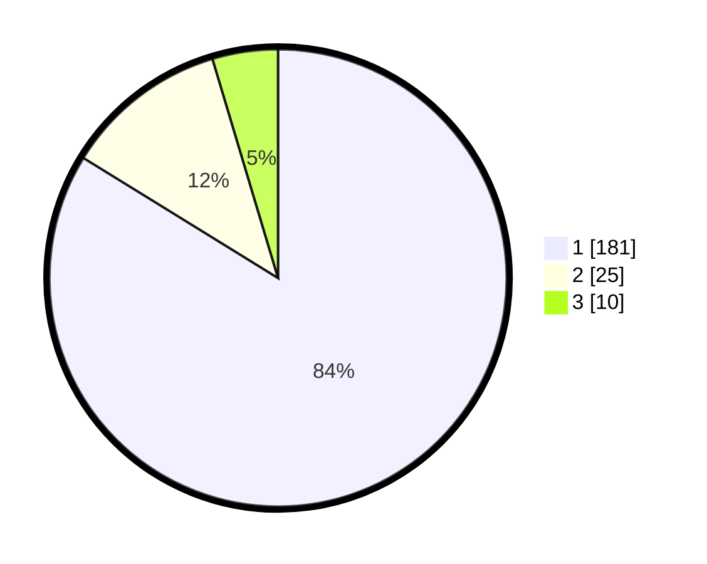

# Hasil

## Grafik

## Tabel

| No. | Nama Paslon    | Suara | Suara (raw) | Persentase |
|:--- |:-------------- | -----:| -----------:| ----------:|
| 1   | ANIES MUHAIMIN | 181   | [181][p-1]  | 83,80      |
| 2   | PRABOWO GIBRAN | 25    | [25][p-2]   | 11,57      |
| 3   | GANJAR MAHFUD  | 10    | [10][p-3]   | 4,63       |

[p-1]: https://github.com/gigit-pemilu/pemilu-2024-11-aceh/blob/main/pilpres/hitung-suara/sub/11-aceh/sub/08-aceh-utara/sub/03-kuta-makmur/sub/2002-meunasah-buket/sub/003-tps/sub/paslon-1.txt
[p-2]: https://github.com/gigit-pemilu/pemilu-2024-11-aceh/blob/main/pilpres/hitung-suara/sub/11-aceh/sub/08-aceh-utara/sub/03-kuta-makmur/sub/2002-meunasah-buket/sub/003-tps/sub/paslon-2.txt
[p-3]: https://github.com/gigit-pemilu/pemilu-2024-11-aceh/blob/main/pilpres/hitung-suara/sub/11-aceh/sub/08-aceh-utara/sub/03-kuta-makmur/sub/2002-meunasah-buket/sub/003-tps/sub/paslon-3.txt

## Foto C Plano

https://sirekap-obj-formc.kpu.go.id/2587/pemilu/ppwp/11/08/03/20/02/1108032002003-20240219-175130--ab8eec12-dc56-46c0-af5e-6ea7e8dd3a95.jpg

https://sirekap-obj-formc.kpu.go.id/2587/pemilu/ppwp/11/08/03/20/02/1108032002003-20240219-175131--85bc4a61-1ae3-4982-a78a-6ba3b0d04619.jpg

https://sirekap-obj-formc.kpu.go.id/2587/pemilu/ppwp/11/08/03/20/02/1108032002003-20240219-175131--d978a3c1-0227-4b9a-8c36-0d9d77e6d56d.jpg

## Metadata

| Key        | Value               |
| ---------- | ------------------- |
| Time Stamp | 2024-02-24 22:31:28 |

## DATA PEMILIH TETAP

Jumlah pemilih dalam DPT: **231**.
 * L: **119**.
 * P: **112**.

## DATA PENGGUNA HAK PILIH

Jumlah pengguna hak pilih dalam DPT: **216**.
 * L: **107**.
 * P: **109**.

Jumlah pengguna hak pilih dalam DPTb: **0**.
 * L: **0**.
 * P: **0**.

Jumlah pengguna hak pilih dalam DPK: **0**.
 * L: **0**.
 * P: **0**.

Jumlah pengguna hak pilih: **216**.
 * L: **107**.
 * P: **109**.

## JUMLAH SUARA SAH DAN TIDAK SAH

JUMLAH SELURUH SUARA SAH: **216**.

JUMLAH SUARA TIDAK SAH: **0**.

JUMLAH SELURUH SUARA SAH DAN SUARA TIDAK SAH: **216**.

